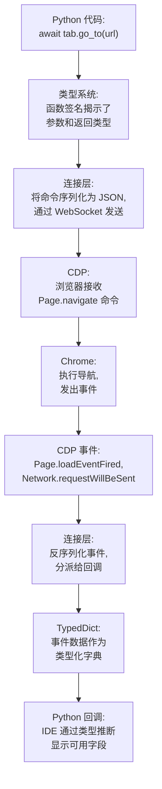

# 核心基础

**掌握了基础，其他一切都会变得更容易。**

本节涵盖了 Pydoll 赖以运行的 **基石技术**：Chrome 开发者工具协议 (CDP)、基于 WebSocket 的异步通信以及 Python 的类型系统集成。这些不仅仅是实现细节，它们是使 Pydoll 快速、强大且类型安全的 **基本设计决策**。

## 为什么基础知识很重要

大多数自动化框架都将其通信层抽象化，留给您一个“黑匣子”，它能正常工作直到出现问题。当出现问题时，如果不了解底层机制，调试和优化将变得困难。

**Pydoll 采用了不同的方法**：我们揭示并解释基础知识，使您能够同时作为 **框架用户** 和 **协议工程师** 工作。

!!! quote "第一性原理的力量"
    **“通晓大道者，万物皆在其中。”** - 宫本武藏
    
    理解 CDP、异步通信和类型系统不仅仅是为了 Pydoll，它是为了从 **核心层面理解现代浏览器自动化是如何工作的**。这些知识可以转移到任何基于 CDP 的工具和任何异步 Python 项目中。

## 三大支柱

### 1. Chrome 开发者工具协议 (CDP)
**[→ 阅读 CDP 深度解析](./cdp.md)**

**驱动现代浏览器自动化的协议。**

CDP 是 Chrome 的原生调试协议，与 Chrome 开发者工具 (F12) 使用的协议相同。通过直接与 CDP 通信，Pydoll 能够：

- **消除 WebDriver**（没有 Selenium 开销，没有 geckodriver/chromedriver 中间件）
- **获得深度控制**（修改请求、拦截事件、执行特权操作）
- **实现原生速度**（直接 WebSocket 通信，无 HTTP 轮询）
- **变得无法检测**（没有 `navigator.webdriver`，没有 WebDriver 指纹）

**您将学到什么：**

- CDP 如何将功能组织到各个域中（Page, Network, DOM, Fetch 等）
- 驱动反应式自动化的命令/事件架构
- 为什么基于 CDP 的工具 **从根本上比 Selenium 更强大**
- 如何阅读 CDP 文档并扩展 Pydoll

**为什么这很重要**：CDP 不仅仅是 Pydoll 的实现细节，它是现代浏览器自动化的基础。Puppeteer、Playwright 和类似的工具都使用 CDP。一次理解，知识可通用于多种工具。

---

### 2. 连接层
**[→ 阅读连接层架构](./connection-layer.md)**

**正确实现的异步通信。**

CDP 定义了您 **能做什么**，而连接层则定义了 Pydoll **如何** 与浏览器通信。在这里，协议消息变成了 Python 对象，async/await 模式实现了并发，WebSocket 提供了实时的双向通信。

**您将学到什么：**

- WebSocket 架构：持久连接、消息分帧、心跳维持
- async/await 模式：为什么 `async def` 和 `await` 能实现并发自动化
- 命令/响应关联：Pydoll 如何将响应与请求匹配
- 事件分发：浏览器事件如何触发 Python 回调
- 错误处理：超时管理、连接失败、优雅降级

**为什么这很重要**：连接层是 Pydoll 的通信骨干。理解它有助于：
- **有效调试**：检查 Python 和 Chrome 之间流动的消息
- **性能优化**：识别延迟来源并使操作并行化
- **扩展能力**：添加自定义 CDP 命令或修改现有行为

---

### 3. Python 类型系统集成
**[→ 阅读类型系统深度解析](./typing-system.md)**

**类型同时提供安全性和生产力。**

Python 的类型系统（自 3.5 版引入，此后每个版本都有增强）显著改善了开发体验。Pydoll 利用 `TypedDict`, `Literal`, `overload` 和泛型来提供：

- **IDE 自动补全** CDP 响应字段
- **类型检查** 以在运行时之前捕获错误 (`mypy`, `pyright`)
- **自文档化代码**（函数签名揭示了结构）
- **重构安全**（重命名字段，IDE 会更新所有用法）

**您将学到什么：**

- `TypedDict` 如何为 CDP 事件/响应结构建模
- 为什么 `overload` 为 `find()` / `query()` 提供了精确的返回类型
- 泛型（`TypeVar`, `Generic[T]`）如何实现灵活的命令构建
- 实用模式：注解回调、为异步函数添加类型、使用 `Literal`
- 工具集成：配置 mypy、利用 IDE 类型推断

**为什么这很重要**：类型提示在现代 Python 中变得越来越重要。Pydoll 全面的类型覆盖意味着：
- **更快的开发**：自动补全揭示了可用的字段和方法
- **更少的错误**：类型检查器在错误进入生产环境前捕获它们
- **更好的重构**：借助 IDE 支持，自信地更改签名

---

## 这些基础知识如何相互连接

理解 CDP、异步通信和类型系统如何 **协同工作** 是关键：

**流程**：
1.  您编写带有 **类型注解** 的 Python 代码（类型系统）
2.  代码序列化为 JSON 并通过 **WebSocket** 发送（连接层）
3.  浏览器接收并执行 **CDP 命令**（CDP）
4.  浏览器将 **CDP 事件** 发回（CDP）
5.  事件反序列化为 **TypedDict 实例**（类型系统）
6.  您的回调接收到 **类型安全的事件对象**（类型系统）

每一层都 **放大** 了其他层的作用：
- 类型使 CDP 响应易于发现
- CDP 的事件模型支持了异步模式
- 异步通信使类型变得至关重要（这个响应上有哪些字段？）

## 学习路径

我们推荐以下进阶路径：

### 步骤 1: CDP (1-2 小时)
**[从这里开始: Chrome 开发者工具协议](./cdp.md)**

理解驱动一切的协议。学习域、命令、事件以及如何阅读 CDP 文档。

**成果**：您将知道如何查找和使用任何 CDP 功能，而不仅仅是 Pydoll 暴露的功能。

### 步骤 2: 连接层 (2-3 小时)
**[继续: 连接层架构](./connection-layer.md)**

深入了解 WebSocket 通信、异步模式和事件分发。

**成果**：您将确切理解消息如何在 Python 和 Chrome 之间流动，从而实现调试和优化。

### 步骤 3: 类型系统 (1-2 小时)
**[完成: Python 类型系统](./typing-system.md)**

学习 Pydoll 如何使用现代 Python 类型来实现安全性和生产力。

**成果**：您将编写出具有完整 IDE 支持的类型安全的自动化代码，在运行前捕获错误。

**总时间**：4-7 小时
**回报**：对基于 CDP 的自动化基础的 **永久理解**

## 先决条件

要从本节中获得最大收益：

- **Python 基础知识** - 函数、类、装饰器
- **基本的 async/await** - 理解 `async def` 和 `await` 关键字
- **熟悉 JSON** - 知道对象/数组如何序列化
- **浏览器开发者工具** - 使用过 Chrome 检查器 (F12)

**如果您是 Python 异步编程的新手**，请先阅读：[Real Python: Async IO in Python](https://realpython.com/async-io-python/)

## 超越基础

掌握了这些基础知识后，您就可以开始学习：

- **[内部架构](../architecture/browser-domain.md)** - Pydoll 的组件是如何组合在一起的
- **[网络与安全](../network/index.md)** - 理解代理所需的协议级知识
- **[指纹识别](../fingerprinting/index.md)** - 需要 CDP 知识的检测技术

## 常见问题

### “我需要理解这些才能使用 Pydoll 吗？”

**不需要**，但理解这些基础知识将使您更有效率。基本用法在没有这些知识的情况下也能正常工作。然而，当您需要：
- 调试为什么某些功能不工作
- 优化缓慢的自动化
- 使用自定义 CDP 命令扩展 Pydoll
- 理解错误消息
- 为项目做贡献

这些基础知识就会变得非常有用。

### “这是不是太底层了？”

这种详细程度是故意的。大多数框架隐藏了这些基础知识，但抽象是有代价的：

- 理解有助于更好的调试
- 可见性有助于优化
- 知识有助于扩展

通过教授基础知识，我们使您能够超越 Pydoll 开箱即用的功能。

### “我需要记住多少内容？”

**一点也不用。** 目标是建立心智模型，而不是记忆。阅读完这些部分后，您将培养出一种直觉：

- “这需要 CDP，我去查查协议文档”
- “这很慢是因为顺序 await，让我来并行化”
- “这个类型错误意味着我用错了字段名”

具体细节会淡忘，但理解会长存。

## 理念

这些基础知识代表了持久的知识：

- **CDP** 是 Chrome 的原生协议，并持续演进
- **Async/await** 是 Python 的并发标准
- **类型系统** 在 Python 中变得越来越重要（PEP 484 以后）

学习这些概念将为您的整个开发生涯提供价值。

---

## 准备好奠定您的基础了吗？

从 **[Chrome 开发者工具协议](./cdp.md)** 开始，理解驱动一切的协议。然后逐步学习连接层和类型系统，以完善您的基础理解。

**这就是自动化成为工程学的地方。**

---

!!! tip "完成基础知识之后"
    一旦您掌握了这些概念，您会在 Pydoll 架构中 **无处不在** 地看到它们：
    
    - Browser/Tab/WebElement 都使用 **连接层**
    - 网络事件都遵循 **CDP 的事件模型**
    - 所有响应都使用 **TypedDict** 来确保类型安全
    
    基础知识与 Pydoll 并不分离，它们 **就是** Pydoll 的基石。