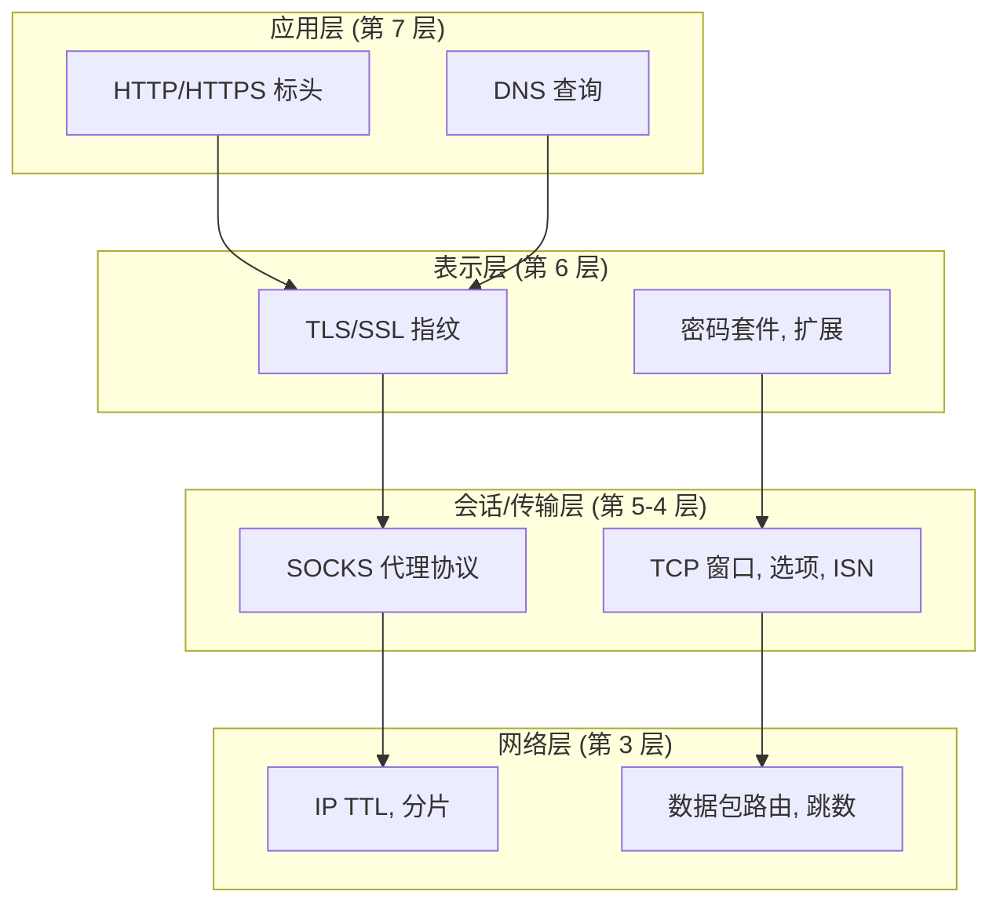

# 网络与安全深度探讨

**欢迎来到现代互联网通信的基础——这里是匿名、检测与规避的战场。**

网络协议是驱动每一次 Web 请求、浏览器连接和自动化脚本的无形基础设施。深入理解它们，您将从一个 **工具使用者** 转变为一个 **协议工程师**，能够应对最复杂的反机器人系统。

## 为什么网络架构很重要

当您运行 `tab.go_to('https://example.com')` 时，一场复杂的协议交响乐便拉开了序幕：

1.  **DNS 解析** 将域名转换为 IP 地址（可能会泄露您的意图）
2.  **TCP 握手** 建立连接（通过数据包特征暴露您的操作系统）
3.  **TLS 协商** 保护通道安全（通过密码套件对您的浏览器进行指纹识别）
4.  **HTTP/2 请求** 获取页面（通过 SETTINGS 帧暴露浏览器版本）
5.  **WebRTC 发现** 可能会探测您的真实 IP（完全绕过您的 VPN）

**每一步都是检测或规避的机会。**

!!! danger "网络层无法说谎"
    与浏览器级特征（JavaScript 可以修改）不同，网络级指纹被 **烙印在操作系统内核和 TCP/IP 协议栈中**。像 Chrome 浏览器声称自己是 Windows，却发送 Linux 的 TCP 选项，这种不匹配对于隐形自动化来说是立竿见影的致命伤。

## 互联网隐私的架构

本模块探讨了在现代互联网上使隐私成为可能（或被破坏）的 **技术基础**：

### OSI 模型的现实

**每一层既是盾牌，也是弱点：**

- **第 7 层 (应用层)**：代理可以读取和修改您的 HTTP 流量
- **第 6 层 (表示层)**：TLS 加密保护内容，但泄露元数据
- **第 4 层 (传输层)**：TCP 特征暴露您的操作系统
- **第 3 层 (网络层)**：IP 地址揭示您的物理位置

## 您将掌握什么

本模块按照从基础到高级利用的 **技术进阶** 构建：

### 1. 网络基础
**[网络基础](./network-fundamentals.md)**

构建基础：了解驱动互联网的协议，以及它们如何揭示或隐藏您的身份。

- **OSI 模型分层** 及其指纹识别含义
- **TCP vs UDP**：为什么您的代理可能会泄露 UDP 流量
- **WebRTC IP 泄露**：现代浏览器中的隐藏威胁
- **网络堆栈特征**：TTL、窗口大小、选项顺序

**为什么从这里开始**：没有这个基础，代理配置就是 **“货物崇拜编程”**，只是复制命令而不理解它们为什么有效（或无效）。

### 2. HTTP/HTTPS 代理
**[HTTP/HTTPS 代理](./http-proxies.md)**

掌握最常见的代理协议，并理解其根本局限性。

- **HTTP 代理操作**：请求转发、缓存、标头注入
- **CONNECT 隧道**：HTTPS 如何“隧道”通过 HTTP 代理
- **HTTP/2 的复杂性**：多路复用、流优先级、SETTINGS 指纹
- **HTTP/3 和 QUIC**：基于 UDP 的代理挑战
- **身份验证方案**：Basic, Digest, NTLM, Bearer 令牌

**关键见解**：HTTP 代理在第 7 层运行，它们可以 **读取、修改和记录** 您未加密的流量。要获得真正的隐私，您需要在代理看到您的数据 **之前** 进行加密。

### 3. SOCKS 代理
**[SOCKS 代理](./socks-proxies.md)**

理解为什么 SOCKS5 是注重隐私的自动化的 **黄金标准**。

- **SOCKS4 vs SOCKS5**：协议演进和功能
- **SOCKS5 握手**：二进制协议深度解析与数据包结构
- **UDP 支持**：通过 SOCKS5 运行游戏、VoIP 和 WebRTC
- **DNS 解析**：为什么代理端 DNS 能防止泄露
- **为什么 SOCKS5 > HTTP 代理**：协议级比较

**关键优势**：SOCKS 在第 5 层（会话层）运行，**低于** 应用层。它无法读取您的 HTTP 流量，只能看到目标 IP，从而极大地减少了信任面。

### 4. 代理检测
**[代理检测与匿名](./proxy-detection.md)**

了解网站如何 **检测代理使用** 以及如何规避检测。

- **匿名级别**：透明代理、匿名代理、精英代理
- **IP 信誉数据库**：您数据中心的 IP 如何暴露您
- **标头分析**：X-Forwarded-For, Via, Forwarded 标头
- **一致性检查**：DNS 反向查找、地理位置不匹配
- **网络指纹集成**：将代理检测与 TCP/TLS 分析相结合

**残酷的现实**：大多数“匿名”代理都很容易被检测到。真正的隐蔽需要 **精英住宅代理** + **一致的浏览器指纹** + **类人行为**。

### 5. 构建代理服务器
**[构建您自己的代理](./build-proxy.md)**

在 Python 中从头开始实现 HTTP 和 SOCKS5 代理，这是终极的学习体验。

- **HTTP 代理服务器**：带身份验证的完整异步实现
- **SOCKS5 代理服务器**：二进制协议处理、TCP 隧道
- **代理链**：分层匿名（以及延迟权衡）
- **旋转代理池**：健康检查、故障转移、负载均衡
- **高级主题**：透明代理、MITM SSL 拦截

**为什么要构建自己的**：了解实现细节可以揭示从外部看不到的 **攻击向量** 和 **优化机会**。

### 6. 法律与道德考量
**[法律与道德准则](./proxy-legal.md)**

驾驭代理使用和网络自动化的法律雷区。

- **法规遵从**：GDPR, CFAA, 国际法律
- **服务条款**：什么构成违规
- **道德准则**：robots.txt, 速率限制, 透明度
- **案例研究**：法律先例 (hiQ vs LinkedIn, QVC vs Resultly)
- **何时避免使用代理**：高风险场景

**免责声明**：这是 **教育信息**，不是法律建议。法律因司法管辖区和用例而异。请咨询合格的法律顾问。

## 代理悖论

关于代理，有一个令人不安的事实：

!!! warning "代理不会让你匿名。它们让你 **与众不同**"
    代理会更改您的 IP 地址，但它也会：
    
    - 增加 **延迟**（可通过计时分析检测）
    - 重置 **TTL** 值（暴露代理跳数）
    - 引入 **TCP 指纹** 不匹配（代理操作系统 ≠ 您的操作系统）
    - 可能注入 **标头** (X-Forwarded-For, Via)
    - 造成 **地理位置** 不一致（浏览器时区 ≠ IP 位置）
    
    代理是一种 **工具**，而不是一个解决方案。真正的隐蔽需要 **全面的一致性**。

## 先决条件

这是 **高级材料**。您应该熟悉：

- 基本网络概念（IP 地址、端口、协议）
- TCP/IP 基础（三次握手、数据包、路由）
- 异步 Python 编程 (asyncio, async/await)
- Pydoll 基础知识 (参见 [核心概念](../../features/core-concepts.md))

**如果您对网络不熟悉**，我们强烈建议您：

1.  首先阅读 TCP/IP 基础指南
2.  尝试使用 Wireshark 来可视化网络流量
3.  在运行数据包捕获的同时尝试代码示例
4.  构建代理服务器并在本地测试它们

## 与其他模块的集成

网络架构并非孤立存在。它与以下内容深度集成：

- **[指纹识别](../fingerprinting/network-fingerprinting.md)**：TCP/IP 和 TLS 特征如何识别您
- **[浏览器配置](../../features/configuration/browser-preferences.md)**：使浏览器行为与代理特征保持一致
- **[连接层](../fundamentals/connection-layer.md)**：Pydoll 如何通过代管理 WebSocket 连接

## 学习路径

我们推荐以下进阶路径：

**阶段 1：基础**
1.  阅读 [网络基础](./network-fundamentals.md)
2.  理解 OSI 模型和协议分层
3.  了解 WebRTC 泄露和 UDP 隧道

**阶段 2：协议深度探讨**
4.  学习 [HTTP/HTTPS 代理](./http-proxies.md)
5.  掌握 [SOCKS 代理](./socks-proxies.md)
6.  比较协议并理解权衡

**阶段 3：对抗性思维**
7.  探索 [代理检测](./proxy-detection.md)
8.  从防御者的角度学习检测技术
9.  应用规避策略

**阶段 4：动手实践**
10. 从 [构建代理](./build-proxy.md) 构建代理服务器
11. 使用 Wireshark 捕获和分析流量
12. 测试代理链和轮换策略

**阶段 5：操作安全**
13. 查看 [法律与道德](./proxy-legal.md) 准则
14. 理解合规性要求
15. 制定负责任的自动化策略

## 理念

网络和安全知识是 **基础性的力量**。与特定框架的技能（会过时）不同，协议知识是 **永恒的**：

- TCP 自 RFC 793 (1981) 以来没有根本改变
- TLS 建立在 SSL (1995) 的概念之上
- HTTP/2 (2015) 和 HTTP/3 (2022) 是演进，而不是革命

一次掌握这些概念，您将在职业生涯的剩余时间里理解您遇到的 **每一个基于网络的系统**。

## 道德承诺

在继续之前，请确认：

我理解代理可用于合法和恶意目的
我将尊重网站的服务条款和 robots.txt
我将实现速率限制和友好的爬行
我不会将此知识用于欺诈、滥用或非法活动
当不确定合规性时，我将咨询法律顾问

**能力越大，责任越大。** 请明智地使用这些知识。

---

## 准备好开始了吗？

从 **[网络基础](./network-fundamentals.md)** 开始您的旅程，以构建基础，然后按顺序浏览各个模块。每个文档都建立在“前一个”文档的基础之上，从而全面了解用于自动化的网络架构。

**这是脚本小子成为工程师的地方。让我们开始吧。**

---

!!! info "文档状态"
    本模块综合了来自 RFC、协议规范、安全研究和真实世界测试的知识。每个代码示例都是可用于生产的。如果您发现不准确之处或有改进意见，欢迎贡献。

## 快速导航

**核心协议：**
- [网络基础](./network-fundamentals.md) - TCP/IP, UDP, WebRTC
- [HTTP/HTTPS 代理](./http-proxies.md) - 应用层代理
- [SOCKS 代理](./socks-proxies.md) - 会话层代理

**高级主题：**
- [代理检测](./proxy-detection.md) - 匿名与规避
- [构建代理](./build-proxy.md) - 从头开始实现
- [法律与道德](./proxy-legal.md) - 合规与责任

**相关模块：**
- [指纹识别](../fingerprinting/index.md) - 检测技术
- [浏览器配置](../../features/configuration/browser-options.md) - 实际设置