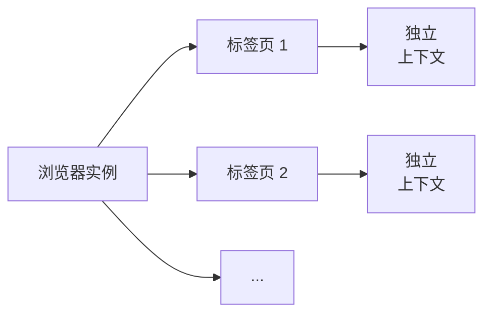

# 多标签页管理

Pydoll 提供了强大的多标签页功能，可以实现跨多个浏览器标签页同时进行复杂的自动化工作流。理解 Pydoll 中标签页的工作原理对于构建健壮、可扩展的自动化至关重要。

## 理解 Pydoll 中的标签页

在 Pydoll 中，`Tab` 实例代表单个浏览器标签页（或窗口），并提供所有页面自动化操作的主要接口。每个标签页维护自己的：

- **独立执行上下文**：JavaScript、DOM 和页面状态
- **隔离的事件处理器**：在一个标签页上注册的回调不会影响其他标签页
- **独立的网络监控**：每个标签页可以跟踪自己的网络活动
- **唯一的 CDP 连接**：与浏览器的直接 WebSocket 通信



| 标签页组件 | 描述 | 独立性 |
|-----------|------|--------|
| **执行上下文** | JavaScript 运行时、DOM、页面状态 | ✓ 每个标签页都有自己的 |
| **事件处理器** | CDP 事件的注册回调 | ✓ 每个标签页隔离 |
| **网络监控** | HTTP 请求、响应、时序 | ✓ 单独跟踪 |
| **CDP 连接** | WebSocket 通信通道 | ✓ 直接连接 |

### 什么是浏览器标签页？

浏览器标签页在技术上是一个 **CDP 目标** - 一个具有自己的隔离浏览上下文：

- 文档对象模型（DOM）
- JavaScript 执行环境
- 网络连接池
- Cookie 存储（与同一上下文中的其他标签页共享）
- 事件循环和渲染引擎

每个标签页都有浏览器分配的唯一 `target_id`，Pydoll 使用它来正确路由命令和事件。

## 标签页实例管理

Pydoll 的 `Browser` 类根据每个标签页的 `target_id` 维护一个 Tab 实例注册表。这确保对同一浏览器标签页的多个引用始终返回相同的 Tab 对象。Browser 将这些实例存储在内部的 `_tabs_opened` 字典中。

| 优势 | 描述 |
|------|------|
| **资源效率** | 每个浏览器标签页一个 Tab 实例，无重复 |
| **状态一致** | 所有引用共享相同的事件处理器和状态 |
| **内存安全** | 防止与同一目标建立多个 WebSocket 连接 |
| **可预测的行为** | 一个引用的变化会影响所有引用 |

```python
import asyncio
from pydoll.browser.chromium import Chrome

async def tab_registry_demonstration():
    async with Chrome() as browser:
        # 启动浏览器并获取初始标签页
        tab1 = await browser.start()

        # 通过不同方法获取同一标签页
        # 注意：get_opened_tabs() 以相反顺序返回标签页（最新的在前）
        # 所以初始标签页（最旧的）在最后
        opened_tabs = await browser.get_opened_tabs()
        tab2 = opened_tabs[-1]  # 初始标签页是最旧的，所以在最后

        # 两个引用指向同一对象
        # 因为 Browser 从其注册表返回相同的实例
        print(f"Same instance? {tab1 is tab2}")  # True
        print(f"Same target ID? {tab1._target_id == tab2._target_id}")  # True

        # 在一个引用上注册事件会影响另一个
        await tab1.enable_network_events()
        print(f"Network events on tab2? {tab2.network_events_enabled}")  # True

        # Browser 在内部维护注册表
        print(f"Tab registered in browser? {tab1._target_id in browser._tabs_opened}")  # True

asyncio.run(tab_registry_demonstration())
```

!!! info "Browser 管理的注册表"
    Browser 类管理一个以 `target_id` 为键的 `_tabs_opened` 字典。当你请求一个标签页（通过 `new_tab()` 或 `get_opened_tabs()`）时，Browser 会先检查该注册表。如果已经存在对应的 Tab，就复用该实例；否则创建新的并缓存。（IFrame 现在作为普通元素处理，不再注册为独立的 Tab。）

## 创建和管理标签页

### 启动浏览器

启动浏览器时，Pydoll 自动为初始浏览器标签页创建并返回一个 Tab 实例：

```python
import asyncio
from pydoll.browser.chromium import Chrome

async def start_browser():
    async with Chrome() as browser:
        # 自动创建初始标签页
        tab = await browser.start()
        
        print(f"Tab created with target ID: {tab._target_id}")
        await tab.go_to('https://example.com')
        
        title = await tab.execute_script('return document.title')
        print(f"Page title: {title}")

asyncio.run(start_browser())
```

### 以编程方式创建额外的标签页

使用 `browser.new_tab()` 完全控制创建额外的标签页：

```python
import asyncio
from pydoll.browser.chromium import Chrome

async def create_multiple_tabs():
    async with Chrome() as browser:
        # 从初始标签页开始
        main_tab = await browser.start()
        
        # 创建带有特定 URL 的额外标签页
        search_tab = await browser.new_tab('https://google.com')
        docs_tab = await browser.new_tab('https://docs.python.org')
        news_tab = await browser.new_tab('https://news.ycombinator.com')
        
        # 每个标签页可以独立控制
        await search_tab.find(name='q')  # Google 搜索框
        await docs_tab.find(id='search-field')  # Python 文档搜索
        await news_tab.find(class_name='storylink', find_all=True)  # HN 故事
        
        # 获取所有打开的标签页
        all_tabs = await browser.get_opened_tabs()
        print(f"Total tabs: {len(all_tabs)}")  # 4（初始 + 3 个新的）
        
        # 完成后关闭特定标签页
        await search_tab.close()
        await docs_tab.close()
        await news_tab.close()

asyncio.run(create_multiple_tabs())
```

!!! tip "URL 参数可选"
    你可以创建不指定 URL 的标签页：`await browser.new_tab()`。标签页将打开空白页面（`about:blank`），准备导航。

### 处理用户打开的标签页

当用户点击带有 `target="_blank"` 的链接或使用"在新标签页中打开"时，Pydoll 可以检测并管理这些标签页：

```python
import asyncio
from pydoll.browser.chromium import Chrome

async def handle_user_tabs():
    async with Chrome() as browser:
        main_tab = await browser.start()
        await main_tab.go_to('https://example.com')
        
        # 记录初始标签页数量
        initial_tabs = await browser.get_opened_tabs()
        print(f"Initial tabs: {len(initial_tabs)}")
        
        # 点击在新标签页中打开的链接（target="_blank"）
        external_link = await main_tab.find(text='Open in New Tab')
        await external_link.click()
        
        # 等待新标签页打开
        await asyncio.sleep(2)
        
        # 检测新标签页
        current_tabs = await browser.get_opened_tabs()
        print(f"Current tabs: {len(current_tabs)}")
        
        # 找到新打开的标签页（列表中的最后一个）
        if len(current_tabs) > len(initial_tabs):
            new_tab = current_tabs[-1]
            
            # 使用新标签页
            url = await new_tab.current_url
            print(f"New tab URL: {url}")
            
            await new_tab.go_to('https://different-site.com')
            title = await new_tab.execute_script('return document.title')
            print(f"New tab title: {title}")
            
            # 完成后关闭
            await new_tab.close()

asyncio.run(handle_user_tabs())
```

### 列出所有打开的标签页

使用 `browser.get_opened_tabs()` 检索所有当前打开的标签页：

```python
import asyncio
from pydoll.browser.chromium import Chrome

async def list_tabs():
    async with Chrome() as browser:
        # 使用 start() 返回的初始标签页
        initial_tab = await browser.start()
        await initial_tab.go_to('https://example.com')
        
        # 再打开几个标签页
        await browser.new_tab('https://github.com')
        await browser.new_tab('https://stackoverflow.com')
        await browser.new_tab('https://reddit.com')
        
        # 获取所有标签页
        all_tabs = await browser.get_opened_tabs()
        
        # 检查每个标签页
        for i, tab in enumerate(all_tabs, 1):
            url = await tab.current_url
            title = await tab.execute_script('return document.title')
            print(f"Tab {i}: {title} - {url}")

asyncio.run(list_tabs())
```

## 并发标签页操作

Pydoll 的异步架构支持跨多个标签页的强大并发工作流：

### 并行数据收集

同时处理多个页面以获得最大效率：

```python
import asyncio
from pydoll.browser.chromium import Chrome

async def scrape_page(tab, url):
    """在给定标签页中抓取单个页面。"""
    await tab.go_to(url)
    title = await tab.execute_script('return document.title')
    articles = await tab.find(class_name='article', find_all=True)
    content = [await article.text for article in articles[:5]]

    return {
        'url': url,
        'title': title,
        'articles_count': len(articles),
        'sample_content': content
    }

async def concurrent_scraping():
    urls = [
        'https://example.com/page1',
        'https://example.com/page2',
        'https://example.com/page3',
        'https://example.com/page4',
    ]

    async with Chrome() as browser:
        # 启动浏览器并打开第一个标签页
        initial_tab = await browser.start()
        # 为每个 URL 创建一个标签页
        tabs = [initial_tab] + [await browser.new_tab() for _ in urls[1:]]

        # 并发运行所有爬虫
        results = await asyncio.gather(*[
            scrape_page(tab, url) for tab, url in zip(tabs, urls)
        ])

        # 显示结果
        for result in results:
            print(f"\n{result['title']}")
            print(f"  URL: {result['url']}")
            print(f"  Articles: {result['articles_count']}")
            if result['sample_content']:
                print(f"  Sample: {result['sample_content'][0][:100]}...")

asyncio.run(concurrent_scraping())
```

!!! tip "性能提升"
    与顺序处理相比，并发抓取可以将总执行时间减少 5-10 倍，特别是对于 I/O 密集型任务如页面加载。

### 协调多标签页工作流

编排需要多个标签页交互的复杂工作流：

```python
import asyncio
from pydoll.browser.chromium import Chrome
from pydoll.protocol.network.events import NetworkEvent, RequestWillBeSentEvent

async def multi_tab_workflow():
    async with Chrome() as browser:
        # 使用初始标签页进行登录
        login_tab = await browser.start()
        await login_tab.go_to('https://app.example.com/login')
        await asyncio.sleep(2)
        
        username = await login_tab.find(id='username')
        password = await login_tab.find(id='password')
        
        await username.type_text('admin@example.com')
        await password.type_text('secure_password')
        
        login_btn = await login_tab.find(id='login')
        await login_btn.click()
        await asyncio.sleep(3)
        
        # 标签页 2：导航到数据导出页面
        export_tab = await browser.new_tab('https://app.example.com/export')
        await asyncio.sleep(2)
        
        export_btn = await export_tab.find(text='Export Data')
        await export_btn.click()
        
        # 标签页 3：在仪表板中监控 API 调用
        monitor_tab = await browser.new_tab('https://app.example.com/dashboard')
        await monitor_tab.enable_network_events()
        
        # 跟踪 API 调用
        api_calls = []
        async def track_api(event: RequestWillBeSentEvent):
            url = event['params']['request']['url']
            if '/api/' in url:
                api_calls.append(url)
        
        await monitor_tab.on(NetworkEvent.REQUEST_WILL_BE_SENT, track_api)
        await asyncio.sleep(5)
        
        print(f"Tracked {len(api_calls)} API calls:")
        for call in api_calls[:10]:
            print(f"  - {call}")
        
        # 清理
        await login_tab.close()
        await export_tab.close()
        await monitor_tab.close()

asyncio.run(multi_tab_workflow())
```

## 标签页生命周期和清理

### 显式标签页关闭

完成后始终关闭标签页以释放浏览器资源：

```python
import asyncio
from pydoll.browser.chromium import Chrome

async def explicit_cleanup():
    async with Chrome() as browser:
        initial_tab = await browser.start()
        
        # 为不同任务创建标签页
        tab1 = await browser.new_tab('https://example.com')
        tab2 = await browser.new_tab('https://example.org')
        
        # 使用标签页进行工作
        await tab1.go_to('https://different-site.com')
        await tab2.take_screenshot('/tmp/screenshot.png')
        
        # 显式关闭标签页
        await tab1.close()
        await tab2.close()
        
        # 验证标签页已关闭
        remaining = await browser.get_opened_tabs()
        print(f"Remaining tabs: {len(remaining)}")  # 应该是 1（初始）

asyncio.run(explicit_cleanup())
```

!!! warning "内存泄漏"
    在长时间运行的自动化中不关闭标签页可能导致内存耗尽。每个标签页消耗浏览器资源（内存、文件句柄、网络连接）。

### 使用上下文管理器自动清理

虽然 Pydoll 没有提供内置的标签页上下文管理器，但你可以创建自己的：

```python
import asyncio
from contextlib import asynccontextmanager
from pydoll.browser.chromium import Chrome

@asynccontextmanager
async def managed_tab(browser, url=None):
    """用于自动清理标签页的上下文管理器。"""
    tab = await browser.new_tab(url)
    try:
        yield tab
    finally:
        await tab.close()

async def auto_cleanup_example():
    async with Chrome() as browser:
        initial_tab = await browser.start()
        
        # 退出上下文时标签页自动关闭
        async with managed_tab(browser, 'https://example.com') as tab:
            title = await tab.execute_script('return document.title')
            print(f"Title: {title}")
            
            await tab.take_screenshot('/tmp/page.png')
        # 标签页在这里自动关闭
        
        tabs = await browser.get_opened_tabs()
        print(f"Tabs after context exit: {len(tabs)}")  # 1（仅 initial_tab）

asyncio.run(auto_cleanup_example())
```

### 浏览器清理

浏览器关闭时，所有标签页会自动关闭：

```python
import asyncio
from pydoll.browser.chromium import Chrome

async def browser_cleanup():
    # 使用上下文管理器 - 自动清理
    async with Chrome() as browser:
        initial_tab = await browser.start()
        
        # 创建多个标签页
        await browser.new_tab('https://example.com')
        await browser.new_tab('https://github.com')
        await browser.new_tab('https://stackoverflow.com')
        
        tabs = await browser.get_opened_tabs()
        print(f"Tabs open: {len(tabs)}")  # 4（初始 + 3 个新的）
    
    # 浏览器退出时所有标签页自动关闭
    print("Browser closed, all tabs cleaned up")

asyncio.run(browser_cleanup())
```

## 标签页状态管理

### 检查标签页状态

查询标签页当前状态的各个方面：

```python
import asyncio
from pydoll.browser.chromium import Chrome

async def check_tab_state():
    async with Chrome() as browser:
        tab = await browser.start()
        await tab.go_to('https://example.com')
        
        # 检查当前 URL
        url = await tab.current_url
        print(f"Current URL: {url}")
        
        # 检查页面源代码
        source = await tab.page_source
        print(f"Page source length: {len(source)} characters")
        
        # 检查已启用的事件域
        print(f"Page events enabled: {tab.page_events_enabled}")
        print(f"Network events enabled: {tab.network_events_enabled}")
        print(f"DOM events enabled: {tab.dom_events_enabled}")
        
        # 启用事件并再次检查
        await tab.enable_network_events()
        print(f"Network events enabled: {tab.network_events_enabled}")  # True

asyncio.run(check_tab_state())
```

### 标签页标识

每个标签页都有唯一标识符：

```python
import asyncio
from pydoll.browser.chromium import Chrome

async def tab_identification():
    async with Chrome() as browser:
        tab1 = await browser.start()
        tab2 = await browser.new_tab()
        
        # Target ID - 浏览器分配的唯一标识符
        print(f"Tab 1 target ID: {tab1._target_id}")
        print(f"Tab 2 target ID: {tab2._target_id}")
        
        # 连接详情
        print(f"Tab 1 connection port: {tab1._connection_port}")
        print(f"Tab 2 connection port: {tab2._connection_port}")
        
        # 浏览器上下文 ID（默认上下文通常为 None）
        print(f"Tab 1 context ID: {tab1._browser_context_id}")
        print(f"Tab 2 context ID: {tab2._browser_context_id}")

asyncio.run(tab_identification())
```

## 高级标签页功能

### 将标签页置于前台

使特定标签页可见（置于前台）：

```python
import asyncio
from pydoll.browser.chromium import Chrome

async def bring_to_front():
    async with Chrome() as browser:
        tab1 = await browser.start()
        tab2 = await browser.new_tab('https://github.com')
        tab3 = await browser.new_tab('https://stackoverflow.com')
        
        # tab3 当前在前台（最后创建的）
        await asyncio.sleep(2)
        
        # 将 tab1 置于前台
        await tab1.bring_to_front()
        print("Tab 1 brought to front")
        
        await asyncio.sleep(2)
        
        # 将 tab2 置于前台
        await tab2.bring_to_front()
        print("Tab 2 brought to front")

asyncio.run(bring_to_front())
```

### 标签页特定的网络监控

每个标签页可以独立监控自己的网络活动：

```python
import asyncio
from pydoll.browser.chromium import Chrome

async def tab_network_monitoring():
    async with Chrome() as browser:
        # 使用初始标签页进行监控导航
        tab1 = await browser.start()
        await tab1.go_to('https://example.com')
        
        # 创建第二个标签页不进行监控
        tab2 = await browser.new_tab('https://github.com')
        
        # 仅在 tab1 上启用网络监控
        await tab1.enable_network_events()
        
        # 导航两个标签页
        await tab1.go_to('https://example.com/page1')
        await tab2.go_to('https://github.com/explore')
        
        await asyncio.sleep(3)
        
        # 仅从 tab1 获取网络日志
        tab1_logs = await tab1.get_network_logs()
        print(f"Tab 1 network requests: {len(tab1_logs)}")
        
        # tab2 没有网络监控
        print(f"Tab 2 network events enabled: {tab2.network_events_enabled}")  # False

asyncio.run(tab_network_monitoring())
```

### 标签页特定的事件处理器

在不同标签页上注册不同的事件处理器：

```python
import asyncio
from pydoll.browser.chromium import Chrome
from pydoll.protocol.page.events import PageEvent

async def tab_specific_events():
    async with Chrome() as browser:
        # 使用初始标签页作为第一个标签页
        tab1 = await browser.start()
        tab2 = await browser.new_tab()
        
        # 在两个标签页上启用页面事件
        await tab1.enable_page_events()
        await tab2.enable_page_events()
        
        # 为每个标签页使用不同的处理器
        async def tab1_handler(event):
            print("Tab 1 loaded!")
        
        async def tab2_handler(event):
            print("Tab 2 loaded!")
        
        await tab1.on(PageEvent.LOAD_EVENT_FIRED, tab1_handler)
        await tab2.on(PageEvent.LOAD_EVENT_FIRED, tab2_handler)
        
        # 导航两个标签页
        await tab1.go_to('https://example.com')
        await tab2.go_to('https://github.com')
        
        await asyncio.sleep(2)

asyncio.run(tab_specific_events())
```

## 性能考虑

| 场景 | 资源影响 | 建议 |
|------|---------|------|
| **1-5 个标签页** | 低 | 直接管理，无需特殊处理 |
| **5-20 个标签页** | 中等 | 使用信号量限制并发 |
| **20-50 个标签页** | 高 | 批处理，积极关闭标签页 |
| **50+ 个标签页** | 非常高 | 考虑顺序处理或多个浏览器 |

### 内存使用

每个标签页大约消耗：

- **基础内存**：50-100 MB
- **启用网络事件**：+10-20 MB
- **启用 DOM 事件**：+20-50 MB
- **复杂页面（SPA）**：+100-300 MB

20 个启用网络监控的标签页：约 1.5-3 GB 内存。

## 常见模式

### 使用单个标签页的顺序处理

```python
async def sequential_pattern():
    async with Chrome() as browser:
        tab = await browser.start()
        
        for url in urls:
            await tab.go_to(url)
            # 提取数据
            await tab.clear_callbacks()  # 清理事件

asyncio.run(sequential_pattern())
```

### 使用多个标签页的并行处理

```python
import asyncio
from pydoll.browser.chromium import Chrome

async def parallel_pattern():
    urls = [
        'https://example.com/page1',
        'https://example.com/page2',
        'https://example.com/page3',
        'https://example.com/page4',
    ]

    async with Chrome() as browser:
        # 启动浏览器并获取初始标签页
        initial_tab = await browser.start()
        # 为每个 URL 创建一个标签页（为第一个重用初始标签页）
        tabs = [initial_tab] + [await browser.new_tab() for _ in urls[1:]]

        async def process_page(tab, url):
            """在给定标签页中处理单个页面。"""
            try:
                await tab.go_to(url)
                await asyncio.sleep(2)
                title = await tab.evaluate('document.title')
                print(f"[{url}] {title}")
            finally:
                if tab is not initial_tab:
                    await tab.close()

        # 并发运行所有标签页
        await asyncio.gather(*[
            process_page(tab, url) for tab, url in zip(tabs, urls)
        ])

asyncio.run(parallel_pattern())
```

### 工作池模式

```python
async def worker_pool_pattern():
    async with Chrome() as browser:
        # 使用初始标签页作为第一个工作者
        initial_tab = await browser.start()
        
        # 创建额外的工作者标签页（总共 5 个工作者：1 个初始 + 4 个新的）
        workers = [initial_tab] + [await browser.new_tab() for _ in range(4)]
        
        # 在所有工作者之间分配工作
        for url in urls:
            worker = workers[urls.index(url) % len(workers)]
            await worker.go_to(url)
            # 处理...
        
        # 清理所有工作者（包括初始标签页）
        for worker in workers:
            await worker.close()

asyncio.run(worker_pool_pattern())
```

!!! tip "重用初始标签页"
    始终使用 `browser.start()` 返回的标签页，而不是让它空闲。这可以节省浏览器资源并提高性能。在上面的示例中，初始标签页被重用作为第一个工作者或批处理中的第一个 URL。

## 另请参阅

- **[浏览器上下文](contexts.md)** - 隔离的浏览器会话
- **[Cookie 和会话](cookies-sessions.md)** - 跨标签页管理 cookie
- **[事件系统](../advanced/event-system.md)** - 标签页特定的事件处理
- **[并发抓取](../../features.md#concurrent-scraping)** - 实际示例

Pydoll 中的多标签页管理为构建可扩展、高效的浏览器自动化提供了基础。通过理解标签页生命周期、单例模式和最佳实践，你可以创建健壮的自动化工作流，轻松处理复杂的多页面场景。
