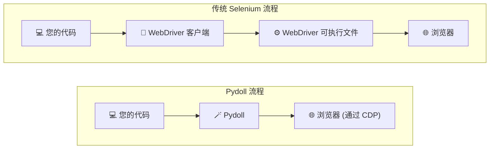
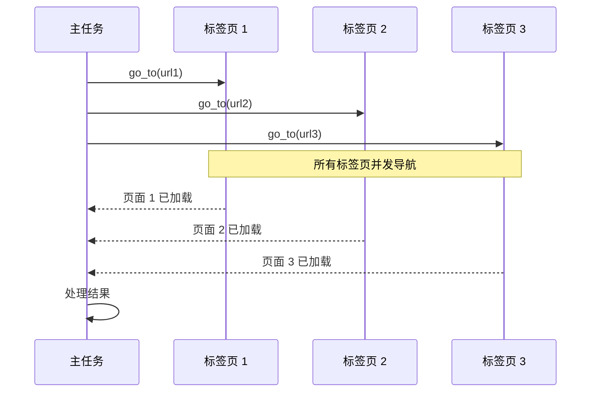

# 核心概念

理解是什么使 Pydoll 与众不同，要从其基础设计决策开始。这些不仅仅是技术选择，它们直接影响您如何编写自动化脚本、可以解决什么问题，以及解决方案的可靠性。

## 零 WebDriver

Pydoll 最显著的优势之一是完全消除了 WebDriver 依赖。如果您曾经遇到过"chromedriver 版本与 Chrome 版本不匹配"错误，或处理过神秘的驱动程序崩溃，您会欣赏这种方法。

### 工作原理

像 Selenium 这样的传统浏览器自动化工具依赖于 WebDriver 可执行文件，它充当代码和浏览器之间的中介。Pydoll 采用不同的路径，通过 Chrome DevTools Protocol (CDP) 直接连接到浏览器。



当您使用 Pydoll 启动浏览器时，底层发生的事情如下：

```python
import asyncio
from pydoll.browser.chromium import Chrome

async def main():
    # 这会创建一个 Browser 实例
    browser = Chrome()
    
    # start() 使用 --remote-debugging-port 启动 Chrome
    # 并建立到 CDP 端点的 WebSocket 连接
    tab = await browser.start()
    
    # 现在您可以通过 CDP 命令控制浏览器
    await tab.go_to('https://example.com')
    
    await browser.stop()

asyncio.run(main())
```

在幕后，`browser.start()` 执行以下操作：

1. **使用** `--remote-debugging-port=<port>` 标志**启动浏览器进程**
2. **等待 CDP 服务器**在该端口上可用
3. **建立 WebSocket 连接**到 `ws://localhost:<port>/devtools/...`
4. **返回准备好自动化的 Tab 实例**

!!! info "想了解更多？"
    有关浏览器进程如何在内部管理的技术细节，请参阅[浏览器域](../../deep-dive/browser-domain.md#browser-process-manager)深入探讨。

### 您会注意到的好处

**没有版本管理的烦恼**
```python
# 使用 Selenium，您可能会看到：
# SessionNotCreatedException: This version of ChromeDriver only supports Chrome version 120

# 使用 Pydoll，您只需要安装 Chrome：
async with Chrome() as browser:
    tab = await browser.start()  # 适用于任何 Chrome 版本
```

**更简单的设置**
```bash
# Selenium 设置：
$ pip install selenium
$ brew install chromedriver  # 或下载、chmod +x、添加到 PATH...
$ chromedriver --version     # 它与您的 Chrome 匹配吗？

# Pydoll 设置：
$ pip install pydoll-python  # 就这样！
```

**更可靠**

没有 WebDriver 作为中间层，失败点更少。您的代码通过 Chromium 开发人员自己使用和维护的定义良好的协议直接与浏览器通信。

### CDP：魔法背后的协议

Chrome DevTools Protocol 不仅适用于 Pydoll；当您打开检查器时，它是为 Chrome DevTools 提供动力的相同协议。这意味着：

- **经过实战检验的可靠性**：每天被数百万开发人员使用
- **丰富的功能**：DevTools 能做的一切，Pydoll 都能做
- **积极开发**：Google 持续维护和发展 CDP

!!! tip "深入探讨：理解 CDP"
    要全面了解 CDP 的工作原理以及为什么它优于 WebDriver，请参阅我们的 [Chrome DevTools Protocol](../../deep-dive/cdp.md) 深入探讨。

## 异步优先架构

Pydoll 不仅仅是异步兼容；它从头开始设计以利用 Python 的 `asyncio` 框架。这不是一个复选框功能；它是 Pydoll 如何实现高性能的基础。

!!! info "异步编程新手？"
    如果您不熟悉 Python 的 `async`/`await` 语法或 asyncio 概念，我们强烈建议首先阅读我们的[理解 Async/Await](../../deep-dive/connection-layer.md#understanding-asyncawait) 指南。它用实际示例解释了基础知识，将帮助您理解 Pydoll 的异步架构如何工作以及为什么它对浏览器自动化如此强大。

### 为什么异步对浏览器自动化很重要

浏览器自动化涉及大量等待：页面加载、元素出现、网络请求完成。传统的同步工具在这些等待期间浪费 CPU 时间。异步架构让您在等待时做有用的工作。

```python
import asyncio
from pydoll.browser.chromium import Chrome

async def scrape_page(browser, url):
    """抓取单个页面。"""
    tab = await browser.new_tab()
    await tab.go_to(url)
    title = await tab.execute_script('return document.title')
    await tab.close()
    return title

async def main():
    urls = [
        'https://example.com/page1',
        'https://example.com/page2',
        'https://example.com/page3',
    ]
    
    async with Chrome() as browser:
        await browser.start()
        
        # 并发处理所有 URL！
        titles = await asyncio.gather(
            *(scrape_page(browser, url) for url in urls)
        )
        
        print(titles)

asyncio.run(main())
```

在这个例子中，不是一个接一个地抓取页面（可能需要 3 × 2 秒 = 6 秒），而是并发抓取所有三个页面，总共大约需要 2 秒。

### 真正的并发与线程

与基于线程的方法不同，Pydoll 的异步架构提供真正的并发执行，而无需线程管理的复杂性：



### 现代 Python 模式

Pydoll 在整个过程中采用现代 Python 习语：

**上下文管理器**
```python
# 自动资源清理
async with Chrome() as browser:
    tab = await browser.start()
    # ... 执行工作 ...
# 退出上下文时浏览器自动停止
```

**操作的异步上下文管理器**
```python
# 等待和处理下载
async with tab.expect_download(keep_file_at='/downloads') as dl:
    await (await tab.find(text='Download PDF')).click()
    pdf_data = await dl.read_bytes()
```

!!! tip "深入探讨"
    想了解异步操作在底层如何工作？查看[连接层](../../deep-dive/connection-layer.md)深入探讨以获取实现细节。

### 性能影响

异步优先设计提供了可衡量的性能改进：

```python
import asyncio
import time
from pydoll.browser.chromium import Chrome

async def benchmark_concurrent():
    """并发抓取 10 个页面。"""
    async with Chrome() as browser:
        await browser.start()
        
        start = time.time()
        tasks = [
            browser.new_tab(f'https://example.com/page{i}')
            for i in range(10)
        ]
        await asyncio.gather(*tasks)
        elapsed = time.time() - start
        
        print(f"10 个页面在 {elapsed:.2f}s 内加载完成")
        # 典型结果：约 2-3 秒，而不是顺序执行的 20+ 秒

asyncio.run(benchmark_concurrent())
```

## 多浏览器支持

Pydoll 为所有基于 Chromium 的浏览器提供统一的 API。编写一次自动化，随处运行。

### 支持的浏览器

**Google Chrome**：主要目标，具有完整的功能支持。
```python
from pydoll.browser.chromium import Chrome

async with Chrome() as browser:
    tab = await browser.start()
```

**Microsoft Edge**：完全支持，包括 Edge 特定功能。
```python
from pydoll.browser.chromium import Edge

async with Edge() as browser:
    tab = await browser.start()
```

**其他 Chromium 浏览器**：Brave、Vivaldi、Opera 等。
```python
from pydoll.browser.chromium import Chrome
from pydoll.browser.options import ChromiumOptions

options = ChromiumOptions()
options.binary_location = '/path/to/brave-browser'  # 或任何 Chromium 浏览器

async with Chrome(options=options) as browser:
    tab = await browser.start()
```

关键好处：所有基于 Chromium 的浏览器共享相同的 API。编写一次自动化，它就可以在 Chrome、Edge、Brave 或任何其他 Chromium 浏览器上运行，无需更改代码。

### 跨浏览器测试

在多个浏览器中测试您的自动化而无需更改代码：

```python
import asyncio
from pydoll.browser.chromium import Chrome, Edge

async def test_login(browser_class, browser_name):
    """在特定浏览器中测试登录流程。"""
    async with browser_class() as browser:
        tab = await browser.start()
        await tab.go_to('https://app.example.com/login')
        
        await (await tab.find(id='username')).type_text('user@example.com')
        await (await tab.find(id='password')).type_text('password123')
        await (await tab.find(id='login-btn')).click()
        
        # 验证登录成功
        success = await tab.find(id='dashboard', raise_exc=False)
        print(f"{browser_name} 登录: {'✓' if success else '✗'}")

async def main():
    # 在 Chrome 和 Edge 中测试
    await test_login(Chrome, "Chrome")
    await test_login(Edge, "Edge")

asyncio.run(main())
```

## 类人行为

自动化浏览器通常可被检测到，因为它们的行为很机械。Pydoll 包含内置功能，使交互看起来更像人类。

### 自然打字

真实用户不会以完全一致的速度打字。Pydoll 的 `type_text()` 方法包括按键之间的随机延迟：

```python
# 以类人的时间打字
username_field = await tab.find(id='username')
await username_field.type_text(
    'user@example.com',
    interval=0.1  # 按键之间平均 100ms，带有随机化
)

# 更快的打字（仍然类人）
await username_field.type_text(
    'user@example.com',
    interval=0.05  # 更快但仍然有变化
)

# 即时（机械；仅在速度比隐蔽性更重要时使用）
await username_field.type_text(
    'user@example.com',
    interval=0
)
```

`interval` 参数设置平均延迟，但 Pydoll 添加随机变化以使时间更自然。

### 真实的点击

点击不仅仅是"触发即忘"。Pydoll 自动分发真实用户会触发的所有鼠标事件：

```python
button = await tab.find(id='submit-button')

# 默认行为：点击元素中心
# 自动触发：mouseover, mouseenter, mousemove, mousedown, mouseup, click
await button.click()

# 带偏移点击（用于避免在较大元素上被检测）
await button.click(offset_x=10, offset_y=5)
```

!!! info "鼠标事件"
    Pydoll 按正确顺序分发完整的鼠标事件序列，模拟真实浏览器如何处理用户点击。这使得点击比简单的 JavaScript `.click()` 调用更真实。

!!! warning "检测注意事项"
    虽然类人行为有助于避免基本的机器人检测，但复杂的反自动化系统使用许多信号。将这些功能与以下内容结合使用：
    
    - 真实的浏览器指纹（通过浏览器首选项）
    - 适当的代理配置
    - 操作之间的合理延迟
    - 变化的导航模式

## 事件驱动设计

与传统的基于轮询的自动化不同，Pydoll 允许您在浏览器事件发生时做出反应。这更高效，并且可以实现复杂的交互模式。

### 实时事件监控

订阅浏览器事件并在它们触发时执行回调：

```python
import asyncio
from functools import partial
from pydoll.browser.chromium import Chrome
from pydoll.protocol.page.events import PageEvent
from pydoll.protocol.network.events import NetworkEvent

async def main():
    async with Chrome() as browser:
        tab = await browser.start()
        
        # 响应页面加载事件
        async def on_page_load(event):
            print(f"页面已加载: {await tab.current_url}")
        
        await tab.enable_page_events()
        await tab.on(PageEvent.LOAD_EVENT_FIRED, on_page_load)
        
        # 监控网络请求
        async def on_request(tab, event):
            url = event['params']['request']['url']
            if '/api/' in url:
                print(f"API 调用: {url}")
        
        await tab.enable_network_events()
        await tab.on(NetworkEvent.REQUEST_WILL_BE_SENT, partial(on_request, tab))
        
        # 导航并观察事件触发
        await tab.go_to('https://example.com')
        await asyncio.sleep(3)  # 让事件处理

asyncio.run(main())
```

### 事件类别

Pydoll 公开了几个您可以订阅的 CDP 事件域：

| 域 | 示例事件 |
|--------|----------------|
| **页面事件** | 加载完成、导航、JavaScript 对话框 |
| **网络事件** | 请求发送、响应接收、WebSocket 活动 |
| **DOM 事件** | DOM 更改、属性修改 |
| **Fetch 事件** | 请求暂停、需要身份验证 |
| **运行时事件** | 控制台消息、异常 |

### 实用的事件驱动模式

**捕获 API 响应**
```python
import json
from functools import partial
from pydoll.protocol.network.events import NetworkEvent

api_data = []

async def capture_api(tab, event):
    url = event['params']['response']['url']
    if '/api/data' in url:
        request_id = event['params']['requestId']
        body = await tab.get_network_response_body(request_id)
        api_data.append(json.loads(body))

await tab.enable_network_events()
await tab.on(NetworkEvent.RESPONSE_RECEIVED, partial(capture_api, tab))

# 导航并自动捕获 API 响应
await tab.go_to('https://app.example.com')
await asyncio.sleep(2)

print(f"捕获了 {len(api_data)} 个 API 响应")
```

**等待特定条件**
```python
import asyncio
from functools import partial
from pydoll.protocol.network.events import NetworkEvent

async def wait_for_api_call(tab, endpoint):
    """等待调用特定的 API 端点。"""
    event_occurred = asyncio.Event()
    
    async def check_endpoint(tab, event):
        url = event['params']['request']['url']
        if endpoint in url:
            event_occurred.set()
    
    await tab.enable_network_events()
    callback_id = await tab.on(
        NetworkEvent.REQUEST_WILL_BE_SENT,
        partial(check_endpoint, tab),
        temporary=True  # 首次触发后自动移除
    )

    await event_occurred.wait()
    print(f"API 端点 {endpoint} 被调用！")

# 用法
await wait_for_api_call(tab, '/api/users')
```

!!! info "深入探讨：事件系统详情"
    有关事件处理、回调模式和性能注意事项的综合指南，请参阅[事件系统](../../deep-dive/event-system.md)深入探讨。

### 事件性能

事件很强大但会带来开销。最佳实践：

```python
# ✓ 好：仅启用您需要的
await tab.enable_network_events()

# ✗ 避免：不必要地启用所有事件
await tab.enable_page_events()
await tab.enable_network_events()
await tab.enable_dom_events()
await tab.enable_fetch_events()
await tab.enable_runtime_events()

# ✓ 好：在回调中提前过滤
async def handle_request(event):
    url = event['params']['request']['url']
    if '/api/' not in url:
        return  # 提前跳过非 API 请求
    # 处理 API 请求...

# ✓ 好：完成后禁用
await tab.disable_network_events()
```

## 将所有内容整合在一起

这些核心概念共同创建了一个强大的自动化框架：

```python
import asyncio
import json
from functools import partial
from pydoll.browser.chromium import Chrome
from pydoll.protocol.network.events import NetworkEvent
from pydoll.constants import Keys

async def advanced_scraping():
    """演示多个核心概念协同工作。"""
    async with Chrome() as browser:  # 异步上下文管理器
        tab = await browser.start()
        
        # 事件驱动：捕获 API 数据
        api_responses = []
        
        async def capture_data(tab, event):
            url = event['params']['response']['url']
            if '/api/products' in url:
                request_id = event['params']['requestId']
                body = await tab.get_network_response_body(request_id)
                api_responses.append(json.loads(body))
        
        await tab.enable_network_events()
        await tab.on(NetworkEvent.RESPONSE_RECEIVED, partial(capture_data, tab))
        
        # 使用零 webdriver 的简单性导航
        await tab.go_to('https://example.com/products')
        
        # 类人交互
        search = await tab.find(id='search')
        await search.type_text('laptop', interval=0.1)  # 自然打字
        await search.press_keyboard_key(Keys.ENTER)
        
        # 等待 API 响应（异步效率）
        await asyncio.sleep(2)
        
        print(f"从 API 捕获了 {len(api_responses)} 个产品")
        return api_responses

# 多浏览器支持：适用于 Chrome、Edge 等
asyncio.run(advanced_scraping())
```

这些基础概念贯穿于 Pydoll 的所有其他部分。当您探索特定功能时，您会看到这些原则在起作用，共同创建可靠、高效和可维护的浏览器自动化。

---

## 下一步是什么？

现在您了解了 Pydoll 的核心设计，您已准备好探索特定功能：

- **[元素查找](element-finding.md)** - 学习 Pydoll 直观的元素定位 API
- **[网络功能](../network/monitoring.md)** - 利用事件系统进行网络分析
- **[浏览器管理](../browser-management/tabs.md)** - 使用异步模式进行并发操作

要获得更深入的技术理解，请探索[深入探讨](../../deep-dive/index.md)部分。