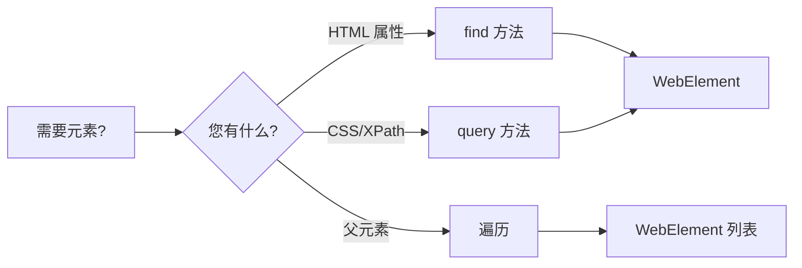
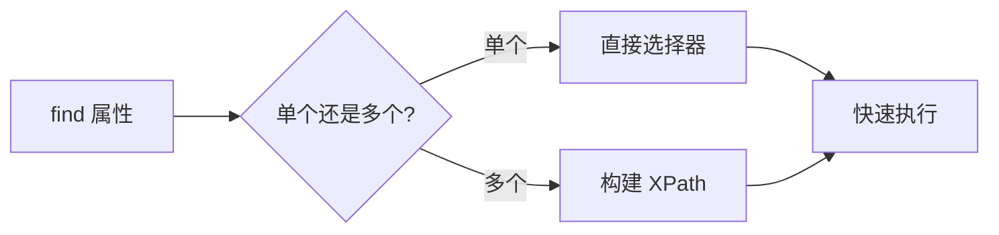
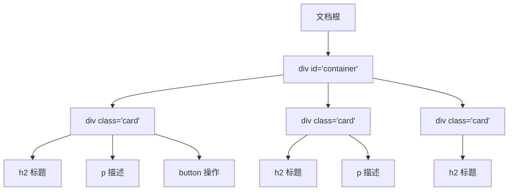
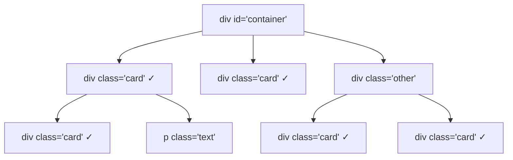
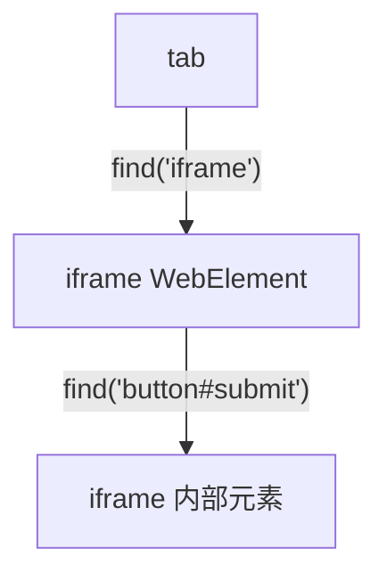
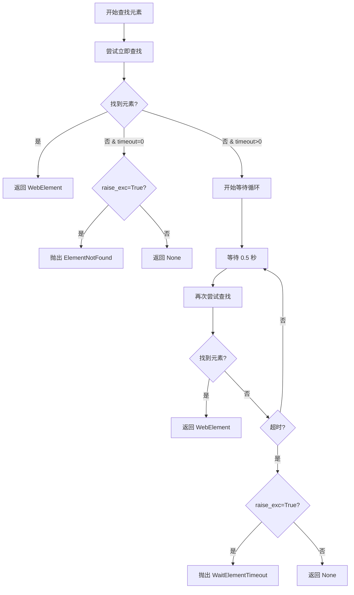

# 元素查找

在网页上查找元素是浏览器自动化的基础。Pydoll 引入了一种革命性的、直观的方法，使元素定位比传统的基于选择器的方法更强大且更易于使用。

## 为什么 Pydoll 的方法与众不同

传统的浏览器自动化工具从一开始就强迫您使用 CSS 选择器和 XPath 表达式进行思考。Pydoll 颠覆了这一点：您使用自然的 HTML 属性描述您要查找的内容，Pydoll 会找出最佳的选择器策略。

```python
# 传统方法（其他工具）
element = driver.find_element(By.XPATH, "//input[@type='email' and @name='username']")

# Pydoll 的方法
element = await tab.find(tag_name="input", type="email", name="username")
```

两者找到相同的元素，但 Pydoll 的语法更清晰、更易维护、更不容易出错。

### 元素查找方法概述

Pydoll 提供三种主要的元素查找方法：

| 方法 | 使用场景 | 示例 |
|--------|----------|---------|
| **`find()`** | 您知道 HTML 属性 | `await tab.find(id="username")` |
| **`query()`** | 您有 CSS/XPath 选择器 | `await tab.query("div.content")` |
| **遍历** | 您想从已知元素探索 | `await element.get_children_elements()` |



!!! info "深入探讨：工作原理"
    好奇 Pydoll 如何在底层实现元素查找？查看 [FindElements Mixin](../deep-dive/find-elements-mixin.md) 文档，了解架构、性能优化和内部选择器策略。

## find() 方法：自然元素选择

`find()` 方法是您定位元素的主要工具。它接受常见的 HTML 属性作为参数，并自动构建最有效的选择器。

### 基本用法

```python
import asyncio
from pydoll.browser.chromium import Chrome

async def basic_finding():
    async with Chrome() as browser:
        tab = await browser.start()
        await tab.go_to('https://example.com')
        
        # 按 ID 查找（最常见且最快）
        username = await tab.find(id="username")
        
        # 按类名查找
        submit_button = await tab.find(class_name="btn-primary")
        
        # 按标签名查找
        first_paragraph = await tab.find(tag_name="p")
        
        # 按 name 属性查找
        email_field = await tab.find(name="email")
        
        # 按文本内容查找
        login_link = await tab.find(text="Login")

asyncio.run(basic_finding())
```

### 组合属性以提高精度

`find()` 的真正威力来自组合多个属性来创建精确的选择器：

```python
import asyncio
from pydoll.browser.chromium import Chrome

async def precise_finding():
    async with Chrome() as browser:
        tab = await browser.start()
        await tab.go_to('https://example.com/form')
        
        # 组合标签名和类型
        password_input = await tab.find(tag_name="input", type="password")
        
        # 组合标签、类和自定义属性
        submit_button = await tab.find(
            tag_name="button",
            class_name="btn",
            type="submit"
        )
        
        # 使用 data 属性
        product_card = await tab.find(
            tag_name="div",
            data_testid="product-card",
            data_category="electronics"
        )
        
        # 组合多个条件
        specific_link = await tab.find(
            tag_name="a",
            class_name="nav-link",
            href="/dashboard"
        )

asyncio.run(precise_finding())
```

!!! info "组合逻辑：AND"
    在 `find()` 中组合属性作为 AND 操作。元素必须匹配**所有**提供的属性。
    
    对于需要 OR 逻辑的更复杂场景 - 例如查找可能具有 `id` 或不同 `name` 的元素 - 正确的方法是链接多个 `find()` 调用，如"完整示例"部分所示。

!!! tip "属性命名约定"
    对于带连字符的属性名使用下划线。例如，`data-testid` 变成 `data_testid`，`aria-label` 变成 `aria_label`。Pydoll 会自动将它们转换为正确的格式。

### find() 如何选择最佳策略

Pydoll 根据您提供的属性自动选择最有效的选择器：

| 提供的属性 | 使用的策略 | 性能 |
|---------------------|---------------|-------------|
| 单个：`id` | `By.ID` | ⚡ 最快 |
| 单个：`class_name` | `By.CLASS_NAME` | ⚡ 快 |
| 单个：`name` | `By.NAME` | ⚡ 快 |
| 单个：`tag_name` | `By.TAG_NAME` | ⚡ 快 |
| 单个：`text` | `By.XPATH` | ⚡ 快 |
| 多个属性 | XPath 表达式 | ✓ 高效 |



### 查找多个元素

使用 `find_all=True` 获取所有匹配元素的列表：

```python
import asyncio
from pydoll.browser.chromium import Chrome

async def find_multiple():
    async with Chrome() as browser:
        tab = await browser.start()
        await tab.go_to('https://example.com/products')
        
        # 查找所有产品卡片
        products = await tab.find(class_name="product-card", find_all=True)
        print(f"找到 {len(products)} 个产品")
        
        # 查找导航中的所有链接
        nav_links = await tab.find(
            tag_name="a",
            class_name="nav-link",
            find_all=True
        )
        
        # 处理每个元素
        for link in nav_links:
            text = await link.text
            href = await link.get_attribute("href")
            print(f"链接: {text} → {href}")

asyncio.run(find_multiple())
```

### 等待动态元素

现代 Web 应用程序动态加载内容。使用 `timeout` 等待元素出现：

```python
import asyncio
from pydoll.browser.chromium import Chrome

async def wait_for_elements():
    async with Chrome() as browser:
        tab = await browser.start()
        await tab.go_to('https://example.com/dashboard')
        
        # 等待最多 10 秒让元素出现
        dynamic_content = await tab.find(
            class_name="dynamic-content",
            timeout=10
        )
        
        # 等待 AJAX 加载的数据
        user_profile = await tab.find(
            id="user-profile",
            timeout=15
        )
        
        # 处理可能不会出现的元素
        optional_banner = await tab.find(
            class_name="promo-banner",
            timeout=3,
            raise_exc=False  # 如果未找到则返回 None
        )
        
        if optional_banner:
            await optional_banner.click()
        else:
            print("没有促销横幅")

asyncio.run(wait_for_elements())
```

!!! warning "超时最佳实践"
    使用合理的超时值。太短会错过加载缓慢的元素；太长会浪费时间等待不存在的元素。对于大多数动态内容，从 5-10 秒开始。

## query() 方法：直接选择器访问

对于喜欢传统选择器或需要更复杂选择逻辑的开发人员，`query()` 方法提供对 CSS 选择器和 XPath 表达式的直接访问。

### CSS 选择器

CSS 选择器速度快、广为人知，非常适合大多数用例：

```python
import asyncio
from pydoll.browser.chromium import Chrome

async def css_selector_examples():
    async with Chrome() as browser:
        tab = await browser.start()
        await tab.go_to('https://example.com')
        
        # 简单选择器
        main_nav = await tab.query("nav.main-menu")
        first_article = await tab.query("article:first-child")
        
        # 属性选择器
        submit_button = await tab.query("button[type='submit']")
        required_inputs = await tab.query("input[required]", find_all=True)
        
        # 复杂选择器
        nested = await tab.query("div.container > .content .item:nth-child(2)")
        
        # 伪类
        first_enabled_button = await tab.query("button:not([disabled])")

asyncio.run(css_selector_examples())
```

### XPath 表达式

XPath 擅长复杂的关系和文本匹配：

```python
import asyncio
from pydoll.browser.chromium import Chrome

async def xpath_examples():
    async with Chrome() as browser:
        tab = await browser.start()
        await tab.go_to('https://example.com/table')
        
        # 文本匹配
        button = await tab.query("//button[contains(text(), 'Submit')]")
        
        # 导航到父元素
        input_parent = await tab.query("//input[@name='email']/parent::div")
        
        # 查找兄弟元素
        label_input = await tab.query(
            "//label[text()='Email:']/following-sibling::input"
        )
        
        # 复杂的表格查询
        edit_button = await tab.query(
            "//tr[td[text()='John Doe']]//button[@class='btn-edit']"
        )

asyncio.run(xpath_examples())
```

!!! info "CSS vs XPath：使用哪个？"
    有关在 CSS 选择器和 XPath 之间进行选择的综合指南，包括语法参考和实际示例，请参阅[选择器指南](../deep-dive/selectors-guide.md)。

## DOM 遍历：子元素和兄弟元素

有时您需要从已知的起点探索 DOM 树。Pydoll 提供专门的方法来遍历元素关系。

### DOM 树结构

理解 DOM 树结构有助于您选择正确的遍历方法：



### 获取子元素

`get_children_elements()` 方法检索元素的后代：

```python
import asyncio
from pydoll.browser.chromium import Chrome

async def traverse_children():
    async with Chrome() as browser:
        tab = await browser.start()
        await tab.go_to('https://example.com/cards')
        
        # 获取容器
        container = await tab.find(id="cards-container")
        
        # 仅获取直接子元素（max_depth=1）
        direct_children = await container.get_children_elements(max_depth=1)
        print(f"容器有 {len(direct_children)} 个直接子元素")
        
        # 包括孙元素（max_depth=2）
        descendants = await container.get_children_elements(max_depth=2)
        print(f"找到 {len(descendants)} 个元素，深度最多为 2 级")
        
        # 按标签名过滤
        links = await container.get_children_elements(
            max_depth=3,
            tag_filter=["a"]
        )
        print(f"在容器中找到 {len(links)} 个链接")
        
        # 组合过滤器以获取特定元素
        nav_links = await container.get_children_elements(
            max_depth=2,
            tag_filter=["a", "button"]
        )

asyncio.run(traverse_children())
```

### 获取兄弟元素

`get_siblings_elements()` 方法查找同一级别的元素：

```python
import asyncio
from pydoll.browser.chromium import Chrome

async def traverse_siblings():
    async with Chrome() as browser:
        tab = await browser.start()
        await tab.go_to('https://example.com/list')
        
        # 查找活动项
        active_item = await tab.find(class_name="item-active")
        
        # 获取所有兄弟元素（不包括 active_item 本身）
        all_siblings = await active_item.get_siblings_elements()
        print(f"活动项有 {len(all_siblings)} 个兄弟元素")
        
        # 按标签过滤兄弟元素
        link_siblings = await active_item.get_siblings_elements(
            tag_filter=["a"]
        )
        
        # 处理兄弟元素
        for sibling in all_siblings:
            text = await sibling.text
            print(f"兄弟元素: {text}")

asyncio.run(traverse_siblings())
```

!!! tip "性能注意事项"
    对于大型树，DOM 遍历可能很昂贵。优先使用较浅的 `max_depth` 值和特定的 `tag_filter` 参数以最小化处理的节点数。对于深度嵌套的结构，考虑使用多个有针对性的 `find()` 调用，而不是单个深度遍历。

## 在元素内查找元素

一旦您有了一个元素，您可以使用相同的 `find()` 和 `query()` 方法在其范围内搜索。

!!! warning "重要：搜索深度行为"
    当您调用 `element.find()` 或 `element.query()` 时，Pydoll 会搜索**所有后代**（子元素、孙元素、曾孙元素等），而不仅仅是直接子元素。这是 `querySelector()` 的标准行为，符合大多数开发人员的期望。

### 理解搜索范围



```python
# 这会在树中找到所有 5 个 class='card' 的元素
# （2 个直接子元素 + 3 个嵌套后代）
cards = await container.find(class_name="card", find_all=True)
print(len(cards))  # 输出：5
```

### 基本范围搜索

```python
import asyncio
from pydoll.browser.chromium import Chrome

async def scoped_search():
    async with Chrome() as browser:
        tab = await browser.start()
        await tab.go_to('https://example.com/products')
        
        # 查找产品容器
        product_card = await tab.find(class_name="product-card")
        
        # 在产品卡片内搜索（搜索所有后代，仅返回第一个匹配项）
        product_title = await product_card.find(class_name="title")
        product_price = await product_card.find(class_name="price")
        add_button = await product_card.find(tag_name="button", text="Add to Cart")
        
        # 在范围内查询
        product_image = await product_card.query("img.product-image")
        
        # 查找容器内的所有项目（所有后代）
        nav_menu = await tab.find(class_name="nav-menu")
        menu_items = await nav_menu.find(tag_name="li", find_all=True)
        
        print(f"菜单有 {len(menu_items)} 项")

asyncio.run(scoped_search())
```

### 仅查找直接子元素

如果您需要查找**仅直接子元素**（深度 1），请使用 CSS 子组合器 `>` 或 XPath：

```python
import asyncio
from pydoll.browser.chromium import Chrome

async def direct_children_only():
    async with Chrome() as browser:
        tab = await browser.start()
        await tab.go_to('https://example.com/cards')
        
        container = await tab.find(id="cards-container")
        
        # 方法 1：CSS 子组合器（>）
        # 仅查找具有 class='card' 的直接子元素
        direct_cards = await container.query("> .card", find_all=True)
        print(f"直接子元素: {len(direct_cards)}")
        
        # 方法 2：XPath 直接子元素
        direct_divs = await container.query("./div[@class='card']", find_all=True)
        
        # 方法 3：使用 max_depth=1 的 get_children_elements()
        # （但这只按标签过滤，不按其他属性）
        direct_children = await container.get_children_elements(
            max_depth=1,
            tag_filter=["div"]
        )
        
        # 然后按类手动过滤
        cards_only = [
            child for child in direct_children
            if 'card' in (await child.get_attribute('class') or '')
        ]

asyncio.run(direct_children_only())
```

### 比较：find() vs get_children_elements()

| 特性 | `find()` / `query()` | `get_children_elements()` |
|---------|---------------------|---------------------------|
| **搜索深度** | 所有后代 | 使用 `max_depth` 可配置 |
| **过滤依据** | 任何 HTML 属性 | 仅标签名 |
| **用例** | 在子树中的任何位置查找特定元素 | 探索 DOM 结构，获取直接子元素 |
| **性能** | 针对单个属性优化 | 适合广泛探索 |
| **参数** | `tag_name="a"`（字符串） | `tag_filter=["a"]`（列表） |

```python
import asyncio
from pydoll.browser.chromium import Chrome

async def comparison_example():
    async with Chrome() as browser:
        tab = await browser.start()
        await tab.go_to('https://example.com')
        
        container = await tab.find(id="container")
        
        # 场景 1：我想要容器中任何位置的所有链接
        # 使用 find() - 搜索所有后代
        all_links = await container.find(tag_name="a", find_all=True)
        
        # 场景 2：我只想要直接子链接
        # 使用 CSS 子组合器
        direct_links = await container.query("> a", find_all=True)
        
        # 场景 3：我想要具有特定类的直接子元素
        # 使用 CSS 子组合器
        direct_cards = await container.query("> .card", find_all=True)
        
        # 场景 4：我想探索 DOM 结构
        # 使用 get_children_elements()
        direct_children = await container.get_children_elements(max_depth=1)
        
        # 场景 5：我想要深度最多为 2 的所有后代，按标签过滤
        # 使用 get_children_elements()
        shallow_links = await container.get_children_elements(
            max_depth=2,
            tag_filter=["a"]
        )

asyncio.run(comparison_example())
```

!!! tip "何时使用每种方法"
    - **使用 `find()`**：当您知道属性（class、id 等）并想搜索整个子树时
    - **使用 `query("> .class")`**：当您只需要具有特定属性的直接子元素时
    - **使用 `get_children_elements()`**：当探索 DOM 结构或仅按标签过滤时

### 常见用例

这种范围搜索对于处理重复模式非常有用，例如：

- 电子商务网站中的产品卡片
- 具有多个单元格的表格行
- 具有多个字段的表单部分
- 具有嵌套项的导航菜单

```python
import asyncio
from pydoll.browser.chromium import Chrome

async def practical_example():
    async with Chrome() as browser:
        tab = await browser.start()
        await tab.go_to('https://example.com/products')
        
        # 查找页面上的所有产品卡片
        product_cards = await tab.find(class_name="product-card", find_all=True)
        
        for card in product_cards:
            # 在每个卡片内，查找具有这些类的所有后代
            title = await card.find(class_name="product-title")
            price = await card.find(class_name="product-price")
            
            # 获取此卡片内任何位置的按钮
            buy_button = await card.find(tag_name="button", text="Buy Now")
            
            title_text = await title.text
            price_text = await price.text
            
            print(f"产品: {title_text}, 价格: {price_text}")
            
            # 点击购买按钮
            await buy_button.click()

asyncio.run(practical_example())
```

## 使用 iFrame

!!! info "提供完整的 IFrame 指南"
    本节介绍用于元素查找的基本 iframe 交互。有关包括嵌套 iframe、CAPTCHA 处理、技术深入探讨和故障排除的综合指南，请参阅**[使用 IFrame](automation/iframes.md)**。

iFrame 在浏览器自动化中提出了特殊的挑战，因为它们具有单独的 DOM 上下文。Pydoll 使 iframe 交互无缝：

### iFrame 上下文隔离


```python
import asyncio
from pydoll.browser.chromium import Chrome

async def iframe_interaction():
    async with Chrome() as browser:
        tab = await browser.start()
        await tab.go_to('https://example.com/page-with-iframe')

        iframe = await tab.query("iframe.embedded-content", timeout=10)

        # WebElement 辅助方法会自动在 iframe 内执行
        iframe_button = await iframe.find(tag_name="button", class_name="submit")
        await iframe_button.click()

        iframe_input = await iframe.find(id="captcha-input")
        await iframe_input.type_text("verification-code")

        # 如果还有内层 iframe，继续链式查找
        inner_iframe = await iframe.find(tag_name="iframe")
        download_link = await inner_iframe.find(text="下载 PDF")
        await download_link.click()

asyncio.run(iframe_interaction())
```
!!! note "iframe 中的截图"
    `tab.take_screenshot()` 只能作用于顶层 target。想要截取 iframe 内容，请锁定 iframe 内部的某个元素，使用 `element.take_screenshot()`。

## 错误处理策略

健壮的自动化需要处理元素不存在或出现时间超过预期的情况。

### 元素查找流程与错误处理



### 使用 raise_exc 参数

控制在未找到元素时是否抛出异常：

```python
import asyncio
from pydoll.browser.chromium import Chrome
from pydoll.exceptions import ElementNotFound

async def error_handling():
    async with Chrome() as browser:
        tab = await browser.start()
        await tab.go_to('https://example.com')
        
        # 如果未找到则抛出异常（默认行为）
        try:
            critical_element = await tab.find(id="must-exist")
        except ElementNotFound:
            print("缺少关键元素！无法继续。")
            return
        
        # 如果未找到则返回 None（可选元素）
        optional_banner = await tab.find(
            class_name="promo-banner",
            raise_exc=False
        )
        
        if optional_banner:
            print("找到横幅，正在关闭它")
            close_button = await optional_banner.find(class_name="close-btn")
            await close_button.click()
        else:
            print("没有横幅，继续")

asyncio.run(error_handling())
```

## 最佳实践

### 1. 优先使用稳定的选择器

使用不太可能改变的属性：

```python
# 好：语义属性
await tab.find(id="user-profile")  # ID 通常是稳定的
await tab.find(data_testid="submit-button")  # 测试 ID 专为自动化设计
await tab.find(name="username")  # 表单名称是稳定的

# 避免：结构依赖
await tab.query("div > div > div:nth-child(3) > input")  # 脆弱，容易损坏
```

### 2. 使用最简单的有效选择器

从简单开始，仅在需要时添加复杂性：

```python
# 好：简单明了
await tab.find(id="login-form")

# 不必要：过于复杂
await tab.query("//div[@id='content']/descendant::form[@id='login-form']")
```

### 3. 选择正确的方法

- 使用 `find()` 进行简单的基于属性的搜索
- 使用 `query()` 进行复杂的 CSS 或 XPath 模式
- 使用遍历方法从已知锚点探索

```python
# 使用 find() 处理简单情况
username = await tab.find(id="username")

# 使用 query() 处理复杂模式
active_nav_link = await tab.query("nav.menu a.active")

# 使用遍历进行基于关系的搜索
container = await tab.find(id="cards")
child_links = await container.get_children_elements(tag_filter=["a"])
```

### 4. 添加有意义的超时

不要对动态内容使用零超时，也不要永远等待可选元素：

```python
# 好：合理的超时
critical_data = await tab.find(id="data", timeout=10)
optional_popup = await tab.find(class_name="popup", timeout=2, raise_exc=False)

# 坏：动态内容没有超时
dynamic_element = await tab.find(class_name="ajax-loaded")  # 会立即失败

# 坏：可选元素的超时时间太长
banner = await tab.find(class_name="ad-banner", timeout=60)  # 浪费时间
```

### 5. 优雅地处理错误

为可能不存在的元素制定计划：

```python
# 关键元素：让异常冒泡
submit_button = await tab.find(id="submit-btn")

# 可选元素：显式处理
cookie_notice = await tab.find(class_name="cookie-notice", raise_exc=False)
if cookie_notice:
    accept_button = await cookie_notice.find(text="Accept")
    await accept_button.click()
```

## 完整示例：表单自动化

这是一个结合多种元素查找技术的完整示例：

```python
import asyncio
from pydoll.browser.chromium import Chrome
from pydoll.exceptions import ElementNotFound

async def automate_registration_form():
    async with Chrome() as browser:
        tab = await browser.start()
        
        try:
            # 导航到注册页面
            await tab.go_to('https://example.com/register', timeout=10)
            
            # 处理可选的 cookie 横幅
            cookie_banner = await tab.find(
                class_name="cookie-banner",
                timeout=2,
                raise_exc=False
            )
            if cookie_banner:
                accept = await cookie_banner.find(text="Accept")
                await accept.click()
                await asyncio.sleep(1)
            
            # 填写注册表单
            # 查找表单字段
            username_field = await tab.find(name="username", timeout=5)
            email_field = await tab.find(name="email")
            password_field = await tab.find(type="password", name="password")
            confirm_password = await tab.find(type="password", name="confirm_password")
            
            # 输入信息
            await username_field.type_text("john_doe_2024", interval=0.1)
            await email_field.type_text("john@example.com", interval=0.1)
            await password_field.type_text("SecurePass123!", interval=0.1)
            await confirm_password.type_text("SecurePass123!", interval=0.1)
            
            # 查找并勾选条款复选框
            # 尝试多种策略
            terms_checkbox = await tab.find(id="terms", raise_exc=False)
            if not terms_checkbox:
                terms_checkbox = await tab.find(name="accept_terms", raise_exc=False)
            if not terms_checkbox:
                terms_checkbox = await tab.query("input[type='checkbox']")
            
            await terms_checkbox.click()
            
            # 查找并点击提交按钮
            submit_button = await tab.find(
                tag_name="button",
                type="submit",
                timeout=2
            )
            await submit_button.click()
            
            # 等待成功消息，超时时间更长（表单处理）
            success_message = await tab.find(
                class_name="success-message",
                timeout=15
            )
            
            message_text = await success_message.text
            print(f"注册成功: {message_text}")
            
            # 验证重定向到仪表板
            await asyncio.sleep(2)
            current_url = await tab.current_url
            
            if "dashboard" in current_url:
                print("成功重定向到仪表板")
                
                # 查找欢迎消息
                welcome = await tab.find(class_name="welcome-message", timeout=5)
                welcome_text = await welcome.text
                print(f"欢迎消息: {welcome_text}")
            else:
                print(f"注册后的意外 URL: {current_url}")
                
        except ElementNotFound as e:
            print(f"元素未找到: {e}")
            # 为调试截图
            await tab.take_screenshot("error_screenshot.png")
        except Exception as e:
            print(f"意外错误: {e}")
            await tab.take_screenshot("unexpected_error.png")

asyncio.run(automate_registration_form())
```

## 了解更多

想深入了解元素查找？

- **[FindElements Mixin 深入探讨](../deep-dive/find-elements-mixin.md)**：了解架构、内部选择器策略和性能优化
- **[选择器指南](../deep-dive/selectors-guide.md)**：CSS 选择器和 XPath 的综合指南，包含语法参考和实际示例
- **[WebElement 域](../deep-dive/webelement-domain.md)**：了解找到元素后可以对元素执行的操作

元素查找是成功的浏览器自动化的基础。掌握这些技术，您将能够可靠地定位任何网页上的任何元素，无论结构多么复杂。