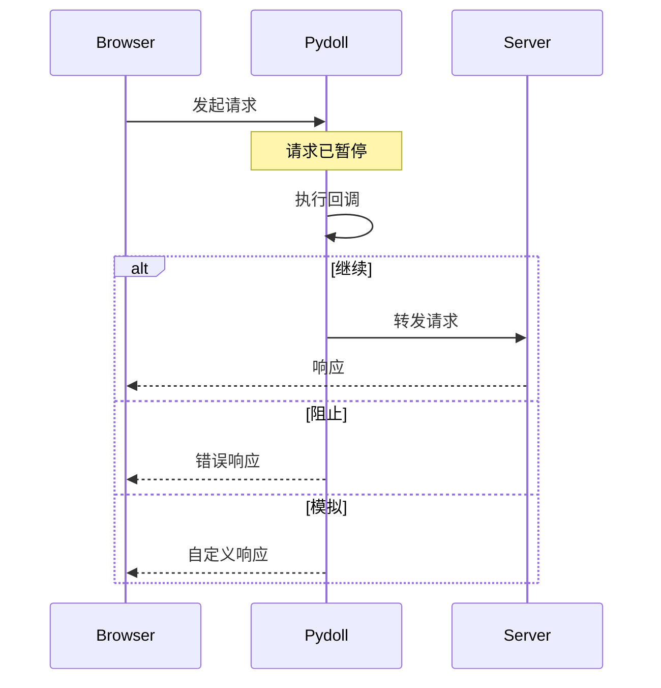

# 请求拦截

请求拦截允许您实时拦截、修改、阻止或模拟 HTTP 请求和响应。这对于测试、性能优化、内容过滤和模拟各种网络条件至关重要。

!!! info "Network 域与 Fetch 域"
    **Network 域**用于被动监控（观察流量）。**Fetch 域**用于主动拦截（修改/阻止请求）。本指南专注于拦截。有关被动监控，请参阅[网络监控](monitoring.md)。

## 理解请求拦截

当您启用请求拦截时，Pydoll 会在匹配的请求发送到服务器之前（或接收响应之后）暂停它们。然后您有三个选项：

1. **继续**：让请求继续（可选择性地进行修改）
2. **阻止**：使请求失败并返回错误
3. **模拟**：使用自定义响应满足请求



!!! warning "性能影响"
    请求拦截会为每个匹配的请求增加延迟。只拦截您需要的内容，完成后禁用以避免减慢页面加载速度。

## 启用请求拦截

在拦截请求之前，您必须启用 Fetch 域：

```python
import asyncio
from pydoll.browser.chromium import Chrome

async def main():
    async with Chrome() as browser:
        tab = await browser.start()
        
        # 启用 fetch 事件（默认拦截所有请求）
        await tab.enable_fetch_events()
        
        await tab.go_to('https://example.com')
        
        # 完成后禁用
        await tab.disable_fetch_events()

asyncio.run(main())
```

### 选择性拦截

您可以按资源类型过滤要拦截的请求：

```python
import asyncio
from pydoll.browser.chromium import Chrome

async def selective_interception():
    async with Chrome() as browser:
        tab = await browser.start()
        
        # 仅拦截图片和样式表
        await tab.enable_fetch_events(
            resource_type='Image'  # 或 'Stylesheet'、'Script' 等
        )
        
        await tab.go_to('https://example.com')
        await tab.disable_fetch_events()

asyncio.run(selective_interception())
```

!!! tip "资源类型"
    参见[资源类型参考](#resource-types-reference)部分以获取可拦截资源类型的完整列表。

## 拦截请求

使用 `RequestPaused` 事件来拦截请求：

```python
import asyncio
from pydoll.browser.chromium import Chrome
from pydoll.protocol.fetch.events import FetchEvent, RequestPausedEvent

async def basic_interception():
    async with Chrome() as browser:
        tab = await browser.start()
        
        # 带有类型提示的回调以获得 IDE 支持
        async def handle_request(event: RequestPausedEvent):
            request_id = event['params']['requestId']
            url = event['params']['request']['url']
            
            print(f"已拦截: {url}")
            
            # 继续请求而不进行修改
            await tab.continue_request(request_id)
        
        await tab.enable_fetch_events()
        await tab.on(FetchEvent.REQUEST_PAUSED, handle_request)
        
        await tab.go_to('https://example.com')
        await asyncio.sleep(3)
        
        await tab.disable_fetch_events()

asyncio.run(basic_interception())
```

!!! info "类型提示以获得更好的 IDE 支持"
    使用 `RequestPausedEvent` 等类型提示来获得事件键的自动完成。所有事件类型都在 `pydoll.protocol.fetch.events` 中。

!!! note "生产就绪的等待"
    本指南中的示例使用 `asyncio.sleep()` 以简化。在生产代码中，考虑使用更明确的等待策略，如等待特定元素或实现网络空闲检测。有关高级技术，请参阅[网络监控](monitoring.md)指南。

## 常见用例

### 1. 阻止资源以节省带宽

阻止图片、样式表或其他资源以加快页面加载速度：

```python
import asyncio
from pydoll.browser.chromium import Chrome
from pydoll.protocol.fetch.events import FetchEvent, RequestPausedEvent
from pydoll.protocol.network.types import ErrorReason

async def block_images():
    async with Chrome() as browser:
        tab = await browser.start()
        
        blocked_count = 0
        
        async def block_resource(event: RequestPausedEvent):
            nonlocal blocked_count
            request_id = event['params']['requestId']
            resource_type = event['params']['resourceType']
            url = event['params']['request']['url']
            
            # 阻止图片和样式表
            if resource_type in ['Image', 'Stylesheet']:
                blocked_count += 1
                print(f"🚫 已阻止 {resource_type}: {url[:60]}")
                await tab.fail_request(request_id, ErrorReason.BLOCKED_BY_CLIENT)
            else:
                # 继续其他请求
                await tab.continue_request(request_id)
        
        await tab.enable_fetch_events()
        await tab.on(FetchEvent.REQUEST_PAUSED, block_resource)
        
        await tab.go_to('https://example.com')
        await asyncio.sleep(3)
        
        print(f"\n📊 总共阻止: {blocked_count} 个资源")
        
        await tab.disable_fetch_events()

asyncio.run(block_images())
```

### 2. 修改请求头

在发送请求之前添加、修改或删除请求头：

```python
import asyncio
from pydoll.browser.chromium import Chrome
from pydoll.protocol.fetch.events import FetchEvent, RequestPausedEvent
from pydoll.protocol.fetch.types import HeaderEntry

async def modify_headers():
    async with Chrome() as browser:
        tab = await browser.start()
        
        async def add_custom_headers(event: RequestPausedEvent):
            request_id = event['params']['requestId']
            url = event['params']['request']['url']
            
            # 仅修改 API 请求
            if '/api/' in url:
                # 构建自定义请求头（使用 HeaderEntry 类型提示以获得 IDE 支持）
                headers: list[HeaderEntry] = [
                    {'name': 'X-Custom-Header', 'value': 'MyValue'},
                    {'name': 'Authorization', 'value': 'Bearer my-token-123'},
                ]
                
                print(f"✨ 已修改请求头: {url}")
                await tab.continue_request(request_id, headers=headers)
            else:
                await tab.continue_request(request_id)
        
        await tab.enable_fetch_events()
        await tab.on(FetchEvent.REQUEST_PAUSED, add_custom_headers)
        
        await tab.go_to('https://your-app.com')
        await asyncio.sleep(3)
        
        await tab.disable_fetch_events()

asyncio.run(modify_headers())
```

!!! tip "请求头类型提示"
    `HeaderEntry` 是来自 `pydoll.protocol.fetch.types` 的 `TypedDict`。将其用作类型提示可为您提供 `name` 和 `value` 键的 IDE 自动完成。您也可以使用普通字典而不使用类型提示。

!!! tip "请求头管理"
    当您提供自定义请求头时，它们会**替换**所有现有请求头。如果需要，请确保包含必要的请求头，如 `User-Agent`、`Accept` 等。

### 3. 模拟 API 响应

用自定义模拟数据替换真实的 API 响应：

```python
import asyncio
import json
import base64
from pydoll.browser.chromium import Chrome
from pydoll.protocol.fetch.events import FetchEvent, RequestPausedEvent
from pydoll.protocol.fetch.types import HeaderEntry

async def mock_api_responses():
    async with Chrome() as browser:
        tab = await browser.start()
        
        async def mock_response(event: RequestPausedEvent):
            request_id = event['params']['requestId']
            url = event['params']['request']['url']
            
            # 模拟特定的 API 端点
            if '/api/users' in url:
                # 创建模拟响应数据
                mock_data = {
                    'users': [
                        {'id': 1, 'name': 'Mock User 1'},
                        {'id': 2, 'name': 'Mock User 2'},
                    ],
                    'total': 2
                }
                
                # 转换为 JSON 并进行 base64 编码
                body_json = json.dumps(mock_data)
                body_base64 = base64.b64encode(body_json.encode()).decode()
                
                # 响应头
                headers: list[HeaderEntry] = [
                    {'name': 'Content-Type', 'value': 'application/json'},
                    {'name': 'Access-Control-Allow-Origin', 'value': '*'},
                ]
                
                print(f"🎭 已模拟响应: {url}")
                await tab.fulfill_request(
                    request_id=request_id,
                    response_code=200,
                    response_headers=headers,
                    body=body_base64,
                    response_phrase='OK'
                )
            else:
                # 正常继续其他请求
                await tab.continue_request(request_id)
        
        await tab.enable_fetch_events()
        await tab.on(FetchEvent.REQUEST_PAUSED, mock_response)
        
        await tab.go_to('https://your-app.com')
        await asyncio.sleep(3)
        
        await tab.disable_fetch_events()

asyncio.run(mock_api_responses())
```

!!! warning "需要 Base64 编码"
    `fulfill_request()` 中的 `body` 参数必须经过 base64 编码。使用 Python 的 `base64` 模块对响应数据进行编码。

### 4. 修改请求 URL

将请求重定向到不同的 URL：

```python
import asyncio
from pydoll.browser.chromium import Chrome
from pydoll.protocol.fetch.events import FetchEvent, RequestPausedEvent

async def redirect_requests():
    async with Chrome() as browser:
        tab = await browser.start()
        
        async def redirect_url(event: RequestPausedEvent):
            request_id = event['params']['requestId']
            original_url = event['params']['request']['url']
            
            # 将 CDN 请求重定向到本地服务器
            if 'cdn.example.com' in original_url:
                new_url = original_url.replace(
                    'cdn.example.com',
                    'localhost:8080'
                )
                print(f"🔀 已重定向: {original_url} → {new_url}")
                await tab.continue_request(request_id, url=new_url)
            else:
                await tab.continue_request(request_id)
        
        await tab.enable_fetch_events()
        await tab.on(FetchEvent.REQUEST_PAUSED, redirect_url)
        
        await tab.go_to('https://example.com')
        await asyncio.sleep(3)
        
        await tab.disable_fetch_events()

asyncio.run(redirect_requests())
```

### 5. 修改请求体

在发送之前修改 POST 数据：

```python
import asyncio
import base64
from pydoll.browser.chromium import Chrome
from pydoll.protocol.fetch.events import FetchEvent, RequestPausedEvent

async def modify_post_data():
    async with Chrome() as browser:
        tab = await browser.start()
        
        async def modify_body(event: RequestPausedEvent):
            request_id = event['params']['requestId']
            method = event['params']['request']['method']
            url = event['params']['request']['url']
            
            # 修改 POST 请求
            if method == 'POST' and '/api/submit' in url:
                # 创建新的 POST 数据
                new_data = '{"modified": true, "timestamp": 123456789}'
                post_data_base64 = base64.b64encode(new_data.encode()).decode()
                
                print(f"✏️  已修改 POST 数据: {url}")
                await tab.continue_request(
                    request_id,
                    post_data=post_data_base64
                )
            else:
                await tab.continue_request(request_id)
        
        await tab.enable_fetch_events()
        await tab.on(FetchEvent.REQUEST_PAUSED, modify_body)
        
        await tab.go_to('https://your-app.com/form')
        await asyncio.sleep(3)
        
        await tab.disable_fetch_events()

asyncio.run(modify_post_data())
```

### 6. 处理身份验证挑战

手动响应 HTTP 身份验证挑战（基本身份验证、摘要身份验证等）：

```python
import asyncio
from pydoll.browser.chromium import Chrome
from pydoll.protocol.fetch.events import FetchEvent, AuthRequiredEvent
from pydoll.protocol.fetch.types import AuthChallengeResponseType

async def handle_auth():
    async with Chrome() as browser:
        tab = await browser.start()
        
        async def respond_to_auth(event: AuthRequiredEvent):
            request_id = event['params']['requestId']
            auth_challenge = event['params']['authChallenge']
            
            print(f"🔐 来自以下来源的身份验证挑战: {auth_challenge['origin']}")
            print(f"   方案: {auth_challenge['scheme']}")
            print(f"   领域: {auth_challenge.get('realm', 'N/A')}")
            
            # 为身份验证挑战提供凭据
            await tab.continue_with_auth(
                request_id=request_id,
                auth_challenge_response=AuthChallengeResponseType.PROVIDE_CREDENTIALS,
                proxy_username='myuser',
                proxy_password='mypassword'
            )
        
        # 启用并处理身份验证
        await tab.enable_fetch_events(handle_auth=True)
        await tab.on(FetchEvent.AUTH_REQUIRED, respond_to_auth)
        
        await tab.go_to('https://httpbin.org/basic-auth/myuser/mypassword')
        await asyncio.sleep(3)
        
        await tab.disable_fetch_events()

asyncio.run(handle_auth())
```

!!! note "自动代理身份验证"
    **Pydoll 在您通过浏览器选项配置代理凭据时会自动处理代理身份验证**（407 需要代理身份验证）。此示例演示了身份验证挑战的**手动处理**，这对于以下情况很有用：
    
    - 来自服务器的 HTTP 基本/摘要身份验证（401 未经授权）
    - 自定义身份验证流程
    - 基于挑战的动态凭据选择
    - 测试身份验证失败场景
    
    对于标准代理使用，只需在浏览器选项中配置您的代理凭据 - 无需手动处理！

### 7. 模拟网络错误

测试您的应用程序如何处理网络故障：

```python
import asyncio
from pydoll.browser.chromium import Chrome
from pydoll.protocol.fetch.events import FetchEvent, RequestPausedEvent
from pydoll.protocol.network.types import ErrorReason

async def simulate_errors():
    async with Chrome() as browser:
        tab = await browser.start()
        
        request_count = 0
        
        async def fail_some_requests(event: RequestPausedEvent):
            nonlocal request_count
            request_id = event['params']['requestId']
            url = event['params']['request']['url']
            
            request_count += 1
            
            # 每三个请求失败一次
            if request_count % 3 == 0:
                print(f"❌ 模拟超时: {url[:60]}")
                await tab.fail_request(request_id, ErrorReason.TIMED_OUT)
            else:
                await tab.continue_request(request_id)
        
        await tab.enable_fetch_events()
        await tab.on(FetchEvent.REQUEST_PAUSED, fail_some_requests)
        
        await tab.go_to('https://example.com')
        await asyncio.sleep(3)
        
        await tab.disable_fetch_events()

asyncio.run(simulate_errors())
```

## 请求阶段

您可以在不同阶段拦截请求：

```python
import asyncio
from pydoll.browser.chromium import Chrome
from pydoll.protocol.fetch.types import RequestStage

async def intercept_responses():
    async with Chrome() as browser:
        tab = await browser.start()
        
        # 拦截响应而不是请求
        await tab.enable_fetch_events(request_stage=RequestStage.RESPONSE)
        
        # 现在您可以在响应到达页面之前修改它们
        await tab.go_to('https://example.com')
        await asyncio.sleep(3)
        
        await tab.disable_fetch_events()

asyncio.run(intercept_responses())
```

| 阶段 | 拦截时机 | 用例 |
|-------|------------------|-----------|
| `Request`（默认） | 请求发送之前 | 修改请求头、阻止请求、更改 URL |
| `Response` | 接收响应之后 | 修改响应体、更改状态码 |

!!! tip "响应拦截"
    在拦截响应时，您可以在 `continue_request()` 中使用 `intercept_response=True` 来同时拦截该特定请求的响应。

## 资源类型参考

| 资源类型 | 描述 | 常见文件扩展名 |
|---------------|-------------|------------------------|
| `Document` | HTML 文档 | `.html` |
| `Stylesheet` | CSS 文件 | `.css` |
| `Image` | 图片资源 | `.jpg`、`.png`、`.gif`、`.webp`、`.svg` |
| `Media` | 音频/视频 | `.mp4`、`.webm`、`.mp3`、`.ogg` |
| `Font` | 网络字体 | `.woff`、`.woff2`、`.ttf`、`.otf` |
| `Script` | JavaScript | `.js` |
| `TextTrack` | 字幕 | `.vtt`、`.srt` |
| `XHR` | XMLHttpRequest | AJAX 请求 |
| `Fetch` | Fetch API | 现代 API 调用 |
| `EventSource` | 服务器发送事件 | 实时流 |
| `WebSocket` | WebSocket | 双向通信 |
| `Manifest` | Web 应用清单 | PWA 配置 |
| `Other` | 其他类型 | 杂项 |

## 错误原因参考

在 `fail_request()` 中使用这些来模拟不同的网络故障：

| 错误原因 | 描述 | 用例 |
|--------------|-------------|----------|
| `FAILED` | 通用失败 | 常规错误 |
| `ABORTED` | 请求中止 | 用户取消 |
| `TIMED_OUT` | 请求超时 | 网络超时 |
| `ACCESS_DENIED` | 访问被拒绝 | 权限错误 |
| `CONNECTION_CLOSED` | 连接关闭 | 服务器断开连接 |
| `CONNECTION_RESET` | 连接重置 | 网络重置 |
| `CONNECTION_REFUSED` | 连接被拒绝 | 服务器无法访问 |
| `NAME_NOT_RESOLVED` | DNS 失败 | 无效的主机名 |
| `INTERNET_DISCONNECTED` | 无互联网 | 离线模式 |
| `BLOCKED_BY_CLIENT` | 客户端阻止 | 广告拦截器模拟 |
| `BLOCKED_BY_RESPONSE` | 响应被阻止 | CORS/CSP 违规 |

## 最佳实践

### 1. 始终继续或使请求失败

```python
# 好：每个暂停的请求都得到处理
async def handle_request(event: RequestPausedEvent):
    request_id = event['params']['requestId']
    try:
        # 您的逻辑在这里
        await tab.continue_request(request_id)
    except Exception as e:
        # 出错时失败以防止挂起
        await tab.fail_request(request_id, ErrorReason.FAILED)

# 坏：如果回调引发异常，请求可能会挂起
async def handle_request(event: RequestPausedEvent):
    request_id = event['params']['requestId']
    # 如果引发异常，请求将永远挂起
    await tab.continue_request(request_id)
```

### 2. 使用选择性拦截

```python
# 好：仅拦截您需要的内容
await tab.enable_fetch_events(resource_type='Image')

# 坏：拦截所有内容，减慢所有请求
await tab.enable_fetch_events()
```

### 3. 完成后禁用

```python
# 好：完成后清理
await tab.enable_fetch_events()
# ... 执行工作 ...
await tab.disable_fetch_events()

# 坏：使拦截保持启用状态
await tab.enable_fetch_events()
# ... 执行工作 ...
# （从未禁用）
```

### 4. 优雅地处理错误

```python
# 好：包装在 try/except 中
async def safe_handler(event: RequestPausedEvent):
    request_id = event['params']['requestId']
    try:
        # 可能失败的复杂逻辑
        modified_url = transform_url(event['params']['request']['url'])
        await tab.continue_request(request_id, url=modified_url)
    except Exception as e:
        print(f"处理请求时出错: {e}")
        # 出错时继续而不进行修改
        await tab.continue_request(request_id)
```

## 完整示例：高级请求控制

这是一个结合多种拦截技术的完整示例：

```python
import asyncio
import base64
import json
from pydoll.browser.chromium import Chrome
from pydoll.protocol.fetch.events import FetchEvent, RequestPausedEvent
from pydoll.protocol.fetch.types import HeaderEntry
from pydoll.protocol.network.types import ErrorReason

async def advanced_interception():
    async with Chrome() as browser:
        tab = await browser.start()
        
        stats = {
            'blocked': 0,
            'mocked': 0,
            'modified': 0,
            'continued': 0
        }
        
        async def intelligent_handler(event: RequestPausedEvent):
            request_id = event['params']['requestId']
            url = event['params']['request']['url']
            resource_type = event['params']['resourceType']
            method = event['params']['request']['method']
            
            try:
                # 阻止广告和跟踪器
                if any(tracker in url for tracker in ['analytics', 'ads', 'tracking']):
                    stats['blocked'] += 1
                    print(f"🚫 已阻止跟踪器: {url[:50]}")
                    await tab.fail_request(request_id, ErrorReason.BLOCKED_BY_CLIENT)
                
                # 模拟 API 响应
                elif '/api/config' in url:
                    stats['mocked'] += 1
                    mock_config = {'feature_x': True, 'debug_mode': False}
                    body = base64.b64encode(json.dumps(mock_config).encode()).decode()
                    headers: list[HeaderEntry] = [
                        {'name': 'Content-Type', 'value': 'application/json'},
                    ]
                    print(f"🎭 已模拟配置 API")
                    await tab.fulfill_request(
                        request_id, 200, headers, body, 'OK'
                    )
                
                # 为 API 请求添加身份验证头
                elif '/api/' in url and method == 'GET':
                    stats['modified'] += 1
                    headers: list[HeaderEntry] = [
                        {'name': 'Authorization', 'value': 'Bearer token-123'},
                    ]
                    print(f"✨ 已添加身份验证: {url[:50]}")
                    await tab.continue_request(request_id, headers=headers)
                
                # 正常继续其他所有内容
                else:
                    stats['continued'] += 1
                    await tab.continue_request(request_id)
                    
            except Exception as e:
                print(f"⚠️  处理请求时出错: {e}")
                # 出错时始终继续以防止挂起
                await tab.continue_request(request_id)
        
        # 启用拦截
        await tab.enable_fetch_events()
        await tab.on(FetchEvent.REQUEST_PAUSED, intelligent_handler)
        
        # 导航
        await tab.go_to('https://example.com')
        await asyncio.sleep(5)
        
        # 打印统计信息
        print(f"\n📊 拦截统计:")
        print(f"   已阻止: {stats['blocked']}")
        print(f"   已模拟: {stats['mocked']}")
        print(f"   已修改: {stats['modified']}")
        print(f"   已继续: {stats['continued']}")
        print(f"   总计: {sum(stats.values())}")
        
        # 清理
        await tab.disable_fetch_events()

asyncio.run(advanced_interception())
```

## 另请参阅

- **[网络监控](monitoring.md)** - 被动网络流量观察
- **[CDP Fetch 域](../../deep-dive/network-capabilities.md#fetch-domain)** - 深入了解 Fetch 域
- **[事件系统](../advanced/event-system.md)** - 了解 Pydoll 的事件架构

请求拦截是用于测试、优化和模拟的强大工具。掌握这些技术以构建强大、高效的浏览器自动化脚本。
