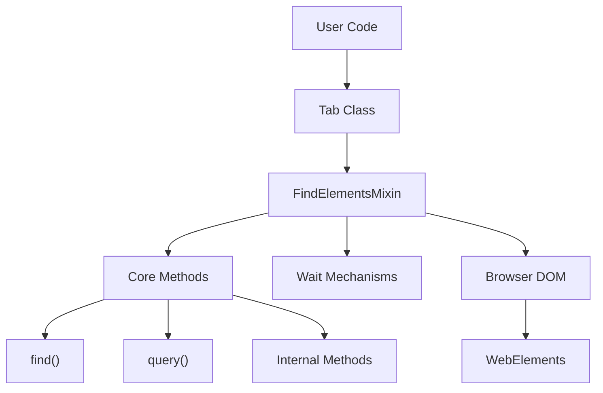
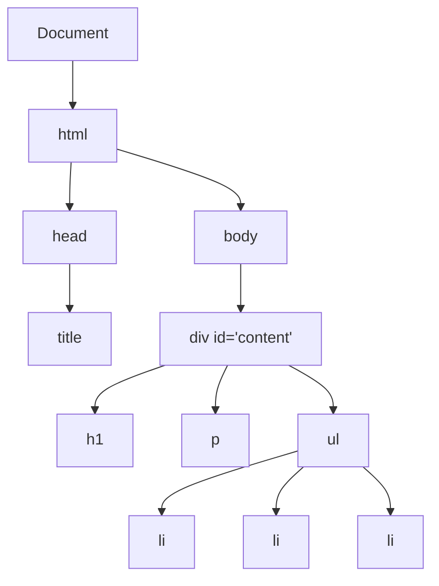
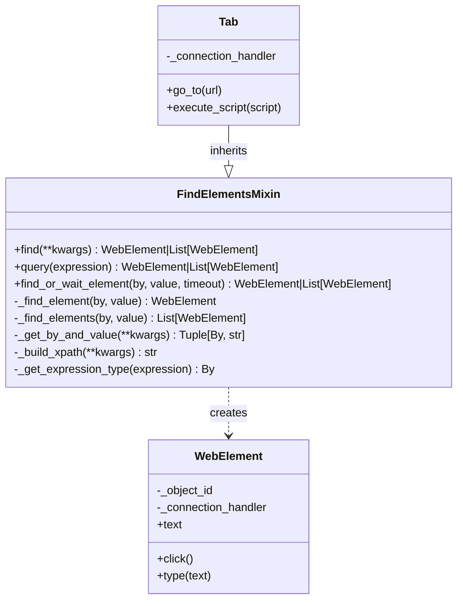

# FindElements Mixin

The FindElementsMixin is a fundamental component in Pydoll's architecture that implements element location strategies using various selector types. This mixin provides the core capabilities for finding and interacting with elements in the DOM, serving as a bridge between high-level automation code and the browser's rendering engine.



## Understanding Mixins in Python

In object-oriented programming, a mixin is a class that provides methods to other classes without being considered a base class. Unlike traditional inheritance where a subclass inherits from a parent class representing an "is-a" relationship, mixins implement a "has-a" capability relationship.

```python
# Example of a mixin in Python
class LoggerMixin:
    def log(self, message):
        print(f"LOG: {message}")
        
    def log_error(self, error):
        print(f"ERROR: {error}")

class DataProcessor(LoggerMixin):
    def process_data(self, data):
        self.log("Processing data...")
        # Process the data
        self.log("Data processing complete")
```

Mixins offer several advantages in complex software architecture:

1. **Code Reuse**: The same functionality can be used by multiple unrelated classes
2. **Separation of Concerns**: Each mixin handles a specific aspect of functionality
3. **Composition Over Inheritance**: Avoids deep inheritance hierarchies
4. **Modularity**: Features can be added or removed independently

!!! info "Mixin vs. Multiple Inheritance"
    While Python supports multiple inheritance, mixins are a specific design pattern within that capability. A mixin is not meant to be instantiated on its own and typically doesn't maintain state. It provides methods that can be used by other classes without establishing an "is-a" relationship.

## The Document Object Model (DOM)

Before diving into element selection strategies, it's important to understand the DOM, which represents the structure of an HTML document as a tree of objects.



The DOM is:

1. **Hierarchical**: Elements nest within other elements, forming parent-child relationships
2. **Manipulable**: JavaScript can modify the structure, content, and styling
3. **Queryable**: Elements can be located using various selection strategies
4. **Event-driven**: Elements can respond to user interactions and other events

### Chrome DevTools Protocol and DOM Access

Pydoll interacts with the DOM through the Chrome DevTools Protocol (CDP), which provides methods for querying and manipulating the document:

| CDP Domain | Purpose | Example Commands |
|------------|---------|------------------|
| DOM | Access to document structure | `querySelector`, `getDocument` |
| Runtime | JavaScript execution in page context | `evaluate`, `callFunctionOn` |
| Page | Page-level operations | `navigate`, `captureScreenshot` |

The CDP allows both direct DOM manipulation through the DOM domain and JavaScript-based interaction through the Runtime domain. FindElementsMixin leverages both approaches for robust element selection.

## Core API Methods

Pydoll introduces two primary methods for element finding that provide a more intuitive and flexible approach:

### The find() Method

The `find()` method provides an intuitive way to locate elements using common HTML attributes:

```python
# Find by ID
element = await tab.find(id="username")

# Find by class name
element = await tab.find(class_name="submit-button")

# Find by tag name
element = await tab.find(tag_name="button")

# Find by text content
element = await tab.find(text="Click here")

# Find by name attribute
element = await tab.find(name="email")

# Combine multiple attributes
element = await tab.find(tag_name="input", name="password", type="password")

# Find all matching elements
elements = await tab.find(class_name="item", find_all=True)

# Find with timeout
element = await tab.find(id="dynamic-content", timeout=10)
```

#### Method Signature

```python
async def find(
    self,
    id: Optional[str] = None,
    class_name: Optional[str] = None,
    name: Optional[str] = None,
    tag_name: Optional[str] = None,
    text: Optional[str] = None,
    timeout: int = 0,
    find_all: bool = False,
    raise_exc: bool = True,
    **attributes,
) -> Union[WebElement, list[WebElement], None]:
```

#### Parameters

| Parameter | Type | Description |
|-----------|------|-------------|
| `id` | `Optional[str]` | Element ID attribute value |
| `class_name` | `Optional[str]` | CSS class name to match |
| `name` | `Optional[str]` | Element name attribute value |
| `tag_name` | `Optional[str]` | HTML tag name (e.g., "div", "input") |
| `text` | `Optional[str]` | Text content to match within element |
| `timeout` | `int` | Maximum seconds to wait for elements to appear |
| `find_all` | `bool` | If True, returns all matches; if False, first match only |
| `raise_exc` | `bool` | Whether to raise exception if no elements found |
| `**attributes` | `dict` | Additional HTML attributes to match |

### The query() Method

The `query()` method provides direct access using CSS selectors or XPath expressions:

```python
# CSS selectors
element = await tab.query("div.content > p.intro")
element = await tab.query("#login-form input[type='password']")

# XPath expressions
element = await tab.query("//div[@id='content']/p[contains(text(), 'Welcome')]")
element = await tab.query("//button[text()='Submit']")

# ID shorthand (automatically detected)
element = await tab.query("#username")

# Class shorthand (automatically detected)
element = await tab.query(".submit-button")

# Find all matching elements
elements = await tab.query("div.item", find_all=True)

# Query with timeout
element = await tab.query("#dynamic-content", timeout=10)
```

#### Method Signature

```python
async def query(
    self, 
    expression: str, 
    timeout: int = 0, 
    find_all: bool = False, 
    raise_exc: bool = True
) -> Union[WebElement, list[WebElement], None]:
```

#### Parameters

| Parameter | Type | Description |
|-----------|------|-------------|
| `expression` | `str` | Selector expression (CSS, XPath, ID with #, class with .) |
| `timeout` | `int` | Maximum seconds to wait for elements to appear |
| `find_all` | `bool` | If True, returns all matches; if False, first match only |
| `raise_exc` | `bool` | Whether to raise exception if no elements found |

## Practical Usage Examples

### Basic Element Finding

```python
import asyncio
from pydoll.browser.chromium import Chrome

async def basic_element_finding():
    browser = Chrome()
    tab = await browser.start()
    
    try:
        await tab.go_to("https://example.com/login")
        
        # Find login form elements
        username_field = await tab.find(id="username")
        password_field = await tab.find(name="password")
        submit_button = await tab.find(tag_name="button", type="submit")
        
        # Interact with elements
        await username_field.type_text("user@example.com")
        await password_field.type_text("password123")
        await submit_button.click()
        
    finally:
        await browser.stop()

asyncio.run(basic_element_finding())
```

### Advanced Selector Combinations

```python
async def advanced_selectors():
    browser = Chrome()
    tab = await browser.start()
    
    try:
        await tab.go_to("https://example.com/products")
        
        # Find specific product by combining attributes
        product = await tab.find(
            tag_name="div",
            class_name="product",
            data_category="electronics",
            data_price_range="500-1000"
        )
        
        # Find all products in a category
        electronics = await tab.find(
            class_name="product",
            data_category="electronics",
            find_all=True
        )
        
        # Find element by text content
        add_to_cart = await tab.find(text="Add to Cart")
        
        print(f"Found {len(electronics)} electronics products")
        
    finally:
        await browser.stop()
```

### Using CSS Selectors and XPath

```python
async def css_and_xpath_examples():
    browser = Chrome()
    tab = await browser.start()
    
    try:
        await tab.go_to("https://example.com/table")
        
        # CSS selectors
        header_cells = await tab.query("table thead th", find_all=True)
        first_row = await tab.query("table tbody tr:first-child")
        
        # XPath for complex selections
        # Find table cell containing specific text
        price_cell = await tab.query("//td[contains(text(), '$')]")
        
        # Find button in the same row as specific text
        edit_button = await tab.query(
            "//tr[td[contains(text(), 'John Doe')]]//button[text()='Edit']"
        )
        
        # Find all rows with price > $100 (using XPath functions)
        expensive_items = await tab.query(
            "//tr[number(translate(td[3], '$,', '')) > 100]",
            find_all=True
        )
        
        print(f"Found {len(expensive_items)} expensive items")
        
    finally:
        await browser.stop()
```

## Waiting Mechanisms

The FindElementsMixin implements sophisticated waiting mechanisms for handling dynamic content:

### Timeout-Based Waiting

```python
async def waiting_examples():
    browser = Chrome()
    tab = await browser.start()
    
    try:
        await tab.go_to("https://example.com/dynamic")
        
        # Wait up to 10 seconds for element to appear
        dynamic_content = await tab.find(id="dynamic-content", timeout=10)
        
        # Wait for multiple elements
        items = await tab.find(class_name="item", timeout=5, find_all=True)
        
        # Handle cases where element might not appear
        optional_element = await tab.find(
            id="optional-banner", 
            timeout=3, 
            raise_exc=False
        )
        
        if optional_element:
            await optional_element.click()
        else:
            print("Optional banner not found, continuing...")
            
    finally:
        await browser.stop()
```

### Error Handling Strategies

```python
async def robust_element_finding():
    browser = Chrome()
    tab = await browser.start()
    
    try:
        await tab.go_to("https://example.com")
        
        # Strategy 1: Try multiple selectors
        submit_button = None
        selectors = [
            {"id": "submit"},
            {"class_name": "submit-btn"},
            {"tag_name": "button", "type": "submit"},
            {"text": "Submit"}
        ]
        
        for selector in selectors:
            try:
                submit_button = await tab.find(**selector, timeout=2)
                break
            except ElementNotFound:
                continue
        
        if not submit_button:
            raise Exception("Submit button not found with any selector")
        
        # Strategy 2: Graceful degradation
        try:
            premium_feature = await tab.find(class_name="premium-only", timeout=1)
            await premium_feature.click()
        except ElementNotFound:
            # Fall back to basic feature
            basic_feature = await tab.find(class_name="basic-feature")
            await basic_feature.click()
            
    finally:
        await browser.stop()
```

## Selector Strategy Selection

The FindElementsMixin automatically chooses the most appropriate selector strategy based on the provided parameters:

### Single Attribute Selection

When only one attribute is provided, the mixin uses the most efficient selector:

```python
# These use optimized single-attribute selectors
await tab.find(id="username")           # Uses By.ID
await tab.find(class_name="button")     # Uses By.CLASS_NAME  
await tab.find(tag_name="input")        # Uses By.TAG_NAME
await tab.find(name="email")            # Uses By.NAME
```

### Multiple Attribute Selection

When multiple attributes are provided, the mixin builds an XPath expression:

```python
# This builds XPath: //input[@type='password' and @name='password']
await tab.find(tag_name="input", type="password", name="password")

# This builds XPath: //div[@class='product' and @data-id='123']
await tab.find(tag_name="div", class_name="product", data_id="123")
```

### Expression Type Detection

The `query()` method automatically detects the expression type:

```python
# Detected as XPath (starts with //)
await tab.query("//div[@id='content']")

# Detected as ID (starts with #)
await tab.query("#username")

# Detected as class (starts with . but not ./)
await tab.query(".submit-button")

# Detected as CSS selector (default)
await tab.query("div.content > p")
```

## Internal Architecture

The FindElementsMixin implements element location through a sophisticated internal architecture:



### Core Internal Methods

#### find_or_wait_element()

The core method that handles both immediate finding and waiting:

```python
async def find_or_wait_element(
    self,
    by: By,
    value: str,
    timeout: int = 0,
    find_all: bool = False,
    raise_exc: bool = True,
) -> Union[WebElement, list[WebElement], None]:
    """
    Core element finding method with optional waiting capability.
    
    Searches for elements with flexible waiting. If timeout specified,
    repeatedly attempts to find elements with 0.5s delays until success or timeout.
    """
```

This method:
1. Determines the appropriate find method (`_find_element` or `_find_elements`)
2. Implements polling logic with 0.5-second intervals
3. Handles timeout and exception raising logic
4. Returns appropriate results based on `find_all` parameter

#### _get_by_and_value()

Converts high-level parameters into CDP-compatible selector strategies:

```python
def _get_by_and_value(
    self,
    by_map: dict[str, By],
    id: Optional[str] = None,
    class_name: Optional[str] = None,
    name: Optional[str] = None,
    tag_name: Optional[str] = None,
    text: Optional[str] = None,
    **attributes,
) -> tuple[By, str]:
```

This method:
1. Identifies which attributes were provided
2. For single attributes, returns the appropriate `By` enum and value
3. For multiple attributes, builds an XPath expression using `_build_xpath()`

#### _build_xpath()

Constructs complex XPath expressions from multiple criteria:

```python
@staticmethod
def _build_xpath(
    id: Optional[str] = None,
    class_name: Optional[str] = None,
    name: Optional[str] = None,
    tag_name: Optional[str] = None,
    text: Optional[str] = None,
    **attributes,
) -> str:
```

This method:
1. Builds the base XPath (`//tag` or `//*`)
2. Adds conditions for each provided attribute
3. Handles special cases like class names and text content
4. Combines conditions with `and` operators

### CDP Command Generation

The mixin generates appropriate CDP commands based on selector type:

#### For CSS Selectors

```python
def _get_find_element_command(self, by: By, value: str, object_id: str = ''):
    # Converts to CSS selector format
    if by == By.CLASS_NAME:
        selector = f'.{escaped_value}'
    elif by == By.ID:
        selector = f'#{escaped_value}'
    
    # Uses DOM.querySelector or Runtime.evaluate
```

#### For XPath Expressions

```python
def _get_find_element_by_xpath_command(self, xpath: str, object_id: str):
    # Uses Runtime.evaluate with document.evaluate()
    script = Scripts.FIND_XPATH_ELEMENT.replace('{escaped_value}', escaped_value)
    command = RuntimeCommands.evaluate(expression=script)
```

## Performance Considerations

### Selector Efficiency

Different selector types have varying performance characteristics:

| Selector Type | Performance | Use Case |
|---------------|-------------|----------|
| ID | Fastest | Unique elements with ID attributes |
| CSS Class | Fast | Elements with specific styling |
| Tag Name | Fast | When you need all elements of a type |
| CSS Selector | Good | Complex but common patterns |
| XPath | Slower | Complex relationships and text matching |

### Optimization Strategies

```python
# Good: Use ID when available
element = await tab.find(id="unique-element")

# Good: Use simple CSS selectors
element = await tab.query("#form .submit-button")

# Avoid: Complex XPath when CSS would work
# element = await tab.query("//div[@id='form']//button[@class='submit-button']")

# Good: Combine attributes efficiently
element = await tab.find(tag_name="input", type="email", required=True)

# Good: Use find_all=False when you only need the first match
first_item = await tab.find(class_name="item", find_all=False)
```

### Waiting Best Practices

```python
# Good: Use appropriate timeouts
quick_element = await tab.find(id="static-content", timeout=2)
slow_element = await tab.find(id="ajax-content", timeout=10)

# Good: Handle optional elements gracefully
optional = await tab.find(class_name="optional", timeout=1, raise_exc=False)

# Good: Use specific selectors to reduce false positives
specific_button = await tab.find(
    tag_name="button", 
    class_name="submit", 
    type="submit",
    timeout=5
)
```

## Error Handling

The FindElementsMixin provides comprehensive error handling:

### Exception Types

```python
from pydoll.exceptions import ElementNotFound, WaitElementTimeout

try:
    element = await tab.find(id="missing-element")
except ElementNotFound:
    print("Element not found immediately")

try:
    element = await tab.find(id="slow-element", timeout=10)
except WaitElementTimeout:
    print("Element did not appear within timeout")
```

### Graceful Handling

```python
# Option 1: Use raise_exc=False
element = await tab.find(id="optional-element", raise_exc=False)
if element:
    await element.click()

# Option 2: Try-except with fallback
try:
    primary_button = await tab.find(id="primary-action")
    await primary_button.click()
except ElementNotFound:
    # Fallback to alternative selector
    fallback_button = await tab.find(class_name="action-button")
    await fallback_button.click()
```

## Integration with WebElement

Found elements are returned as WebElement instances that provide rich interaction capabilities:

```python
# Find and interact with form elements
username = await tab.find(name="username")
await username.type_text("user@example.com")

password = await tab.find(type="password")
await password.type_text("secretpassword")

submit = await tab.find(tag_name="button", type="submit")
await submit.click()

# Get element properties
text_content = await username.text
is_visible = await username.is_visible()
attribute_value = await username.get_attribute("placeholder")
```

## Conclusion

The FindElementsMixin serves as the foundation for element interaction in Pydoll, providing a powerful and intuitive API for locating DOM elements. The combination of the `find()` and `query()` methods offers flexibility for both simple and complex element selection scenarios.

Key advantages of the FindElementsMixin design:

1. **Intuitive API**: The `find()` method uses natural HTML attribute names
2. **Flexible Selection**: Support for CSS selectors, XPath, and attribute combinations
3. **Robust Waiting**: Built-in timeout and polling mechanisms
4. **Performance Optimization**: Automatic selection of the most efficient selector strategy
5. **Error Handling**: Comprehensive exception handling with graceful degradation options

By understanding the capabilities and patterns of the FindElementsMixin, you can create robust and maintainable browser automation that handles the complexities of modern web applications.