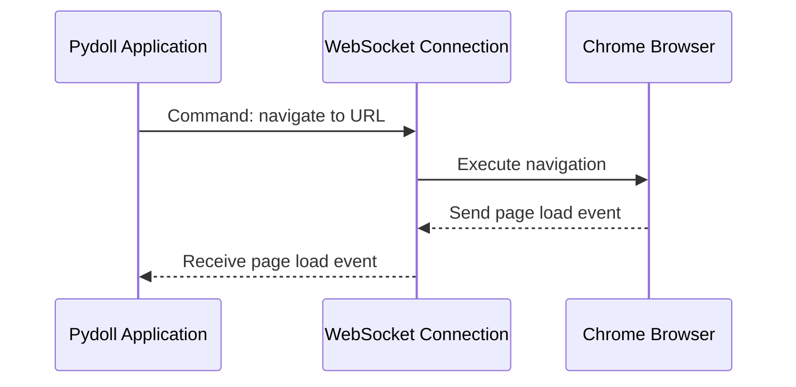
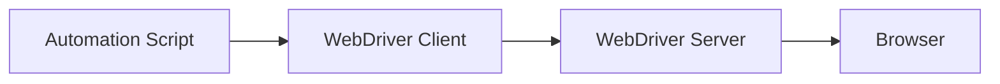
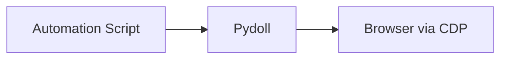
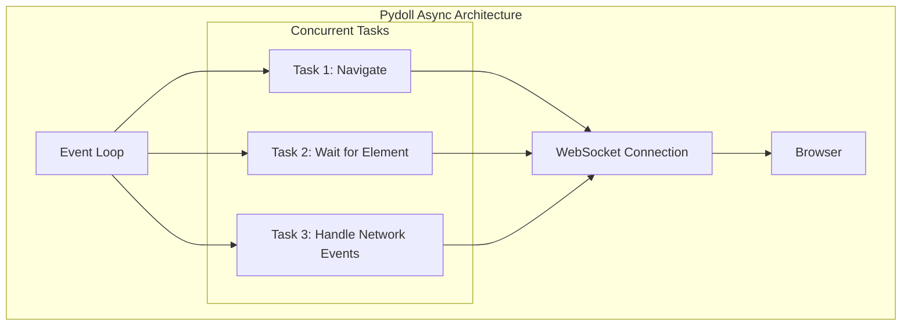

# Chrome DevTools Protocol (CDP)

The Chrome DevTools Protocol (CDP) is the foundation that enables Pydoll to control browsers without traditional webdrivers. Understanding how CDP works provides valuable insight into Pydoll's capabilities and internal architecture.


## What is CDP?

The Chrome DevTools Protocol is a powerful interface developed by the Chromium team that allows programmatic interaction with Chromium-based browsers. It's the same protocol used by Chrome DevTools when you inspect a webpage, but exposed as a programmable API that can be leveraged by automation tools.

At its core, CDP provides a comprehensive set of methods and events for interfacing with browser internals. This allows for fine-grained control over every aspect of the browser, from navigating between pages to manipulating the DOM, intercepting network requests, and monitoring performance metrics.

!!! info "CDP Evolution"
    The Chrome DevTools Protocol has been continuously evolving since its introduction. Google maintains and updates the protocol with each Chrome release, regularly adding new functionality and improving existing features.
    
    While the protocol was initially designed for Chrome's DevTools, its comprehensive capabilities have made it the foundation for next-generation browser automation tools like Puppeteer, Playwright, and of course, Pydoll.

## WebSocket Communication

One of the key architectural decisions in CDP is its use of WebSockets for communication. When a Chromium-based browser is started with the remote debugging flag enabled, it opens a WebSocket server on a specified port:

```
chrome --remote-debugging-port=9222
```

Pydoll connects to this WebSocket endpoint to establish a bidirectional communication channel with the browser. This connection:

1. **Remains persistent** throughout the automation session
2. **Enables real-time events** from the browser to be pushed to the client
3. **Allows commands** to be sent to the browser
4. **Supports binary data** for efficient transfer of screenshots, PDFs, and other assets

The WebSocket protocol is particularly well-suited for browser automation because it provides:

- **Low latency communication** - Necessary for responsive automation
- **Bidirectional messaging** - Essential for event-driven architecture
- **Persistent connections** - Eliminating connection setup overhead for each operation

Here's a simplified view of how Pydoll's communication with the browser works:



!!! info "WebSocket vs HTTP"
    Earlier browser automation protocols often relied on HTTP endpoints for communication. CDP's switch to WebSockets represents a significant architectural improvement that enables more responsive automation and real-time event monitoring.
    
    HTTP-based protocols require continuous polling to detect changes, creating overhead and delays. WebSockets allow the browser to push notifications to your automation script exactly when events occur, with minimal latency.

## Key CDP Domains

CDP is organized into logical domains, each responsible for a specific aspect of browser functionality. Some of the most important domains include:


| Domain | Responsibility | Example Use Cases |
|--------|----------------|------------------|
| **Browser** | Control of the browser application itself | Window management, browser context creation |
| **Page** | Interaction with page lifecycle | Navigation, JavaScript execution, frame management |
| **DOM** | Access to page structure | Query selectors, attribute modification, event listeners |
| **Network** | Network traffic monitoring and control | Request interception, response examination, caching |
| **Runtime** | JavaScript execution environment | Evaluate expressions, call functions, handle exceptions |
| **Input** | Simulating user interactions | Mouse movements, keyboard input, touch events |
| **Target** | Managing browser contexts and targets | Creating tabs, accessing iframes, handling popups |
| **Fetch** | Low-level network interception | Modifying requests, simulating responses, authentication |

Pydoll maps these CDP domains to a more intuitive API structure while preserving the full capabilities of the underlying protocol.

## Event-Driven Architecture

One of CDP's most powerful features is its event system. The protocol allows clients to subscribe to various events that the browser emits during normal operation. These events cover virtually every aspect of browser behavior:

- **Lifecycle events**: Page loads, frame navigation, target creation
- **DOM events**: Element changes, attribute modifications
- **Network events**: Request/response cycles, WebSocket messages
- **Execution events**: JavaScript exceptions, console messages
- **Performance events**: Metrics for rendering, scripting, and more


When you enable event monitoring in Pydoll (e.g., with `page.enable_network_events()`), the library sets up the necessary subscriptions with the browser and provides hooks for your code to react to these events.

```python
from pydoll.events.network import NetworkEvents
from functools import partial

async def on_request(page, event):
    url = event['params']['request']['url']
    print(f"Request to: {url}")

# Subscribe to network request events
await page.enable_network_events()
await page.on(NetworkEvents.REQUEST_WILL_BE_SENT, partial(on_request, page))
```

This event-driven approach allows automation scripts to react immediately to browser state changes without relying on inefficient polling or arbitrary delays.

## Performance Advantages of Direct CDP Integration

Using CDP directly, as Pydoll does, offers several performance advantages over traditional webdriver-based automation:

### 1. Elimination of Protocol Translation Layer

Traditional webdriver-based tools like Selenium use a multi-layered approach:



Each layer adds overhead, especially the WebDriver server, which acts as a translation layer between the WebDriver protocol and the browser's native APIs.

Pydoll's approach streamlines this to:



This direct communication eliminates the computational and network overhead of the intermediate server, resulting in faster operations.

### 2. Efficient Command Batching

CDP allows for the batching of multiple commands in a single message, reducing the number of round trips required for complex operations. This is particularly valuable for operations that require several steps, such as finding an element and then interacting with it.

### 3. Asynchronous Operation

CDP's WebSocket-based, event-driven architecture aligns perfectly with Python's asyncio framework, enabling true asynchronous operation. This allows Pydoll to:

- Execute multiple operations concurrently
- Process events as they occur
- Avoid blocking the main thread during I/O operations



!!! info "Async Performance Gains"
    The combination of asyncio and CDP creates a multiplicative effect on performance. In benchmark tests, Pydoll's asynchronous approach can process multiple pages in parallel with near-linear scaling, while traditional synchronous tools see diminishing returns as concurrency increases.
    
    For example, scraping 10 pages that each take 2 seconds to load might take over 20 seconds with a synchronous tool, but just over 2 seconds with Pydoll's async architecture (plus some minimal overhead).

### 4. Fine-Grained Control

CDP provides more granular control over browser behavior than the WebDriver protocol. This allows Pydoll to implement optimized strategies for common operations:

- More precise waiting conditions (vs. arbitrary timeouts)
- Direct access to browser caches and storage
- Targeted JavaScript execution in specific contexts
- Detailed network control for request optimization


## Conclusion

The Chrome DevTools Protocol forms the foundation of Pydoll's zero-webdriver approach to browser automation. By leveraging CDP's WebSocket communication, comprehensive domain coverage, event-driven architecture, and direct browser integration, Pydoll achieves superior performance and reliability compared to traditional automation tools.

In the following sections, we'll dive deeper into how Pydoll implements specific CDP domains and transforms the low-level protocol into an intuitive, developer-friendly API. 