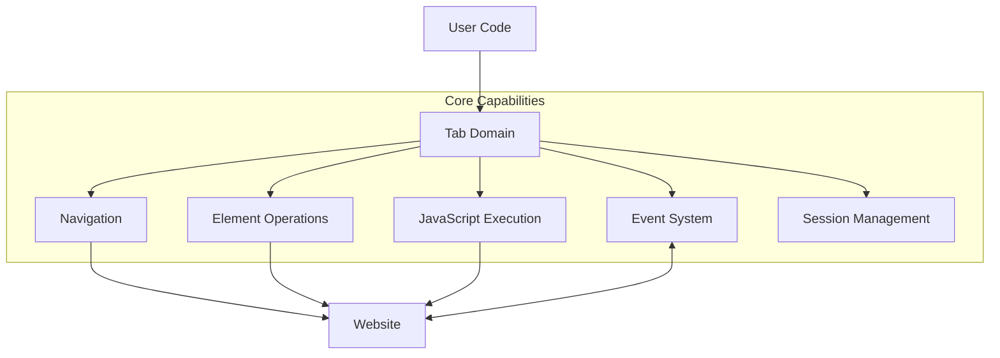
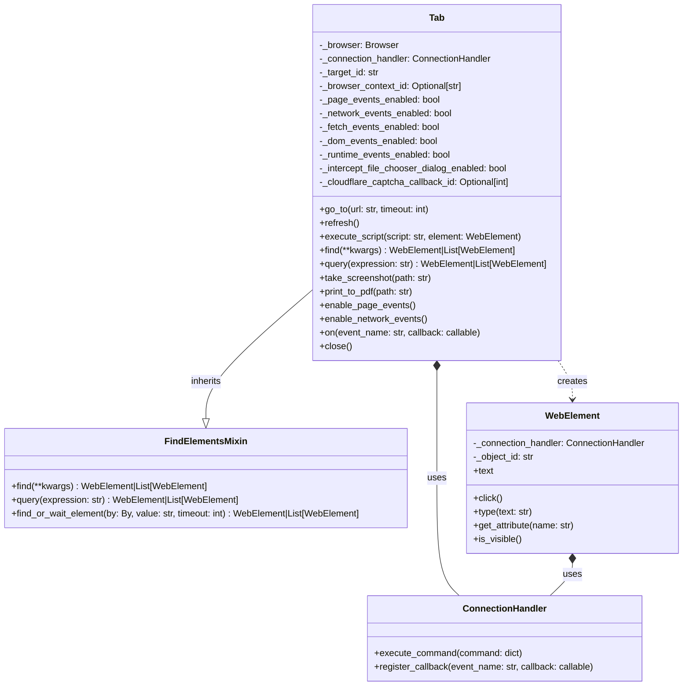
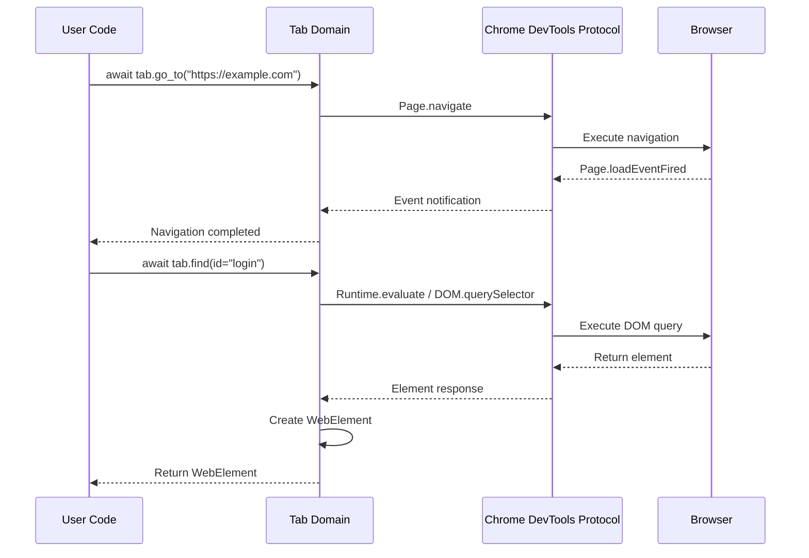
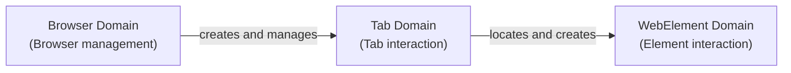

# Tab Domain

The Tab domain forms the core of Pydoll's architecture, providing a comprehensive interface for controlling browser tabs and their content. This domain bridges your high-level automation code with the browser's capabilities, enabling everything from basic navigation to complex interaction patterns.



## Technical Architecture

The Tab domain in Pydoll acts as an integration layer between your automation code and multiple Chrome DevTools Protocol (CDP) domains. It's implemented as a concrete class that integrates multiple functional capabilities through composition and inheritance.



The design leverages several key patterns:

1. **Inheritance** - The Tab class inherits from FindElementsMixin to gain element location capabilities
2. **Composition** - It uses a ConnectionHandler to manage CDP communication
3. **Factory Method** - It creates WebElement instances when finding elements in the tab
4. **Command** - It translates high-level methods into CDP commands
5. **Observer** - It implements an event system for reacting to browser events

### CDP Integration

The Tab domain integrates with multiple CDP domains to provide its functionality:

| CDP Domain | Purpose |
|------------|---------|
| **Page** | Core page lifecycle and navigation |
| **Runtime** | JavaScript execution in page context |
| **DOM** | Document structure and element access |
| **Network** | Network operations and cookie management |
| **Fetch** | Request interception and modification |
| **Storage** | Cookie and storage management |

This integration creates a powerful abstraction that simplifies browser automation while providing access to the full capabilities of the underlying protocol.



## Initialization and State Management

The Tab class is initialized with parameters from the browser instance:

```python
def __init__(
    self,
    browser: 'Browser',
    connection_port: int,
    target_id: str,
    browser_context_id: Optional[str] = None,
):
    """
    Initialize tab controller for existing browser tab.

    Args:
        browser: Browser instance that created this tab.
        connection_port: CDP WebSocket port.
        target_id: CDP target identifier for this tab.
        browser_context_id: Optional browser context ID.
    """
    self._browser = browser
    self._connection_port = connection_port
    self._target_id = target_id
    self._connection_handler = ConnectionHandler(connection_port, target_id)
    self._page_events_enabled = False
    self._network_events_enabled = False
    self._fetch_events_enabled = False
    self._dom_events_enabled = False
    self._runtime_events_enabled = False
    self._intercept_file_chooser_dialog_enabled = False
    self._cloudflare_captcha_callback_id = None
    self._browser_context_id = browser_context_id
```

The Tab class maintains several state flags to track which event domains are currently enabled. This state management is crucial for:

1. Preventing duplicate event registrations
2. Accurately reflecting the current capabilities of the tab
3. Enabling proper cleanup when the tab is closed

## Core Patterns and Usage

The Tab domain follows a consistent pattern for interaction in Pydoll v2.0+:

```python
import asyncio
from pydoll.browser.chromium import Chrome

async def pydoll_example():
    # Create a browser instance and get initial tab
    browser = Chrome()
    tab = await browser.start()  # Returns Tab directly
    
    try:
        # Work with the tab...
        await tab.go_to("https://example.com")
        
        # Find and interact with elements
        button = await tab.find(id="submit")
        await button.click()
        
    finally:
        # Clean up when done
        await browser.stop()

# Run your example with asyncio
asyncio.run(pydoll_example())
```

Most examples in this documentation assume a browser and tab have already been created and will be properly cleaned up.

## Navigation System

The Tab domain provides a fluid navigation experience through a combination of methods that abstract the complexities of browser navigation:

```python
# Navigate to a page with custom timeout
await tab.go_to("https://example.com", timeout=60)

# Get the current URL
current_url = await tab.current_url
print(f"Current URL: {current_url}")

# Get the page source
source = await tab.page_source
print(f"Page source length: {len(source)}")

# Refresh the page
await tab.refresh()
```

!!! tip "Advanced Navigation"
    For specialized navigation scenarios, you can combine navigation with event listeners:
    
    ```python
    # Listen for network requests during navigation
    await tab.enable_network_events()
    await tab.on('Network.responseReceived', handle_response)
    
    # Navigate to the page
    await tab.go_to('https://example.com')
    ```

Under the hood, the navigation system performs several operations:

1. Sends the navigation command through the connection handler
2. Monitors page load status through periodic JavaScript evaluation
3. Manages timeouts to prevent infinite waits
4. Handles refresh optimization if navigating to the current URL


## JavaScript Execution

The JavaScript execution system in the Tab domain provides two distinct execution modes:

1. **Global Execution**: Evaluates JavaScript in the global page context
2. **Element Context Execution**: Executes JavaScript with an element as the context

```python
# Execute JavaScript in page context
dimensions = await tab.execute_script("""
    return {
        width: window.innerWidth,
        height: window.innerHeight,
        devicePixelRatio: window.devicePixelRatio
    }
""")
print(f"Window dimensions: {dimensions}")

# Find an element and manipulate it with JavaScript
heading = await tab.find(tag_name="h1")

# Execute JavaScript with the element as context
await tab.execute_script("""
    // 'argument' refers to the element
    argument.style.color = 'red';
    argument.style.fontSize = '32px';
    argument.textContent = 'Modified by JavaScript';
""", heading)
```

!!! warning "Script Execution Security"
    When executing scripts, be aware of security implications:
    
    - Scripts run with the full permissions of the page
    - Input validation is crucial if script content includes user data
    - Consider using element methods instead of scripts for standard operations

The implementation transforms the provided JavaScript code and parameters to match the CDP requirements:

1. For global execution: 
   - The script is sent directly to Runtime.evaluate
2. For element context execution:
   - The script is wrapped in a function
   - 'argument' references are replaced with 'this'
   - The function is called with the element's objectId as context

## Session State Management

The Tab domain implements sophisticated session state management that works with browser contexts:

```python
# Set cookies for this tab
cookies_to_set = [
    {
        "name": "session_id",
        "value": "test_session_123",
        "domain": "example.com",
        "path": "/",
        "secure": True,
        "httpOnly": True
    }
]
await tab.set_cookies(cookies_to_set)

# Get all cookies accessible from this tab
all_cookies = await tab.get_cookies()
print(f"Number of cookies: {len(all_cookies)}")

# Delete all cookies from this tab's context
await tab.delete_all_cookies()
```

!!! info "Tab-Specific Cookie Management"
    A powerful feature of Pydoll is the ability to control cookies at the individual Tab level within browser contexts:
    
    ```python
    # Create different contexts for isolation
    context1 = await browser.create_browser_context()
    context2 = await browser.create_browser_context()
    
    # Tabs in different contexts have isolated cookies
    tab1 = await browser.new_tab("https://example.com", browser_context_id=context1)
    tab2 = await browser.new_tab("https://example.com", browser_context_id=context2)
    
    # Set different cookies for each tab
    await tab1.set_cookies([{"name": "user", "value": "user_a", "domain": "example.com"}])
    await tab2.set_cookies([{"name": "user", "value": "user_b", "domain": "example.com"}])
    ```
    
    This capability enables:
    - Testing user interactions between different account types
    - Comparing different user permission levels side-by-side
    - Maintaining multiple authenticated sessions simultaneously

## Content Capture

The Tab domain provides flexible methods for capturing visual content:

```python
# Take a screenshot and save it to a file
await tab.take_screenshot("homepage.png")

# Get a screenshot as base64 (useful for embedding in reports)
screenshot_base64 = await tab.take_screenshot(as_base64=True)

# Take a high-quality screenshot
await tab.take_screenshot("high_quality.jpg", quality=95)

# Export page as PDF
await tab.print_to_pdf("homepage.pdf")

# Export PDF with custom settings
await tab.print_to_pdf(
    "custom.pdf",
    landscape=True,
    print_background=True,
    scale=0.8
)
```

!!! info "Supported Screenshot Formats"
    Pydoll supports saving screenshots in several formats:
    - PNG (.png): Lossless compression, best for UI testing
    - JPEG (.jpg/.jpeg): Lossy compression, smaller file size
    
    If you attempt to use an unsupported format, Pydoll will raise an `InvalidFileExtension` exception.

These visual capture capabilities are invaluable for:
- Visual regression testing
- Creating documentation
- Debugging automation scripts
- Archiving page content

!!! warning "Top-level targets vs iFrames for Tab screenshots"
    `Tab.take_screenshot()` relies on CDP's `Page.captureScreenshot`, which only works for top-level targets. If you obtained a `Tab` for an iframe using `await tab.get_frame(iframe_element)`, calling `take_screenshot()` on that iframe tab will raise `TopLevelTargetRequired`.
    
    Use `WebElement.take_screenshot()` inside iframes. It captures via the viewport and works within the iframe context.
    
    ```python
    # Wrong: iframe Tab screenshot (raises TopLevelTargetRequired)
    iframe_tab = await tab.get_frame(iframe_element)
    await iframe_tab.take_screenshot(as_base64=True)  # will raise an exception

    # Correct: element screenshot inside iframe (uses viewport)
    element = await iframe_tab.find(id='captcha')
    await element.take_screenshot('captcha.png')  # will work!
    ```

## Event System Overview

The Tab domain provides a comprehensive event system for monitoring and reacting to browser events:

```python
# Enable different event domains
await tab.enable_page_events()
await tab.enable_network_events()
await tab.enable_fetch_events()
await tab.enable_dom_events()
await tab.enable_runtime_events()

# Register event handlers
async def handle_load_event(event):
    print("Page loaded!")

async def handle_network_response(event):
    url = event['params']['response']['url']
    print(f"Response received from: {url}")

await tab.on('Page.loadEventFired', handle_load_event)
await tab.on('Network.responseReceived', handle_network_response)
```

### Event Properties

The Tab class provides convenient properties to check event states:

```python
# Check which events are enabled
print(f"Page events enabled: {tab.page_events_enabled}")
print(f"Network events enabled: {tab.network_events_enabled}")
print(f"Fetch events enabled: {tab.fetch_events_enabled}")
print(f"DOM events enabled: {tab.dom_events_enabled}")
print(f"Runtime events enabled: {tab.runtime_events_enabled}")
```

!!! info "Event Categories"
    Pydoll supports several event categories, each requiring explicit enabling:
    
    - **Page Events**: Navigation, loading, errors, dialog handling
    - **Network Events**: Requests, responses, WebSockets
    - **DOM Events**: Document updates, attribute changes
    - **Fetch Events**: Request interception and modification
    - **Runtime Events**: JavaScript execution and console messages

## Advanced Capabilities

### Cloudflare Captcha Handling

The Tab domain provides intelligent Cloudflare captcha handling through two distinct approaches:

```python
# Context manager approach (blocks until captcha is solved)
async with tab.expect_and_bypass_cloudflare_captcha():
    await tab.go_to("https://site-with-cloudflare.com")
    # Continue only after captcha is solved

# Background processing approach
await tab.enable_auto_solve_cloudflare_captcha()
await tab.go_to("https://another-protected-site.com")
# Code continues immediately, captcha solved in background

# When finished with auto-solving
await tab.disable_auto_solve_cloudflare_captcha()
```

### Dialog Management

Pydoll implements dialog handling through event monitoring and state tracking:

```python
# Set up a dialog handler
async def handle_dialog(event):
    if await tab.has_dialog():
        message = await tab.get_dialog_message()
        print(f"Dialog detected: {message}")
        await tab.handle_dialog(accept=True)

# Enable page events to detect dialogs
await tab.enable_page_events()
await tab.on('Page.javascriptDialogOpening', handle_dialog)

# Trigger an alert dialog
await tab.execute_script("alert('This is a test alert')")
```

## Network Analysis Methods

The Tab domain provides specialized methods for analyzing network traffic and extracting response data. These methods require network events to be enabled first.

### Network Logs Retrieval

The `get_network_logs()` method provides access to all captured network requests:

```python
# Enable network monitoring
await tab.enable_network_events()

# Navigate to trigger network requests
await tab.go_to('https://example.com/api-heavy-page')

# Get all network logs
all_logs = await tab.get_network_logs()
print(f"Captured {len(all_logs)} network requests")

# Filter logs by URL content
api_logs = await tab.get_network_logs(filter='api')
static_logs = await tab.get_network_logs(filter='.js')
domain_logs = await tab.get_network_logs(filter='example.com')

print(f"API requests: {len(api_logs)}")
print(f"JavaScript files: {len(static_logs)}")
print(f"Domain requests: {len(domain_logs)}")
```

### Response Body Extraction

The `get_network_response_body()` method allows extraction of actual response content:

```python
from functools import partial
from pydoll.protocol.network.events import NetworkEvent

# Storage for captured responses
captured_responses = {}

async def capture_api_responses(tab, event):
    """Capture response bodies from API calls"""
    request_id = event['params']['requestId']
    response = event['params']['response']
    url = response['url']
    
    # Only capture API responses
    if '/api/' in url and response['status'] == 200:
        try:
            # Extract the response body
            body = await tab.get_network_response_body(request_id)
            captured_responses[url] = body
            print(f"Captured response from: {url}")
        except Exception as e:
            print(f"Failed to capture response: {e}")

# Enable network monitoring and register callback
await tab.enable_network_events()
await tab.on(NetworkEvent.RESPONSE_RECEIVED, partial(capture_api_responses, tab))

# Navigate to trigger API calls
await tab.go_to('https://example.com/dashboard')
await asyncio.sleep(3)  # Wait for API calls

print(f"Captured {len(captured_responses)} API responses")
```

### Practical Network Analysis Example

Here's a comprehensive example combining both methods for thorough network analysis:

```python
import asyncio
import json
from functools import partial
from pydoll.browser.chromium import Chrome
from pydoll.protocol.network.events import NetworkEvent

async def comprehensive_network_analysis():
    async with Chrome() as browser:
        tab = await browser.start()
        
        # Storage for analysis results
        analysis_results = {
            'api_responses': {},
            'failed_requests': [],
            'request_summary': {}
        }
        
        async def analyze_responses(tab, event):
            """Analyze network responses"""
            request_id = event['params']['requestId']
            response = event['params']['response']
            url = response['url']
            status = response['status']
            
            # Track failed requests
            if status >= 400:
                analysis_results['failed_requests'].append({
                    'url': url,
                    'status': status,
                    'request_id': request_id
                })
                return
            
            # Capture successful API responses
            if '/api/' in url and status == 200:
                try:
                    body = await tab.get_network_response_body(request_id)
                    
                    # Try to parse JSON responses
                    try:
                        data = json.loads(body)
                        analysis_results['api_responses'][url] = {
                            'data': data,
                            'size': len(body),
                            'type': 'json'
                        }
                    except json.JSONDecodeError:
                        analysis_results['api_responses'][url] = {
                            'data': body,
                            'size': len(body),
                            'type': 'text'
                        }
                        
                except Exception as e:
                    print(f"Failed to capture response from {url}: {e}")
        
        # Enable monitoring and register callback
        await tab.enable_network_events()
        await tab.on(NetworkEvent.RESPONSE_RECEIVED, partial(analyze_responses, tab))
        
        # Navigate and perform actions
        await tab.go_to('https://example.com/complex-app')
        await asyncio.sleep(5)  # Wait for network activity
        
        # Get comprehensive logs
        all_logs = await tab.get_network_logs()
        api_logs = await tab.get_network_logs(filter='api')
        
        # Generate summary
        analysis_results['request_summary'] = {
            'total_requests': len(all_logs),
            'api_requests': len(api_logs),
            'failed_requests': len(analysis_results['failed_requests']),
            'captured_responses': len(analysis_results['api_responses'])
        }
        
        # Display results
        print("🔍 Network Analysis Results:")
        print(f"   Total requests: {analysis_results['request_summary']['total_requests']}")
        print(f"   API requests: {analysis_results['request_summary']['api_requests']}")
        print(f"   Failed requests: {analysis_results['request_summary']['failed_requests']}")
        print(f"   Captured responses: {analysis_results['request_summary']['captured_responses']}")
        
        # Show failed requests
        if analysis_results['failed_requests']:
            print("\n❌ Failed Requests:")
            for failed in analysis_results['failed_requests']:
                print(f"   {failed['status']} - {failed['url']}")
        
        # Show captured API data
        if analysis_results['api_responses']:
            print("\n✅ Captured API Responses:")
            for url, info in analysis_results['api_responses'].items():
                print(f"   {url} ({info['type']}, {info['size']} bytes)")
        
        return analysis_results

# Run the analysis
asyncio.run(comprehensive_network_analysis())
```

### Use Cases for Network Analysis

These network analysis methods enable powerful automation scenarios:

**API Testing and Validation:**
```python
# Validate API responses during automated testing
api_logs = await tab.get_network_logs(filter='/api/users')
for log in api_logs:
    request_id = log['params']['requestId']
    response_body = await tab.get_network_response_body(request_id)
    data = json.loads(response_body)
    
    # Validate response structure
    assert 'users' in data
    assert len(data['users']) > 0
```

**Performance Monitoring:**
```python
# Monitor request timing and sizes
all_logs = await tab.get_network_logs()
large_responses = []

for log in all_logs:
    if 'response' in log['params']:
        response = log['params']['response']
        if response.get('encodedDataLength', 0) > 1000000:  # > 1MB
            large_responses.append({
                'url': response['url'],
                'size': response['encodedDataLength']
            })

print(f"Found {len(large_responses)} large responses")
```

**Data Extraction:**
```python
# Extract dynamic content loaded via AJAX
await tab.go_to('https://spa-application.com')
await asyncio.sleep(3)  # Wait for AJAX calls

data_logs = await tab.get_network_logs(filter='/data/')
extracted_data = []

for log in data_logs:
    request_id = log['params']['requestId']
    try:
        body = await tab.get_network_response_body(request_id)
        data = json.loads(body)
        extracted_data.extend(data.get('items', []))
    except:
        continue

print(f"Extracted {len(extracted_data)} data items")
```

### File Upload Handling

The Tab domain provides a context manager for handling file uploads:

```python
# Path to a file to upload
file_path = "document.pdf"

# Use the context manager to handle file chooser dialog
async with tab.expect_file_chooser(files=file_path):
    # Find and click the upload button
    upload_button = await tab.find(id="upload-button")
    await upload_button.click()
```

### IFrame Interaction

Work with iframes through the Tab domain:

```python
# Find an iframe element
iframe_element = await tab.find(tag_name="iframe")

# Get a Tab instance for the iframe
iframe_tab = await tab.get_frame(iframe_element)

# Interact with content inside the iframe
iframe_button = await iframe_tab.find(id="iframe-button")
await iframe_button.click()
```

## Tab Lifecycle Management

### Closing Tabs

```python
# Close a specific tab
await tab.close()

# Note: Tab instance becomes invalid after closing
```

### Multiple Tab Management

```python
# Create multiple tabs
tab1 = await browser.start()  # Initial tab
tab2 = await browser.new_tab("https://example.com")
tab3 = await browser.new_tab("https://github.com")

# Work with different tabs
await tab1.go_to("https://google.com")
await tab2.find(id="search").type_text("Pydoll")
await tab3.find(class_name="header-search-input").type_text("automation")

# Close specific tabs when done
await tab2.close()
await tab3.close()
```

## Performance Optimization

### Event Optimization

Enable only the specific event domains necessary for your current task:

```python
# GOOD: Enable only what you need
await tab.enable_network_events()  # Only enable network events

# BAD: Enabling unnecessary events creates overhead
await tab.enable_page_events()
await tab.enable_network_events()
await tab.enable_dom_events()
await tab.enable_fetch_events()
await tab.enable_runtime_events()
```

### Resource Management

```python
# Use context managers for automatic cleanup
async with Chrome() as browser:
    tab = await browser.start()
    
    # Enable events only when needed
    await tab.enable_page_events()
    
    try:
        # Your automation code
        await tab.go_to("https://example.com")
    finally:
        # Events are automatically cleaned up when browser closes
        pass
```

## Domain Relationships

Understanding Pydoll's domain architecture helps clarify how the Tab Domain fits into the library's broader ecosystem:



The **Browser Domain** sits at the top of the hierarchy, responsible for browser lifecycle, connection management, and global configuration. It creates and manages tab instances through methods like `start()` and `new_tab()`.

The **Tab Domain** acts as the crucial intermediary, operating within the context of a specific browser tab. It exposes methods for navigation, content interaction, JavaScript execution, and event handling. A fundamental aspect is its ability to locate elements within the tab and create WebElement instances.

The **WebElement Domain** represents specific DOM elements. Each WebElement belongs to a tab and provides specialized methods for interactions such as clicking, typing, or retrieving properties.

This layered architecture provides several benefits:

- **Separation of Concerns**: Each domain has a clear, well-defined purpose
- **Reusability**: Components can be used independently when needed
- **Ease of Use**: The API follows a natural flow from browser → tab → element
- **Flexibility**: Multiple tabs can operate within a single browser with independent states

## Conclusion

The Tab domain is the central workspace for most Pydoll automation tasks. Its sophisticated architecture integrates multiple CDP domains into a unified API that simplifies complex automation scenarios while maintaining the full power of the Chrome DevTools Protocol.

The domain's design leverages several architectural patterns:
- Inheritance and composition for code organization
- Command pattern for CDP communication
- Observer pattern for event handling 
- Factory pattern for element creation
- Context managers for resource management

Key advantages of the Tab domain in Pydoll v2.0+:

1. **Intuitive Element Finding**: Modern `find()` and `query()` methods
2. **Browser Context Integration**: Seamless work with isolated browser contexts
3. **Comprehensive Event System**: Full CDP event support with easy enabling/disabling
4. **Advanced Automation**: Built-in captcha handling, dialog management, and file uploads
5. **Performance Optimization**: Selective event enabling and proper resource management

By understanding the Tab domain's architecture, capabilities, and patterns, you can create sophisticated browser automation scripts that effectively handle navigation, interaction, events, and state management in modern web applications. 