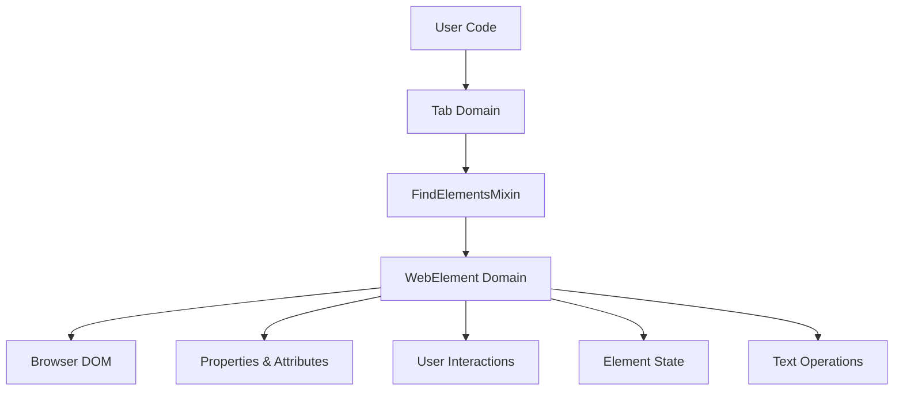
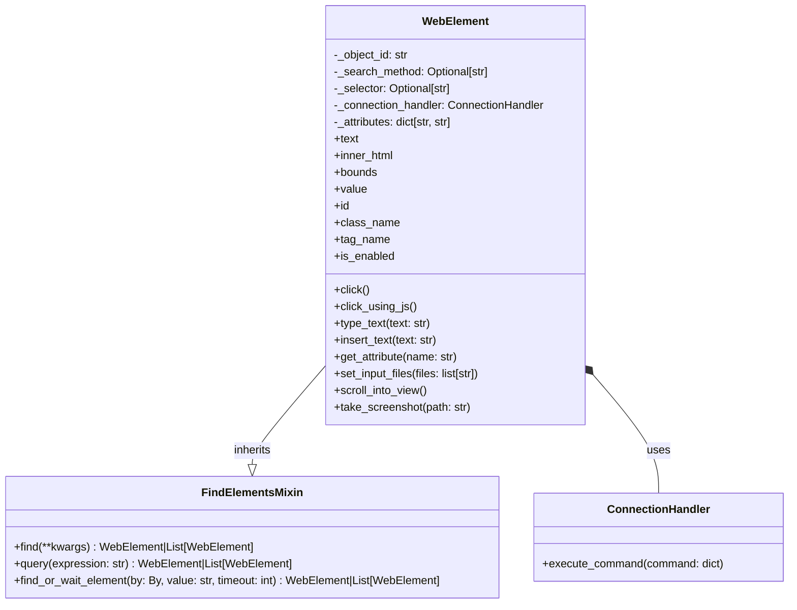

# WebElement Domain

The WebElement domain is a cornerstone of Pydoll's architecture, providing a rich representation of DOM elements that allows for intuitive and powerful interactions with web page components. This domain bridges the gap between high-level automation code and the underlying DOM elements rendered by the browser.



## Understanding WebElement

At its core, a WebElement represents a snapshot of a DOM element within a tab. Unlike traditional DOM references in JavaScript, a WebElement in Pydoll is:

1. **Asynchronous** - All interactions follow Python's async/await pattern
2. **Persistent** - Maintains a reference to the element across page changes
3. **Self-contained** - Encapsulates all operations possible on a DOM element
4. **Intelligent** - Implements specialized handling for different element types

Each WebElement instance maintains several crucial pieces of information:

```python
class WebElement(FindElementsMixin):
    def __init__(
        self,
        object_id: str,
        connection_handler: ConnectionHandler,
        method: Optional[str] = None,
        selector: Optional[str] = None,
        attributes_list: list[str] = [],
    ):
        self._object_id = object_id
        self._search_method = method
        self._selector = selector
        self._connection_handler = connection_handler
        self._attributes: dict[str, str] = {}
        self._def_attributes(attributes_list)
```

The core components include:
- The `object_id` provides a remote JavaScript reference to the element
- The `connection_handler` enables communication with the browser
- The `_search_method` and `_selector` track how the element was found
- The `_attributes` dictionary stores element attributes

By inheriting from `FindElementsMixin`, each WebElement can also function as a starting point for finding child elements.

## Technical Architecture

The WebElement domain combines several key design patterns to provide a robust and flexible API:



The architectural design follows several key principles:

1. **Command Pattern** - Element interactions are translated into CDP commands
2. **Property System** - Combines synchronous attribute access with asynchronous DOM property retrieval
3. **Mixin Inheritance** - Inherits element finding capabilities through the FindElementsMixin
4. **Bridge Pattern** - Abstracts the CDP protocol details from the user-facing API

### Attribute Management

A unique aspect of WebElement's design is how it handles HTML attributes:

```python
def _def_attributes(self, attributes_list: list):
    """
    Defines element attributes from a flat list of key-value pairs.
    """
    for i in range(0, len(attributes_list), 2):
        key = attributes_list[i]
        key = key if key != 'class' else 'class_name'
        value = attributes_list[i + 1]
        self._attributes[key] = value
```

This approach:
1. Processes attributes during element creation
2. Provides fast, synchronous access to common attributes
3. Handles Python reserved keywords (like `class` → `class_name`)
4. Forms the basis for the element's string representation

!!! info "Attribute vs. Property Access"
    WebElement provides two complementary ways to access element data:
    
    - **Attribute Dictionary**: Fast, synchronous access to HTML attributes available at element creation
    - **Asynchronous Properties**: Dynamic access to current DOM state through CDP commands
    
    ```python
    # Synchronous attribute access (from initial HTML)
    element_id = element.id
    element_class = element.class_name
    
    # Asynchronous property access (current state from DOM)
    element_text = await element.text
    element_bounds = await element.bounds
    ```

## Core Interaction Patterns

The WebElement domain provides several categories of interactions:

### Element Properties

WebElement offers both synchronous and asynchronous property access:

```python
# Synchronous properties (from attributes present at element creation)
element_id = element.id
element_class = element.class_name
is_element_enabled = element.is_enabled
element_value = element.value

# Asynchronous properties (retrieved from live DOM)
element_text = await element.text
element_html = await element.inner_html
element_bounds = await element.bounds
```

The implementation balances performance and freshness by determining which properties should be synchronous (static HTML attributes) and which should be asynchronous (dynamic DOM state):

```python
@property
async def text(self) -> str:
    """
    Retrieves the text of the element.
    """
    outer_html = await self.inner_html
    soup = BeautifulSoup(outer_html, 'html.parser')
    return soup.get_text(strip=True)

@property
def id(self) -> str:
    """
    Retrieves the id of the element.
    """
    return self._attributes.get('id')
```

### Mouse Interactions

WebElement provides multiple ways to interact with elements through mouse events:

```python
# Standard click at element center
await element.click()

# Click with offset from center
await element.click(x_offset=10, y_offset=5)

# Click with longer hold time (like for long press)
await element.click(hold_time=1.0)

# JavaScript-based click (useful for elements that are difficult to click)
await element.click_using_js()
```

The implementation intelligently handles different element types and visibility states:

```python
async def click(
    self,
    x_offset: int = 0,
    y_offset: int = 0,
    hold_time: float = 0.1,
):
    """
    Clicks on the element using mouse events.
    """
    if self._is_option_tag():
        return await self.click_option_tag()

    if not await self._is_element_visible():
        raise exceptions.ElementNotVisible(
            'Element is not visible on the page.'
        )

    await self.scroll_into_view()
    
    # Get element position and calculate click point
    # ... (position calculation code)
    
    # Send mouse press and release events
    press_command = InputCommands.mouse_press(*position_to_click)
    release_command = InputCommands.mouse_release(*position_to_click)
    await self._connection_handler.execute_command(press_command)
    await asyncio.sleep(hold_time)
    await self._connection_handler.execute_command(release_command)
```

!!! tip "Special Element Handling"
    The WebElement implementation includes specialized handling for different element types:
    
    ```python
    # Option elements in dropdowns need special click handling
    if self._is_option_tag():
        return await self.click_option_tag()
    
    # File inputs need special file selection handling
    await input_element.set_input_files("path/to/file.pdf")
    ```

### Keyboard Interactions

WebElement provides multiple ways to input text into form elements:

```python
# Quick text insertion (faster but less realistic)
await element.insert_text("Hello, world!")

# Realistic typing with configurable speed
await element.type_text("Hello, world!", interval=0.1)

# Individual key events
await element.key_down(Key.CONTROL)
await element.key_down(Key.A)
await element.key_up(Key.A)
await element.key_up(Key.CONTROL)

# Press and release key combination
await element.press_keyboard_key(Key.ENTER, interval=0.1)
```

!!! info "File Upload Handling"
    For file input elements, WebElement provides a specialized method:
    
    ```python
    # Upload a single file
    await file_input.set_input_files(["path/to/file.pdf"])
    
    # Upload multiple files
    await file_input.set_input_files(["file1.jpg", "file2.jpg"])
    ```

## Visual Capabilities

### Element Screenshots

WebElement can capture screenshots of specific elements:

```python
# Take a screenshot of just this element
await element.take_screenshot("element.png")

# Take a high-quality screenshot
await element.take_screenshot("element.jpg", quality=95)
```

This implementation involves:
1. Getting the element's bounds using JavaScript
2. Creating a clip region for the screenshot
3. Taking a screenshot of just that region
4. Saving the image to the specified path

```python
async def take_screenshot(self, path: str, quality: int = 100):
    """
    Capture screenshot of this element only.
    
    Automatically scrolls element into view before capturing.
    """
    bounds = await self.get_bounds_using_js()
    clip = Viewport(
        x=bounds['x'],
        y=bounds['y'],
        width=bounds['width'],
        height=bounds['height'],
        scale=1,
    )
    screenshot = await self._connection_handler.execute_command(
        PageCommands.capture_screenshot(
            format=ScreenshotFormat.JPEG, clip=clip, quality=quality
        )
    )
    async with aiofiles.open(path, 'wb') as file:
        image_bytes = decode_base64_to_bytes(screenshot['result']['data'])
        await file.write(image_bytes)
```

!!! tip "Multiple Bounds Methods"
    WebElement provides two ways to get element bounds:
    
    ```python
    # Using the DOM domain (primary method)
    bounds = await element.bounds
    
    # Fallback using JavaScript (more reliable in some cases)
    bounds = await element.get_bounds_using_js()
    ```

## JavaScript Integration

WebElement provides seamless integration with JavaScript for operations that require direct DOM interaction:

```python
# Execute JavaScript in the context of this element
await element._execute_script("this.style.border = '2px solid red';")

# Get result from JavaScript execution
visibility = await element._is_element_visible()
```

The implementation uses the CDP Runtime domain to execute JavaScript with the element as the context:

```python
async def _execute_script(
    self, script: str, return_by_value: bool = False
):
    """
    Executes a JavaScript script in the context of this element.
    """
    return await self._execute_command(
        RuntimeCommands.call_function_on(
            self._object_id, script, return_by_value
        )
    )
```

## Element State Verification

WebElement provides methods to check the element's visibility and interactability:

```python
# Check if element is visible
is_visible = await element._is_element_visible()

# Check if element is the topmost at its position
is_on_top = await element._is_element_on_top()
```

These verifications are crucial for reliable automation, ensuring that elements can be interacted with before attempting operations.

## Position and Scrolling

The WebElement domain includes methods for positioning and scrolling:

```python
# Scroll element into view
await element.scroll_into_view()

# Get element bounds
bounds = await element.bounds
```

These capabilities ensure that elements are visible in the viewport before interaction, mimicking how a real user would interact with a page.

## Performance and Reliability Considerations

The WebElement domain balances performance and reliability through several key strategies:

### Smart Fallbacks

Many methods implement multiple approaches to ensure operations succeed even in challenging scenarios:

```python
async def click(self, ...):
    # Try using CDP mouse events first
    # If that fails, fallback to JavaScript click
    # If that fails, provide a clear error message
```

### Appropriate Context Selection

The implementation chooses the most appropriate context for each operation:

| Operation | Approach | Rationale |
|-----------|----------|-----------|
| Get Text | Parse HTML with BeautifulSoup | More accurate text extraction |
| Click | Mouse events via CDP | Most realistic user simulation |
| Select Option | Specialized JavaScript | Required for dropdown elements |
| Check Visibility | JavaScript | Most reliable across browser variations |

### Command Batching

Where possible, operations are combined to reduce round-trips to the browser:

```python
# Get element bounds in a single operation
bounds = await element.get_bounds_using_js()

# Calculate position in local code without additional browser calls
position_to_click = (
    bounds['x'] + bounds['width'] / 2,
    bounds['y'] + bounds['height'] / 2,
)
```

## Conclusion

The WebElement domain provides a comprehensive and intuitive interface for interacting with elements in a web page. By encapsulating the complexities of DOM interaction, event handling, and state management, it allows automation code to focus on high-level tasks rather than low-level details.

The domain demonstrates several key design principles:

1. **Abstraction** - Hides the complexity of CDP commands behind a clean API
2. **Specialization** - Provides unique handling for different element types
3. **Hybrid Access** - Balances synchronous and asynchronous operations for optimal performance
4. **Resilience** - Implements fallback strategies for common operations

When used in conjunction with the Tab domain and Browser domain, WebElement creates a powerful toolset for web automation that handles the complexities of modern web applications while providing a straightforward and reliable API for developers. 