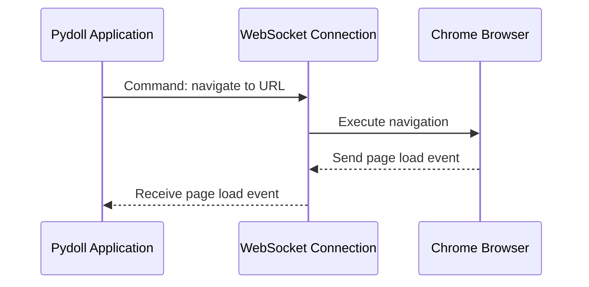
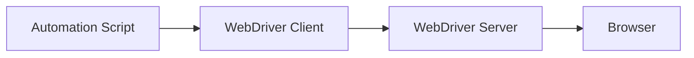
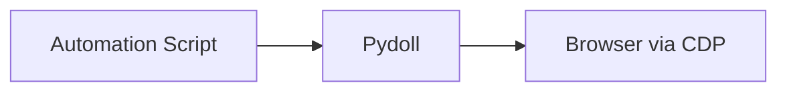
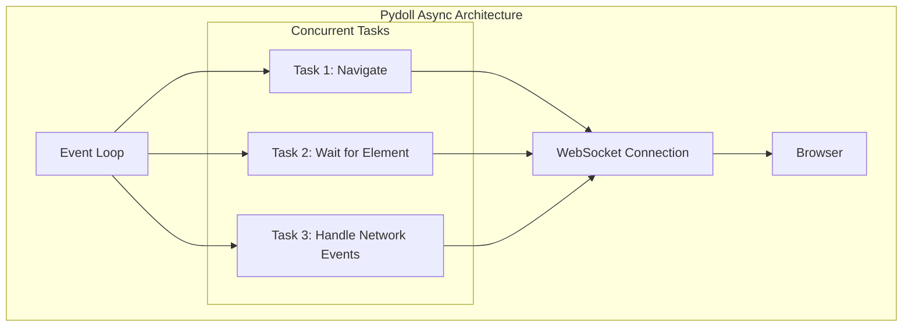

# Chrome DevTools 协议(CDP)

Chrome DevTools 协议(CDP)是Pydoll能够不依赖传统WebDriver控制浏览器的核心技术基础。理解CDP的工作原理，有助于深入掌握Pydoll的功能特性和内部架构设计。

## 什么是CDP？

Chrome DevTools 协议是由Chromium团队开发的一个强大接口，它允许通过编程方式与基于Chromium的浏览器进行交互。当您在Chrome开发者工具中检查网页时使用的正是这个协议，只不过Pydoll将其暴露为可编程API供自动化工具调用。

CDP提供了一套全面的方法和事件接口，用于与浏览器内部机制进行交互。这使得我们可以对浏览器的各个方面实现精细化控制——从页面导航、DOM操作、网络请求拦截，到性能指标监控等所有功能。

!!! info "CDP发展历程"
    自推出以来，Chrome DevTools 协议一直在持续演进。Google会在每个Chrome版本发布时维护并更新该协议，定期新增功能并改进现有特性。
    
    虽然该协议最初是为Chrome开发者工具设计的，但其全面的功能特性使其成为新一代浏览器自动化工具(如Puppeteer、Playwright以及Pydoll)的基础架构。

## WebSocket通信机制

CDP架构设计中最关键的决定之一是采用WebSocket进行通信。当基于Chromium的浏览器以远程调试模式启动时，会在指定端口开启一个WebSocket服务器：

```
chrome --remote-debugging-port=9222
```

Pydoll通过连接这个WebSocket端点，与浏览器建立双向通信通道。该连接具有以下特点：

1. **持久化连接** - 在整个自动化会话期间保持连接状态
2. **实时事件推送** - 支持浏览器主动向客户端推送事件
3. **命令下发通道** - 允许向浏览器发送控制指令
4. **二进制数据传输** - 高效传输截图、PDF等二进制资源

WebSocket协议特别适合浏览器自动化场景，因为它具备：

- **低延迟通信** - 满足响应式自动化的需求
- **双向消息传递** - 支持事件驱动架构的核心特性
- **持久连接** - 避免每次操作都重新建立连接的开销

以下是Pydoll与浏览器通信机制的简化示意图：



!!! info "WebSocket与HTTP对比"
    早期的浏览器自动化协议通常依赖HTTP端点进行通信。CDP改用WebSocket代表了架构上的重大改进，使得自动化控制更加实时响应，事件监控更加高效。
    
    基于HTTP的协议需要持续轮询来检测状态变化，这会产生额外开销和延迟。而WebSocket允许浏览器在事件发生时立即向自动化脚本推送通知，实现近乎零延迟的事件响应。

## 核心CDP功能域

CDP被划分为多个逻辑功能域，每个域负责浏览器特定方面的功能控制。其中最重要的几个功能域包括：

| 功能域 | 职责范围 | 典型应用场景 |
|--------|----------|--------------|
| **Browser** | 浏览器应用本身的控制 | 窗口管理、浏览器上下文创建 |
| **Page** | 页面生命周期交互 | 页面导航、JavaScript执行、框架管理 |
| **DOM** | 页面结构访问 | 选择器查询、属性修改、事件监听 |
| **Network** | 网络流量监控与控制 | 请求拦截、响应检查、缓存管理 |
| **Runtime** | JavaScript执行环境 | 表达式求值、函数调用、异常处理 |
| **Input** | 用户交互模拟 | 鼠标移动、键盘输入、触摸事件 |
| **Target** | 浏览器上下文和目标管理 | 标签页创建、iframe访问、弹窗处理 |
| **Fetch** | 底层网络拦截 | 请求修改、响应模拟、身份验证 |

Pydoll将这些CDP功能域映射为更符合直觉的API结构，同时完整保留了底层协议的全部功能。

## 事件驱动架构

CDP最强大的特性之一是其事件系统。该协议允许客户端订阅浏览器在正常运行期间发出的各种事件。这些事件几乎涵盖了浏览器行为的所有方面：

- **生命周期事件**：页面加载、框架导航、目标创建
- **DOM事件**：元素变化、属性修改
- **网络事件**：请求/响应周期、WebSocket消息
- **执行事件**：JavaScript异常、控制台消息
- **性能事件**：渲染、脚本执行等性能指标

当您在Pydoll中启用事件监控(例如通过`page.enable_network_events()`)时，库会自动与浏览器建立必要的订阅关系，并为代码提供响应这些事件的钩子函数。

```python
from pydoll.events.network import NetworkEvents
from functools import partial

async def on_request(page, event):
    url = event['params']['request']['url']
    print(f"Request to: {url}")

# Subscribe to network request events
await page.enable_network_events()
await page.on(NetworkEvents.REQUEST_WILL_BE_SENT, partial(on_request, page))
```

这种事件驱动的方式使得自动化脚本能够即时响应浏览器状态变化，无需依赖低效的轮询机制或人为设置的延迟。

## 直接CDP集成的性能优势

与传统的基于WebDriver的自动化方案相比，Pydoll直接使用CDP协议具有以下显著的性能优势：

### 1. 消除协议转换层

传统的基于WebDriver的工具(如Selenium)采用多层架构设计：



每个层级都会引入额外的开销，特别是WebDriver服务器作为WebDriver协议与浏览器原生API之间的转换层，带来了显著的性能损耗。

Pydoll的实现方式则进行了大幅简化：



这种直接通信方式消除了中间服务器的计算和网络开销，从而实现了更快的操作响应速度。

### 2. 高效的命令批处理

CDP支持在单条消息中批量发送多个命令，显著减少了复杂操作所需的往返通信次数。这对于需要多步骤完成的操作（例如先定位元素再进行交互）尤其有价值。

### 3. 异步操作支持

CDP基于WebSocket的事件驱动架构与Python的asyncio框架完美契合，能够实现真正的异步操作。这使得Pydoll可以：

- 并发执行多个操作
- 在事件发生时立即进行处理
- 在I/O操作期间避免阻塞主线程




!!! info "异步性能优势"
    asyncio与CDP的结合能产生倍增效应的性能提升。基准测试表明，Pydoll的异步模式可以并行处理多个页面，且接近线性扩展；而传统同步工具随着并发量增加会出现收益递减现象。
    
    举例来说，抓取10个平均加载时间为2秒的页面时，同步工具可能需要超过20秒，而Pydoll的异步架构仅需略高于2秒（加上极小的系统开销）。

### 4. 精细化控制能力

相较于WebDriver协议，CDP为浏览器行为提供了更精细的控制粒度。这使得Pydoll能够针对常见操作实现优化策略：

- 更精确的等待条件（而非固定超时）
- 直接访问浏览器缓存和存储系统
- 在特定上下文中定向执行JavaScript
- 细粒度的网络控制以实现请求优化

## 总结

Chrome DevTools协议构成了Pydoll零WebDriver浏览器自动化方案的核心基础。通过充分利用CDP的WebSocket通信机制、全面的功能域覆盖、事件驱动架构以及直接浏览器集成等特性，Pydoll在性能和可靠性方面均超越了传统自动化工具。

在后续章节中，我们将深入探讨Pydoll如何具体实现各个CDP功能域，并将底层协议转化为直观易用的开发者API。