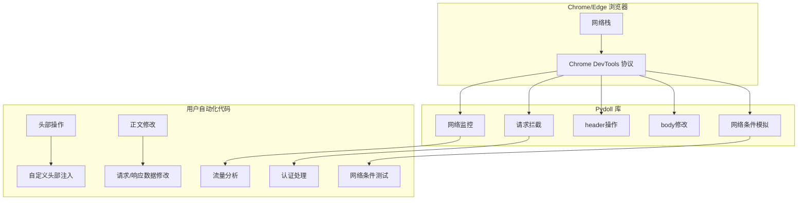
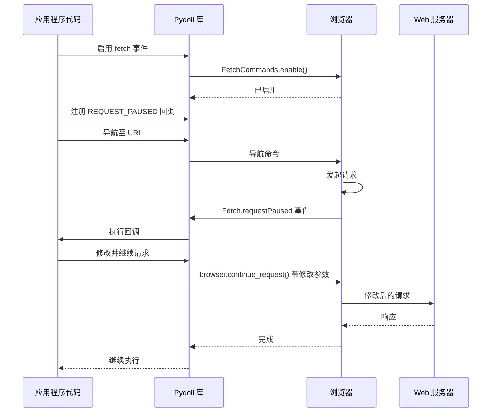

# 网络能力

Pydoll 在浏览器自动化过程中提供了强大的网络流量监控、拦截和操作功能。这些特性让您能够精细控制浏览器与网络的通信方式，支持请求修改、响应分析和网络优化等高级用例。

## 网络架构概述

Pydoll 的网络能力基于 Chrome DevTools Protocol (CDP) 构建，该协议直接对接浏览器内部的网络栈。这种架构消除了传统代理方式存在的限制，实现了对请求和响应的实时监控与修改。



Pydoll 的网络能力可分为两大类：

1. **网络监控**：被动观察网络活动
2. **请求拦截**：主动修改网络请求和响应

## 网络监控

网络监控允许您在不修改网络活动的情况下观察和分析浏览器会话的网络行为。这对于理解网站如何加载资源、检测 API 端点或排查性能问题非常有用。

### 启用网络监控

要开始监控网络活动，需要启用网络事件：

```python
import asyncio
from pydoll.browser.chromium import Chrome
from pydoll.protocol.network.events import NetworkEvent
from functools import partial

async def main():
    async with Chrome() as browser:
        tab = await browser.start()
        
        # Enable network monitoring
        await tab.enable_network_events()
        
        # Navigate to a page
        await tab.go_to('https://example.com')
        
        print("Network monitoring enabled and page loaded")
        
asyncio.run(main())
```

启用网络事件后，Pydoll 会自动捕获所有网络请求的相关信息，包括：

- URL 地址
- HTTP 方法
- 请求头信息
- 状态码
- 响应大小
- 内容类型
- 时间信息

### 网络事件回调

您可以注册回调函数来实时接收特定网络事件的通知：

```python
from pydoll.protocol.network.events import NetworkEvent
from functools import partial

# Define a callback to handle request events
async def on_request(tab, event):
    url = event['params']['request']['url']
    method = event['params']['request']['method']
    
    print(f"{method} request to: {url}")
    
    # You can access request headers
    headers = event['params']['request'].get('headers', {})
    if 'content-type' in headers:
        print(f"Content-Type: {headers['content-type']}")

# Define a callback to handle response events
async def on_response(tab, event):
    url = event['params']['response']['url']
    status = event['params']['response']['status']
    
    print(f"Response from {url}: Status {status}")
    
    # Extract response timing information
    timing = event['params']['response'].get('timing')
    if timing:
        total_time = timing['receiveHeadersEnd'] - timing['requestTime']
        print(f"Request completed in {total_time:.2f}s")

async def main():
    async with Chrome() as browser:
        tab = await browser.start()
        
        # Register the callbacks
        await tab.enable_network_events()
        await tab.on(NetworkEvent.REQUEST_WILL_BE_SENT, partial(on_request, tab))
        await tab.on(NetworkEvent.RESPONSE_RECEIVED, partial(on_response, tab))
        
        # Navigate to trigger network activity
        await tab.go_to('https://example.com')
        
        # Wait to see network activity
        await asyncio.sleep(5)

asyncio.run(main())
```
### 关键网络事件

Pydoll 提供了对广泛网络相关事件的访问：

| 事件常量 | 描述 | 可获取的有用信息 |
|----------|------|----------------|
| `NetworkEvent.REQUEST_WILL_BE_SENT` | 请求即将发送时触发 | URL、方法、请求头、POST 数据 |
| `NetworkEvent.RESPONSE_RECEIVED` | 收到 HTTP 响应时触发 | 状态码、响应头、MIME 类型、时间信息 |
| `NetworkEvent.LOADING_FAILED` | 请求失败时触发 | 错误信息、是否已取消 |
| `NetworkEvent.LOADING_FINISHED` | 请求完成时触发 | 编码方式、压缩后数据大小 |
| `NetworkEvent.RESOURCE_CHANGED_PRIORITY` | 资源加载优先级改变时触发 | 新的优先级级别 |
| `NetworkEvent.WEBSOCKET_CREATED` | 创建 WebSocket 时触发 | URL、发起者 |
| `NetworkEvent.WEBSOCKET_FRAME_SENT` | 发送 WebSocket 帧时触发 | 负载数据 |
| `NetworkEvent.WEBSOCKET_FRAME_RECEIVED` | 接收 WebSocket 帧时触发 | 响应数据 |

### 高级网络监控示例

以下是一个更全面的网络指标跟踪示例：

```python
import asyncio
import time
from pydoll.browser.chromium import Chrome
from pydoll.protocol.network.events import NetworkEvent
from functools import partial

async def main():
    # Statistics counters
    stats = {
        'total_requests': 0,
        'completed_requests': 0,
        'failed_requests': 0,
        'bytes_received': 0,
        'request_types': {},
        'status_codes': {},
        'domains': {},
        'start_time': time.time()
    }
    
    async def update_dashboard():
        while True:
            # Calculate elapsed time
            elapsed = time.time() - stats['start_time']
            
            # Clear console and print stats
            print("\033c", end="")  # Clear console
            print(f"Network Activity Dashboard - Running for {elapsed:.1f}s")
            print(f"Total Requests: {stats['total_requests']}")
            print(f"Completed: {stats['completed_requests']} | Failed: {stats['failed_requests']}")
            print(f"Data Received: {stats['bytes_received'] / 1024:.1f} KB")
            
            print("\nRequest Types:")
            for rtype, count in sorted(stats['request_types'].items(), key=lambda x: x[1], reverse=True):
                print(f"  {rtype}: {count}")
            
            print("\nStatus Codes:")
            for code, count in sorted(stats['status_codes'].items()):
                print(f"  {code}: {count}")
            
            print("\nTop Domains:")
            top_domains = sorted(stats['domains'].items(), key=lambda x: x[1], reverse=True)[:5]
            for domain, count in top_domains:
                print(f"  {domain}: {count}")
            
            await asyncio.sleep(1)
    
    # Start the dashboard updater task
    dashboard_task = asyncio.create_task(update_dashboard())
    
    async with Chrome() as browser:
        tab = await browser.start()
        
        # Track request starts
        async def on_request_sent(tab, event):
            stats['total_requests'] += 1
            
            # Track request type
            resource_type = event['params'].get('type', 'Other')
            stats['request_types'][resource_type] = stats['request_types'].get(resource_type, 0) + 1
            
            # Track domain
            url = event['params']['request']['url']
            try:
                from urllib.parse import urlparse
                domain = urlparse(url).netloc
                stats['domains'][domain] = stats['domains'].get(domain, 0) + 1
            except:
                pass
        
        # Track responses
        async def on_response(tab, event):
            status = event['params']['response']['status']
            stats['status_codes'][status] = stats['status_codes'].get(status, 0) + 1
        
        # Track request completions
        async def on_loading_finished(tab, event):
            stats['completed_requests'] += 1
            if 'encodedDataLength' in event['params']:
                stats['bytes_received'] += event['params']['encodedDataLength']
        
        # Track failures
        async def on_loading_failed(tab, event):
            stats['failed_requests'] += 1
        
        # Register callbacks
        await tab.enable_network_events()
        await tab.on(NetworkEvent.REQUEST_WILL_BE_SENT, partial(on_request_sent, tab))
        await tab.on(NetworkEvent.RESPONSE_RECEIVED, partial(on_response, tab))
        await tab.on(NetworkEvent.LOADING_FINISHED, partial(on_loading_finished, tab))
        await tab.on(NetworkEvent.LOADING_FAILED, partial(on_loading_failed, tab))
        
        # Navigate to a page with lots of requests
        await tab.go_to('https://news.ycombinator.com')
        
        # Wait for user to press Enter to exit
        await asyncio.sleep(60)
    
    # Clean up
    dashboard_task.cancel()

asyncio.run(main())
```
## 请求拦截与修改

请求拦截功能体现了 Pydoll 网络能力的真正优势。与只能观察网络流量的传统浏览器自动化工具不同，Pydoll 允许您在请求发送前进行拦截和修改。

### Fetch 域

Chrome DevTools Protocol 中的 Fetch 域提供了用于拦截和操作网络请求的高级功能。Pydoll 通过简洁的 API 暴露了这些功能，使得实现复杂的网络操作场景变得简单易行。



### 启用请求拦截

要拦截请求，需要启用 Fetch 域：

```python
import asyncio
from pydoll.browser.chromium import Chrome
from pydoll.protocol.fetch.events import FetchEvent
from functools import partial

async def main():
    async with Chrome() as browser:
        tab = await browser.start()
        
        # Define a request interceptor
        async def intercept_request(tab, event):
            request_id = event['params']['requestId']
            request = event['params']['request']
            url = request['url']
            
            print(f"Intercepted request to: {url}")
            
            # You must continue the request to proceed
            await browser.continue_request(request_id)
        
        # Enable fetch events and register the interceptor
        await tab.enable_fetch_events()
        await tab.on(FetchEvent.REQUEST_PAUSED, partial(intercept_request, tab))
        
        # Navigate to a page
        await tab.go_to('https://example.com')
        
asyncio.run(main())
```

!!! warning "必须始终继续已拦截的请求"
    在拦截请求时，必须始终调用 `browser.continue_request()`、`browser.fail_request()` 或 `browser.fulfill_request()` 来解决被拦截的请求。如果不这样做，浏览器将会挂起，等待被拦截请求的解决方案。

### 拦截范围和资源类型

您可以将请求拦截的范围限制为特定的资源类型：

```python
from pydoll.constants import ResourceType

# Intercept all requests (could be resource-intensive)
await tab.enable_fetch_events()

# Intercept only document (HTML) requests
await tab.enable_fetch_events(resource_type=ResourceType.DOCUMENT)

# Intercept only XHR/fetch API requests
await tab.enable_fetch_events(resource_type=ResourceType.XHR)

# Intercept only image requests
await tab.enable_fetch_events(resource_type=ResourceType.IMAGE)
```

可用于拦截的资源类型：

| 资源类型 | 描述 | 常见示例 |
|----------|------|----------|
| `ResourceType.DOCUMENT` | 主HTML文档 | HTML页面、iframe |
| `ResourceType.STYLESHEET` | CSS文件 | .css文件 |
| `ResourceType.IMAGE` | 图片资源 | .jpg、.png、.gif、.webp |
| `ResourceType.MEDIA` | 媒体文件 | .mp4、.webm、音频文件 |
| `ResourceType.FONT` | 字体文件 | .woff、.woff2、.ttf |
| `ResourceType.SCRIPT` | JavaScript文件 | .js文件 |
| `ResourceType.TEXTTRACK` | 文本轨道文件 | .vtt、.srt(字幕文件) |
| `ResourceType.XHR` | XMLHttpRequest调用 | API调用、AJAX请求 |
| `ResourceType.FETCH` | Fetch API请求 | 现代API调用 |
| `ResourceType.EVENTSOURCE` | 服务器发送事件 | 流连接 |
| `ResourceType.WEBSOCKET` | WebSocket连接 | 实时通信 |
| `ResourceType.MANIFEST` | Web应用清单 | .webmanifest文件 |
| `ResourceType.OTHER` | 其他资源类型 | 各类杂项资源 |

### 请求修改能力

在拦截请求时，您可以在请求发送到服务器前修改其多个方面：

#### 1. 修改URL和方法

```python
async def redirect_request(tab, event):
    request_id = event['params']['requestId']
    request = event['params']['request']
    url = request['url']
    
    # Redirect requests for one domain to another
    if 'old-domain.com' in url:
        new_url = url.replace('old-domain.com', 'new-domain.com')
        print(f"Redirecting {url} to {new_url}")
        
        await browser.continue_request(
            request_id=request_id,
            url=new_url
        )
    # Change GET to POST for specific endpoints
    elif '/api/data' in url and request['method'] == 'GET':
        print(f"Converting GET to POST for {url}")
        
        await browser.continue_request(
            request_id=request_id,
            method='POST'
        )
    else:
        # Continue normally
        await browser.continue_request(request_id)
```

#### 2. 添加和修改Headers

```python
async def inject_headers(tab, event):
    request_id = event['params']['requestId']
    request = event['params']['request']
    url = request['url']
    
    # Get existing headers
    headers = request.get('headers', {})
    
    # Add or modify headers
    custom_headers = [
        {'name': 'X-Custom-Header', 'value': 'CustomValue'},
        {'name': 'Authorization', 'value': 'Bearer your-token-here'},
        {'name': 'User-Agent', 'value': 'Custom User Agent String'},
    ]
    
    # Add existing headers to the list
    for name, value in headers.items():
        custom_headers.append({'name': name, 'value': value})
    
    await browser.continue_request(
        request_id=request_id,
        headers=custom_headers
    )
```

#### 3. 修改请求体

```python
import json
import time

async def modify_post_data(tab, event):
    request_id = event['params']['requestId']
    request = event['params']['request']
    url = request['url']
    method = request['method']
    
    # Only process POST requests to specific endpoints
    if method == 'POST' and '/api/submit' in url:
        # Get the original post data, if any
        original_post_data = request.get('postData', '{}')
        
        try:
            # Parse the original data
            data = json.loads(original_post_data)
            
            # Modify the data
            data['additionalField'] = 'injected-value'
            data['timestamp'] = int(time.time())
            
            # Convert back to string
            modified_post_data = json.dumps(data)
            
            print(f"Modified POST data for {url}")
            
            await browser.continue_request(
                request_id=request_id,
                post_data=modified_post_data
            )
        except json.JSONDecodeError:
            # If not JSON, continue normally
            await browser.continue_request(request_id)
    else:
        # Continue normally for non-POST requests
        await browser.continue_request(request_id)
```

### 失败请求与完成请求

除了修改后继续请求外，您还可以使请求失败或使用自定义响应来完成请求：

#### 失败请求

```python
from pydoll.constants import NetworkErrorReason

async def block_requests(tab, event):
    request_id = event['params']['requestId']
    request = event['params']['request']
    url = request['url']
    
    # Block requests to tracking domains
    blocked_domains = ['google-analytics.com', 'facebook.com/tr']
    
    if any(domain in url for domain in blocked_domains):
        print(f"Blocking request to: {url}")
        await browser.fail_request(request_id, NetworkErrorReason.BLOCKED_BY_CLIENT)
    else:
        await browser.continue_request(request_id)
```

#### 使用自定义响应完成请求

```python
async def mock_api_response(tab, event):
    request_id = event['params']['requestId']
    request = event['params']['request']
    url = request['url']
    
    # Mock API responses
    if '/api/user' in url:
        mock_response = {
            'id': 123,
            'name': 'Mock User',
            'email': 'mock@example.com'
        }
        
        response_headers = [
            {'name': 'Content-Type', 'value': 'application/json'},
            {'name': 'Access-Control-Allow-Origin', 'value': '*'}
        ]
        
        print(f"Mocking response for: {url}")
        
        await browser.fulfill_request(
            request_id=request_id,
            response_code=200,
            response_headers=response_headers,
            response_body=json.dumps(mock_response)
        )
    else:
        await browser.continue_request(request_id)
```

### 认证处理
Fetch 域还可以拦截认证质询，使您能够自动处理 HTTP 认证：

```python
async def main():
    async with Chrome() as browser:
        tab = await browser.start()
        
        # Define authentication handler
        async def handle_auth(tab, event):
            request_id = event['params']['requestId']
            auth_challenge = event['params']['authChallenge']
            
            print(f"Authentication required: {auth_challenge['origin']}")
            
            # Provide credentials
            await browser.continue_request_with_auth(
                request_id=request_id,
                auth_challenge_response='ProvideCredentials',
                username="username",
                password="password"
            )
        
        # Enable fetch events with auth handling
        await tab.enable_fetch_events(handle_auth=True)
        await tab.on(FetchEvent.AUTH_REQUIRED, partial(handle_auth, tab))
        
        # Navigate to a page requiring authentication
        await tab.go_to('https://protected-site.com')
```
## 高级网络模式

### 综合请求拦截示例

以下是一个展示各种拦截方法的完整示例：

```python
import asyncio
import json
from pydoll.browser.chromium import Chrome
from pydoll.protocol.fetch.events import FetchEvent
from pydoll.constants import NetworkErrorReason, ResourceType
from functools import partial

async def main():
    async with Chrome() as browser:
        tab = await browser.start()
        
        async def comprehensive_interceptor(tab, event):
            request_id = event['params']['requestId']
            request = event['params']['request']
            url = request['url']
            method = request['method']
            
            print(f"Intercepting {method} request to: {url}")
            
            # Block tracking scripts
            if any(tracker in url for tracker in ['google-analytics', 'facebook.com/tr']):
                print(f"Blocking tracker: {url}")
                await browser.fail_request(request_id, NetworkErrorReason.BLOCKED_BY_CLIENT)
                return
            
            # Mock API responses
            if '/api/config' in url:
                mock_config = {
                    'feature_flags': {'new_ui': True, 'beta_features': True},
                    'api_version': '2.0'
                }
                
                await browser.fulfill_request(
                    request_id=request_id,
                    response_code=200,
                    response_headers=[
                        {'name': 'Content-Type', 'value': 'application/json'},
                        {'name': 'Cache-Control', 'value': 'no-cache'}
                    ],
                    response_body=json.dumps(mock_config)
                )
                return
            
            # Inject custom headers for API requests
            if '/api/' in url:
                headers = [
                    {'name': 'X-Custom-Client', 'value': 'Pydoll-Automation'},
                    {'name': 'X-Request-ID', 'value': f'req-{request_id}'}
                ]
                
                # Preserve existing headers
                for name, value in request.get('headers', {}).items():
                    headers.append({'name': name, 'value': value})
                
                await browser.continue_request(
                    request_id=request_id,
                    headers=headers
                )
                return
            
            # Continue all other requests normally
            await browser.continue_request(request_id)
        
        # Enable fetch events for XHR and Fetch requests only
        await tab.enable_fetch_events(resource_type=ResourceType.XHR)
        await tab.on(FetchEvent.REQUEST_PAUSED, partial(comprehensive_interceptor, tab))
        
        # Navigate and interact with the page
        await tab.go_to('https://example.com')
        await asyncio.sleep(5)  # Wait for network activity

asyncio.run(main())
```

## 特别注意

虽然 Pydoll 的网络功能强大，但需要注意以下性能方面的问题：

1. **选择性拦截**：拦截所有请求可能会显著降低页面加载速度。请谨慎选择需要拦截的资源类型。

2. **内存管理**：网络事件回调如果存储大量数据，可能会消耗内存。在长时间运行的自动化任务中需注意内存使用情况。

3. **回调效率**：确保事件回调高效运行，尤其是对于网络请求等高频事件。低效的回调可能会拖慢整个自动化流程。

4. **清理**：使用完毕后务必禁用网络和 fetch 事件，以防止内存泄漏。

```python
# Enable events only when needed
await tab.enable_network_events()
await tab.enable_fetch_events(resource_type=ResourceType.XHR)  # Only intercept XHR requests

# Do your automation work...

# Clean up when done
await tab.disable_network_events()
await tab.disable_fetch_events()
```

## 最佳实践

### 1. 高效使用资源类型过滤

```python
# Bad: Intercept all requests (performance impact)
await tab.enable_fetch_events()

# Good: Only intercept the specific resource types you need
await tab.enable_fetch_events(resource_type=ResourceType.XHR)  # For API calls
await tab.enable_fetch_events(resource_type=ResourceType.DOCUMENT)  # For main documents
```

### 2. 始终解析已拦截的请求

```python
# Always resolve every intercepted request
async def intercept_handler(tab, event):
    request_id = event['params']['requestId']
    
    try:
        # Make any modifications needed
        custom_headers = [{'name': 'X-Custom', 'value': 'Value'}]
        
        # Continue the request
        await browser.continue_request(
            request_id=request_id,
            headers=custom_headers
        )
    except Exception as e:
        print(f"Error in request handler: {e}")
        # Always try to continue the request even if there was an error
        try:
            await browser.continue_request(request_id)
        except:
            pass
```

### 3. 实现正确的错误处理

```python
async def safe_network_handler(tab, event):
    request_id = event['params']['requestId']
    
    try:
        # Your interception logic here
        await process_request(event)
        await browser.continue_request(request_id)
    except Exception as e:
        print(f"Error in request handler: {e}")
        # Try to continue the request even if there was an error
        try:
            await browser.continue_request(request_id)
        except:
            # If we can't continue, try to fail it gracefully
            try:
                await browser.fail_request(request_id, NetworkErrorReason.FAILED)
            except:
                pass
```

### 4. 使用部分响应实现清晰的回调管理

```python
from functools import partial

# Define your handler with tab object as first parameter
async def handle_request(tab, config, event):
    # Now you have access to both tab and custom config
    request_id = event['params']['requestId']
    
    if config['block_trackers'] and is_tracker(event['params']['request']['url']):
        await browser.fail_request(request_id, NetworkErrorReason.BLOCKED_BY_CLIENT)
    else:
        await browser.continue_request(request_id)

# Register with partial to pre-bind parameters
config = {"block_trackers": True}
await tab.on(
    FetchEvent.REQUEST_PAUSED, 
    partial(handle_request, tab, config)
)
```

## 结论

Pydoll 的网络功能为浏览器网络流量提供了前所未有的控制能力，支持超越传统浏览器自动化的进阶用例。无论是监控 API 调用、注入自定义请求头，还是修改请求数据，这些功能都能显著提升您的自动化工作流效率。

通过利用 Chrome DevTools Protocol 的强大能力，Pydoll 让实现复杂的网络监控与拦截模式变得简单，同时保持高性能与可靠性。

使用这些功能之前需要多多注意，并观察在自动化脚本中大规模进行网络监控与拦截可能带来的性能影响。