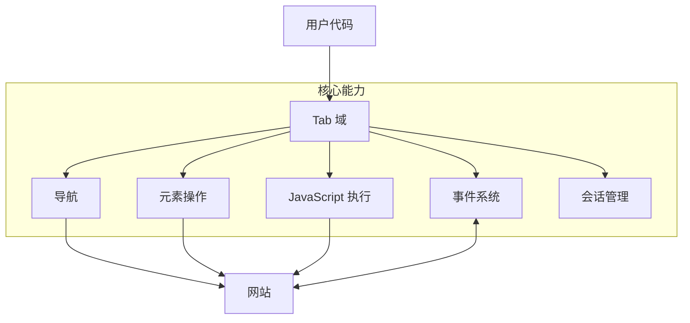
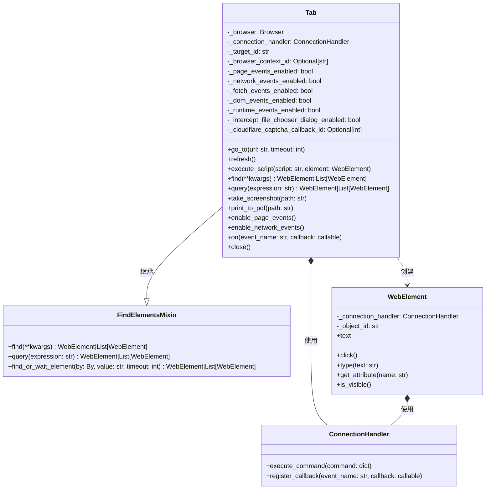
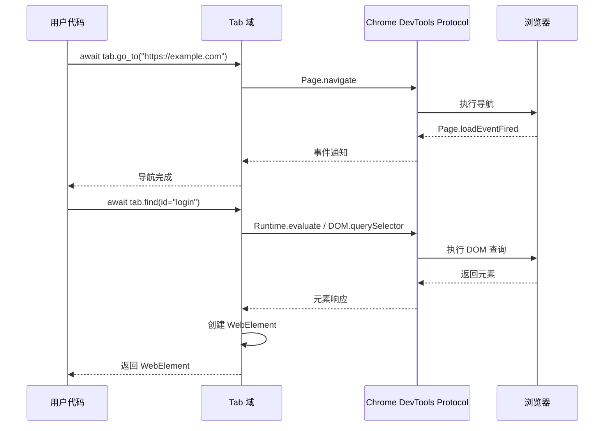
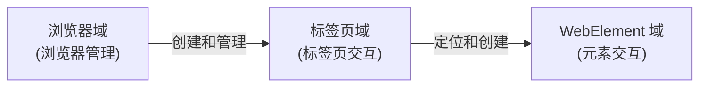

# Tab 域

Tab 域构成了 Pydoll 架构的核心，为控制浏览器标签页及其内容提供了全面的接口。该域将您的高层自动化代码与浏览器功能连接起来，支持从基础导航到复杂交互模式的所有操作。



## 技术架构

Pydoll 中的 Tab 域充当您的自动化代码与多个 Chrome DevTools Protocol (CDP) 域之间的集成层。它作为一个具体类实现，通过组合和继承集成了多种功能能力。



该设计利用了几个关键模式：

1. **继承** - Tab 类从 FindElementsMixin 继承以获得元素定位能力
2. **组合** - 它使用 ConnectionHandler 来管理 CDP 通信
3. **工厂方法** - 它在标签页中查找元素时创建 WebElement 实例
4. **命令** - 它将高层方法转换为 CDP 命令
5. **观察者** - 它实现了一个事件系统来响应浏览器事件

### CDP 集成

Tab 域集成了多个 CDP 域以提供其功能：

| CDP 域 | 目的 |
|--------|------|
| **Page** | 核心页面生命周期和导航 |
| **Runtime** | 页面上下文中的 JavaScript 执行 |
| **DOM** | 文档结构和元素访问 |
| **Network** | 网络操作和 Cookie 管理 |
| **Fetch** | 请求拦截和修改 |
| **Storage** | Cookie 和存储管理 |

这种集成创建了一个强大的抽象，简化了浏览器自动化，同时提供了对底层协议全部功能的访问。



## 初始化与状态管理

Tab 类使用来自浏览器实例的参数进行初始化：

```python
def __init__(
    self,
    browser: 'Browser',
    connection_port: int,
    target_id: str,
    browser_context_id: Optional[str] = None,
):
    """
    Initialize tab controller for existing browser tab.

    Args:
        browser: Browser instance that created this tab.
        connection_port: CDP WebSocket port.
        target_id: CDP target identifier for this tab.
        browser_context_id: Optional browser context ID.
    """
    self._browser = browser
    self._connection_port = connection_port
    self._target_id = target_id
    self._connection_handler = ConnectionHandler(connection_port, target_id)
    self._page_events_enabled = False
    self._network_events_enabled = False
    self._fetch_events_enabled = False
    self._dom_events_enabled = False
    self._runtime_events_enabled = False
    self._intercept_file_chooser_dialog_enabled = False
    self._cloudflare_captcha_callback_id = None
    self._browser_context_id = browser_context_id
```
Tab 类维护多个状态标志以跟踪当前已启用的事件域。这种状态管理对于以下方面至关重要：

1. 防止重复的事件注册
2. 准确反映标签页的当前功能
3. 在标签页关闭时进行正确的清理

## 核心模式与用法

Tab 域在 Pydoll v2.0+ 中遵循一致的交互模式：

```python
import asyncio
from pydoll.browser.chromium import Chrome

async def pydoll_example():
    # Create a browser instance and get initial tab
    browser = Chrome()
    tab = await browser.start()  # Returns Tab directly
    
    try:
        # Work with the tab...
        await tab.go_to("https://example.com")
        
        # Find and interact with elements
        button = await tab.find(id="submit")
        await button.click()
        
    finally:
        # Clean up when done
        await browser.stop()

# Run your example with asyncio
asyncio.run(pydoll_example())
```

本文档中的大多数示例都假定浏览器和标签页已创建，并将得到妥善清理。

## 导航系统

Tab 域通过一系列方法组合提供了流畅的导航体验，这些方法抽象了浏览器导航的复杂性：

```python
# Navigate to a page with custom timeout
await tab.go_to("https://example.com", timeout=60)

# Get the current URL
current_url = await tab.current_url
print(f"Current URL: {current_url}")

# Get the page source
source = await tab.page_source
print(f"Page source length: {len(source)}")

# Refresh the page
await tab.refresh()
```

!!! 提示 "高级导航"
    对于特殊导航场景，您可以将导航与事件监听器结合使用：
    
    ```python
    # 在导航期间监听网络请求
    await tab.enable_network_events()
    await tab.on('Network.responseReceived', handle_response)
    
    # 导航到页面
    await tab.go_to('https://example.com')
    ```

在底层，导航系统执行多个操作：

1. 通过连接处理器发送导航命令
2. 通过定期 JavaScript 评估监控页面加载状态
3. 管理超时以防止无限等待
4. 如果导航到当前 URL，则处理刷新优化

## JavaScript 执行

Tab 域中的 JavaScript 执行系统提供两种不同的执行模式：

1. **全局执行**：在全局页面上下文中评估 JavaScript
2. **元素上下文执行**：以元素作为上下文执行 JavaScript

```python
# Execute JavaScript in page context
dimensions = await tab.execute_script("""
    return {
        width: window.innerWidth,
        height: window.innerHeight,
        devicePixelRatio: window.devicePixelRatio
    }
""")
print(f"Window dimensions: {dimensions}")

# Find an element and manipulate it with JavaScript
heading = await tab.find(tag_name="h1")

# Execute JavaScript with the element as context
await tab.execute_script("""
    // 'argument' refers to the element
    argument.style.color = 'red';
    argument.style.fontSize = '32px';
    argument.textContent = 'Modified by JavaScript';
""", heading)
```
!!! 警告 "脚本执行安全"
    执行脚本时，请注意以下安全影响：
    
    - 脚本以页面的完整权限运行
    - 如果脚本内容包含用户数据，则输入验证至关重要
    - 对于标准操作，考虑使用元素方法而非脚本

实现会将提供的 JavaScript 代码和参数转换为符合 CDP 要求的格式：

1. 对于全局执行：
   - 脚本直接发送到 Runtime.evaluate
2. 对于元素上下文执行：
   - 脚本被包装在一个函数中
   - 'argument' 引用被替换为 'this'
   - 该函数以元素的 objectId 作为上下文被调用

## 会话状态管理

Tab 域实现了与会话浏览器上下文协同工作的复杂会话状态管理：

```python
# Set cookies for this tab
cookies_to_set = [
    {
        "name": "session_id",
        "value": "test_session_123",
        "domain": "example.com",
        "path": "/",
        "secure": True,
        "httpOnly": True
    }
]
await tab.set_cookies(cookies_to_set)

# Get all cookies accessible from this tab
all_cookies = await tab.get_cookies()
print(f"Number of cookies: {len(all_cookies)}")

# Delete all cookies from this tab's context
await tab.delete_all_cookies()
```
!!! 信息 "标签页级 Cookie 管理"
    Pydoll 的一项强大功能是能够在浏览器上下文内对单个标签页进行 Cookie 控制：
    
    ```python
    # 为隔离创建不同上下文
    context1 = await browser.create_browser_context()
    context2 = await browser.create_browser_context()
    
    # 不同上下文中的标签页具有隔离的 Cookie
    tab1 = await browser.new_tab("https://example.com", browser_context_id=context1)
    tab2 = await browser.new_tab("https://example.com", browser_context_id=context2)
    
    # 为每个标签页设置不同的 Cookie
    await tab1.set_cookies([{"name": "user", "value": "user_a", "domain": "example.com"}])
    await tab2.set_cookies([{"name": "user", "value": "user_b", "domain": "example.com"}])
    ```
    
    此功能支持：
    - 测试不同账户类型之间的用户交互
    - 并排比较不同用户权限级别
    - 同时维护多个已认证会话

## 内容捕获

Tab 域提供了灵活的方法来捕获视觉内容：

```python
# Take a screenshot and save it to a file
await tab.take_screenshot("homepage.png")

# Get a screenshot as base64 (useful for embedding in reports)
screenshot_base64 = await tab.take_screenshot(as_base64=True)

# Take a high-quality screenshot
await tab.take_screenshot("high_quality.jpg", quality=95)

# Export page as PDF
await tab.print_to_pdf("homepage.pdf")

# Export PDF with custom settings
await tab.print_to_pdf(
    "custom.pdf",
    landscape=True,
    print_background=True,
    scale=0.8
)
```
!!! 信息 "支持的截图格式"
    Pydoll 支持保存为以下几种格式的截图：
    - PNG (.png)：无损压缩，最适合 UI 测试
    - JPEG (.jpg/.jpeg)：有损压缩，文件更小
    
    如果尝试使用不支持的格式，Pydoll 将抛出 `InvalidFileExtension` 异常。

这些视觉捕获功能在以下方面具有重要价值：
- 视觉回归测试
- 创建文档
- 调试自动化脚本
- 存档页面内容

!!! 警告 "顶层目标与 iframe 的截图差异"
    `Tab.take_screenshot()` 依赖 CDP 的 `Page.captureScreenshot`，该能力仅适用于顶层目标（top-level target）。如果通过 `await tab.get_frame(iframe_element)` 获取了 iframe 对应的 `Tab`，在此 `Tab` 上调用 `take_screenshot()` 会抛出 `TopLevelTargetRequired`。
    
    在 iframe 内请使用 `WebElement.take_screenshot()`。它基于视口（viewport）进行捕获，适用于 iframe 场景。
    
    ```python
    # 错误：在 iframe Tab 上截图（会抛出 TopLevelTargetRequired）
    iframe_tab = await tab.get_frame(iframe_element)
    await iframe_tab.take_screenshot(as_base64=True)  # 会抛出异常

    # 正确：在 iframe 内对元素截图（基于视口）
    element = await iframe_tab.find(id='captcha')
    await element.take_screenshot('captcha.png')  # 会正常工作！
    ```

## 事件系统概述

Tab 域提供了一个全面的事件系统，用于监控和响应浏览器事件：

```python
# Enable different event domains
await tab.enable_page_events()
await tab.enable_network_events()
await tab.enable_fetch_events()
await tab.enable_dom_events()
await tab.enable_runtime_events()

# Register event handlers
async def handle_load_event(event):
    print("Page loaded!")

async def handle_network_response(event):
    url = event['params']['response']['url']
    print(f"Response received from: {url}")

await tab.on('Page.loadEventFired', handle_load_event)
await tab.on('Network.responseReceived', handle_network_response)
```
### 事件属性

Tab 类提供了便捷的属性来检查事件状态：

```python
# 检查哪些事件已启用
print(f"页面事件已启用: {tab.page_events_enabled}")
print(f"网络事件已启用: {tab.network_events_enabled}")
print(f"Fetch 事件已启用: {tab.fetch_events_enabled}")
print(f"DOM 事件已启用: {tab.dom_events_enabled}")
print(f"运行时事件已启用: {tab.runtime_events_enabled}")
```

!!! 信息 "事件分类"
    Pydoll 支持多个事件分类，每个分类都需要显式启用：
    
    - **页面事件**：导航、加载、错误、对话框处理
    - **网络事件**：请求、响应、WebSockets
    - **DOM 事件**：文档更新、属性变更
    - **Fetch 事件**：请求拦截与修改
    - **运行时事件**：JavaScript 执行与控制台消息

## 高级功能

### Cloudflare 验证码处理

Tab 域通过两种不同方法提供智能的 Cloudflare 验证码处理：

```python
# Context manager approach (blocks until captcha is solved)
async with tab.expect_and_bypass_cloudflare_captcha():
    await tab.go_to("https://site-with-cloudflare.com")
    # Continue only after captcha is solved

# Background processing approach
await tab.enable_auto_solve_cloudflare_captcha()
await tab.go_to("https://another-protected-site.com")
# Code continues immediately, captcha solved in background

# When finished with auto-solving
await tab.disable_auto_solve_cloudflare_captcha()
```

### 对话框管理

Pydoll 通过事件监控和状态跟踪实现对话框处理：

```python
# Set up a dialog handler
async def handle_dialog(event):
    if await tab.has_dialog():
        message = await tab.get_dialog_message()
        print(f"Dialog detected: {message}")
        await tab.handle_dialog(accept=True)

# Enable page events to detect dialogs
await tab.enable_page_events()
await tab.on('Page.javascriptDialogOpening', handle_dialog)

# Trigger an alert dialog
await tab.execute_script("alert('This is a test alert')")
```
## 网络分析方法

Tab 域提供了专门用于分析网络流量和提取响应数据的方法。这些方法需要先启用网络事件。

### 网络日志获取

`get_network_logs()` 方法提供了访问所有捕获的网络请求的途径：

```python
# Enable network monitoring
await tab.enable_network_events()

# Navigate to trigger network requests
await tab.go_to('https://example.com/api-heavy-page')

# Get all network logs
all_logs = await tab.get_network_logs()
print(f"Captured {len(all_logs)} network requests")

# Filter logs by URL content
api_logs = await tab.get_network_logs(filter='api')
static_logs = await tab.get_network_logs(filter='.js')
domain_logs = await tab.get_network_logs(filter='example.com')

print(f"API requests: {len(api_logs)}")
print(f"JavaScript files: {len(static_logs)}")
print(f"Domain requests: {len(domain_logs)}")
```

### 响应体提取

`get_network_response_body()` 方法允许提取实际的响应内容：

```python
from functools import partial
from pydoll.protocol.network.events import NetworkEvent

# Storage for captured responses
captured_responses = {}

async def capture_api_responses(tab, event):
    """Capture response bodies from API calls"""
    request_id = event['params']['requestId']
    response = event['params']['response']
    url = response['url']
    
    # Only capture API responses
    if '/api/' in url and response['status'] == 200:
        try:
            # Extract the response body
            body = await tab.get_network_response_body(request_id)
            captured_responses[url] = body
            print(f"Captured response from: {url}")
        except Exception as e:
            print(f"Failed to capture response: {e}")

# Enable network monitoring and register callback
await tab.enable_network_events()
await tab.on(NetworkEvent.RESPONSE_RECEIVED, partial(capture_api_responses, tab))

# Navigate to trigger API calls
await tab.go_to('https://example.com/dashboard')
await asyncio.sleep(3)  # Wait for API calls

print(f"Captured {len(captured_responses)} API responses")
```

### 实际网络分析示例

以下是一个结合两种方法的全面网络分析示例：

```python
import asyncio
import json
from functools import partial
from pydoll.browser.chromium import Chrome
from pydoll.protocol.network.events import NetworkEvent

async def comprehensive_network_analysis():
    async with Chrome() as browser:
        tab = await browser.start()
        
        # Storage for analysis results
        analysis_results = {
            'api_responses': {},
            'failed_requests': [],
            'request_summary': {}
        }
        
        async def analyze_responses(tab, event):
            """Analyze network responses"""
            request_id = event['params']['requestId']
            response = event['params']['response']
            url = response['url']
            status = response['status']
            
            # Track failed requests
            if status >= 400:
                analysis_results['failed_requests'].append({
                    'url': url,
                    'status': status,
                    'request_id': request_id
                })
                return
            
            # Capture successful API responses
            if '/api/' in url and status == 200:
                try:
                    body = await tab.get_network_response_body(request_id)
                    
                    # Try to parse JSON responses
                    try:
                        data = json.loads(body)
                        analysis_results['api_responses'][url] = {
                            'data': data,
                            'size': len(body),
                            'type': 'json'
                        }
                    except json.JSONDecodeError:
                        analysis_results['api_responses'][url] = {
                            'data': body,
                            'size': len(body),
                            'type': 'text'
                        }
                        
                except Exception as e:
                    print(f"Failed to capture response from {url}: {e}")
        
        # Enable monitoring and register callback
        await tab.enable_network_events()
        await tab.on(NetworkEvent.RESPONSE_RECEIVED, partial(analyze_responses, tab))
        
        # Navigate and perform actions
        await tab.go_to('https://example.com/complex-app')
        await asyncio.sleep(5)  # Wait for network activity
        
        # Get comprehensive logs
        all_logs = await tab.get_network_logs()
        api_logs = await tab.get_network_logs(filter='api')
        
        # Generate summary
        analysis_results['request_summary'] = {
            'total_requests': len(all_logs),
            'api_requests': len(api_logs),
            'failed_requests': len(analysis_results['failed_requests']),
            'captured_responses': len(analysis_results['api_responses'])
        }
        
        # Display results
        print("🔍 Network Analysis Results:")
        print(f"   Total requests: {analysis_results['request_summary']['total_requests']}")
        print(f"   API requests: {analysis_results['request_summary']['api_requests']}")
        print(f"   Failed requests: {analysis_results['request_summary']['failed_requests']}")
        print(f"   Captured responses: {analysis_results['request_summary']['captured_responses']}")
        
        # Show failed requests
        if analysis_results['failed_requests']:
            print("\n❌ Failed Requests:")
            for failed in analysis_results['failed_requests']:
                print(f"   {failed['status']} - {failed['url']}")
        
        # Show captured API data
        if analysis_results['api_responses']:
            print("\n✅ Captured API Responses:")
            for url, info in analysis_results['api_responses'].items():
                print(f"   {url} ({info['type']}, {info['size']} bytes)")
        
        return analysis_results

# Run the analysis
asyncio.run(comprehensive_network_analysis())
```

### 网络分析用例

这些网络分析方法支持强大的自动化场景：

**API 测试与验证：**
```python
# Validate API responses during automated testing
api_logs = await tab.get_network_logs(filter='/api/users')
for log in api_logs:
    request_id = log['params']['requestId']
    response_body = await tab.get_network_response_body(request_id)
    data = json.loads(response_body)
    
    # Validate response structure
    assert 'users' in data
    assert len(data['users']) > 0
```

**性能监控:**
```python
# Monitor request timing and sizes
all_logs = await tab.get_network_logs()
large_responses = []

for log in all_logs:
    if 'response' in log['params']:
        response = log['params']['response']
        if response.get('encodedDataLength', 0) > 1000000:  # > 1MB
            large_responses.append({
                'url': response['url'],
                'size': response['encodedDataLength']
            })

print(f"Found {len(large_responses)} large responses")
```

**数据采集:**
```python
# Extract dynamic content loaded via AJAX
await tab.go_to('https://spa-application.com')
await asyncio.sleep(3)  # Wait for AJAX calls

data_logs = await tab.get_network_logs(filter='/data/')
extracted_data = []

for log in data_logs:
    request_id = log['params']['requestId']
    try:
        body = await tab.get_network_response_body(request_id)
        data = json.loads(body)
        extracted_data.extend(data.get('items', []))
    except:
        continue

print(f"Extracted {len(extracted_data)} data items")
```

### 文件上传处理

Tab 域提供了一个上下文管理器用于处理文件上传：

```python
# Path to a file to upload
file_path = "document.pdf"

# Use the context manager to handle file chooser dialog
async with tab.expect_file_chooser(files=file_path):
    # Find and click the upload button
    upload_button = await tab.find(id="upload-button")
    await upload_button.click()
```

### iframe 交互

通过 Tab 域操作 iframe：

```python
# Find an iframe element
iframe_element = await tab.find(tag_name="iframe")

# Get a Tab instance for the iframe
iframe_tab = await tab.get_frame(iframe_element)

# Interact with content inside the iframe
iframe_button = await iframe_tab.find(id="iframe-button")
await iframe_button.click()
```

## Tab周期管理

### 关闭Tab

```python
# Close a specific tab
await tab.close()

# Note: Tab instance becomes invalid after closing
```

### 多Tab管理

```python
# Create multiple tabs
tab1 = await browser.start()  # Initial tab
tab2 = await browser.new_tab("https://example.com")
tab3 = await browser.new_tab("https://github.com")

# Work with different tabs
await tab1.go_to("https://google.com")
await tab2.find(id="search").type_text("Pydoll")
await tab3.find(class_name="header-search-input").type_text("automation")

# Close specific tabs when done
await tab2.close()
await tab3.close()
```

## 性能优化

### 事件优化

仅启用当前任务所需的特定事件域：

```python
# GOOD: Enable only what you need
await tab.enable_network_events()  # Only enable network events

# BAD: Enabling unnecessary events creates overhead
await tab.enable_page_events()
await tab.enable_network_events()
await tab.enable_dom_events()
await tab.enable_fetch_events()
await tab.enable_runtime_events()
```

### 资源管理

```python
# Use context managers for automatic cleanup
async with Chrome() as browser:
    tab = await browser.start()
    
    # Enable events only when needed
    await tab.enable_page_events()
    
    try:
        # Your automation code
        await tab.go_to("https://example.com")
    finally:
        # Events are automatically cleaned up when browser closes
        pass
```
## 域关系

理解 Pydoll 的域架构有助于明确 Tab 域在整个库生态系统中的定位：



**浏览器域**位于架构顶层，负责浏览器生命周期管理、连接管理和全局配置。它通过 `start()` 和 `new_tab()` 等方法创建和管理标签页实例。

**标签页域**作为关键中间层，在特定浏览器标签页的上下文中运行。它提供了导航、内容交互、JavaScript 执行和事件处理等方法。其核心功能之一是在标签页内定位元素并创建 WebElement 实例。

**WebElement 域**表示特定的 DOM 元素。每个 WebElement 属于一个标签页，并提供点击、输入或获取属性等专用交互方法。

这种分层架构具有以下优势：

- **关注点分离**：每个域都有明确清晰的职责
- **可重用性**：组件在需要时可独立使用
- **易用性**：API 遵循从浏览器→标签页→元素的自然流程
- **灵活性**：单个浏览器内可运行多个具有独立状态的标签页

## 结论

Tab 域是大多数 Pydoll 自动化任务的核心工作空间。其精密的架构将多个 CDP 域整合为统一的 API，在保持 Chrome DevTools Protocol 全部功能的同时，简化了复杂自动化场景的实现。

该域的设计采用了多种架构模式：
- 通过继承和组合实现代码组织
- 使用命令模式处理 CDP 通信
- 应用观察者模式管理事件
- 采用工厂模式创建元素
- 利用上下文管理器进行资源管理

Pydoll v2.0+ 中 Tab 域的主要优势：

1. **直观的元素查找**：现代化的 `find()` 和 `query()` 方法
2. **浏览器上下文集成**：无缝支持隔离的浏览器上下文
3. **全面的事件系统**：完整的 CDP 事件支持，可轻松启用/禁用
4. **高级自动化功能**：内置验证码处理、对话框管理和文件上传
5. **性能优化**：选择性启用事件和合理的资源管理

通过理解 Tab 域的架构、功能和设计模式，您可以创建复杂的浏览器自动化脚本，有效处理现代 Web 应用程序中的导航、交互、事件和状态管理。
