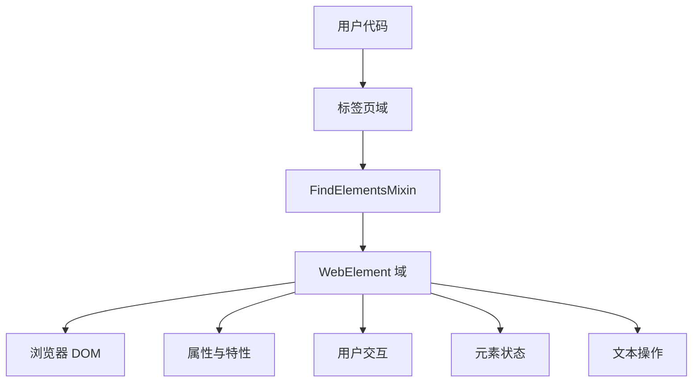
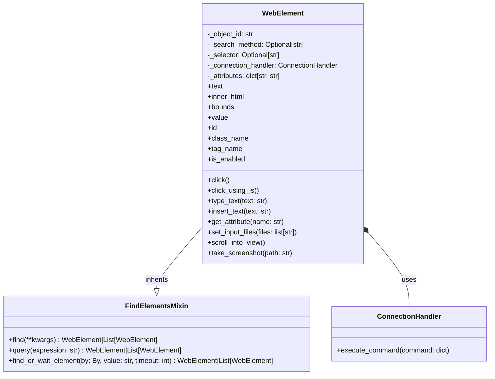

# WebElement 域

WebElement 域是 Pydoll 架构的基石，它提供了丰富的 DOM 元素表示形式，支持对网页组件进行直观而强大的交互。该域在高层自动化代码与浏览器渲染的底层 DOM 元素之间架起了桥梁。



## 理解 WebElement

WebElement 的核心是表示标签页内 DOM 元素的快照。与 JavaScript 中的传统 DOM 引用不同，Pydoll 中的 WebElement 具有以下特点：

1. **异步性** - 所有交互都遵循 Python 的 async/await 模式
2. **持久性** - 在页面变化时仍保持对元素的引用
3. **自包含性** - 封装了对 DOM 元素所有可能的操作
4. **智能性** - 对不同类型的元素实现了专门的处理逻辑

每个 WebElement 实例都维护着几个关键信息：

```python
class WebElement(FindElementsMixin):
    def __init__(
        self,
        object_id: str,
        connection_handler: ConnectionHandler,
        method: Optional[str] = None,
        selector: Optional[str] = None,
        attributes_list: list[str] = [],
    ):
        self._object_id = object_id
        self._search_method = method
        self._selector = selector
        self._connection_handler = connection_handler
        self._attributes: dict[str, str] = {}
        self._def_attributes(attributes_list)
```
# 核心组件

主要包括：
- `object_id` 提供对元素的远程 JavaScript 引用
- `connection_handler` 实现与浏览器的通信
- `_search_method` 和 `_selector` 追踪元素的查找方式
- `_attributes` 字典存储元素属性

通过继承 `FindElementsMixin`，每个 WebElement 也可以作为查找子元素的起点。

## 技术架构

WebElement 域结合了多种关键设计模式，以提供强大而灵活的 API：



该架构设计遵循几个关键原则：

1. **命令模式** - 元素交互被转换为 CDP 命令
2. **属性系统** - 结合同步属性访问与异步 DOM 属性检索
3. **Mixin 继承** - 通过 FindElementsMixin 继承元素查找能力
4. **桥接模式** - 将 CDP 协议细节与用户面向的 API 抽象分离

### 属性管理

WebElement 设计的一个独特之处在于它处理 HTML 属性的方式：

```python
def _def_attributes(self, attributes_list: list):
    """
    Defines element attributes from a flat list of key-value pairs.
    """
    for i in range(0, len(attributes_list), 2):
        key = attributes_list[i]
        key = key if key != 'class' else 'class_name'
        value = attributes_list[i + 1]
        self._attributes[key] = value
```

# 特点

1. 在元素创建期间处理属性
2. 提供对常见属性的快速同步访问
3. 处理 Python 保留关键字(如将`class`映射为`class_name`)
4. 构成元素字符串表示的基础

!!! info "属性访问与特性访问"
    WebElement 提供两种互补的方式来访问元素数据:
    
    - **属性字典**: 快速同步访问元素创建时可用的 HTML 属性
    - **异步特性**: 通过 CDP 命令动态访问当前 DOM 状态
    
    ```python
    # 同步属性访问(来自初始HTML)
    element_id = element.id
    element_class = element.class_name
    
    # 异步特性访问(来自DOM的当前状态)
    element_text = await element.text
    element_bounds = await element.bounds
    ```

## 核心交互模式

WebElement 域提供几类交互方式:

### 元素属性

WebElement 同时提供同步和异步的特性访问方式:

```python
# Synchronous properties (from attributes present at element creation)
element_id = element.id
element_class = element.class_name
is_element_enabled = element.is_enabled
element_value = element.value

# Asynchronous properties (retrieved from live DOM)
element_text = await element.text
element_html = await element.inner_html
element_bounds = await element.bounds
```

通过判断哪些属性应该采用同步方式(静态HTML属性)访问，哪些属性应该采用异步方式(动态DOM状态)访问来实现了性能与数据实时性之间的平衡:

```python
@property
async def text(self) -> str:
    """
    Retrieves the text of the element.
    """
    outer_html = await self.inner_html
    soup = BeautifulSoup(outer_html, 'html.parser')
    return soup.get_text(strip=True)

@property
def id(self) -> str:
    """
    Retrieves the id of the element.
    """
    return self._attributes.get('id')
```

### 鼠标交互

WebElement 提供了多种通过鼠标事件与元素交互的方式：

```python
# Standard click at element center
await element.click()

# Click with offset from center
await element.click(x_offset=10, y_offset=5)

# Click with longer hold time (like for long press)
await element.click(hold_time=1.0)

# JavaScript-based click (useful for elements that are difficult to click)
await element.click_using_js()
```

该实现能在不同元素类型和可见状态下智能处理：

```python
async def click(
    self,
    x_offset: int = 0,
    y_offset: int = 0,
    hold_time: float = 0.1,
):
    """
    Clicks on the element using mouse events.
    """
    if self._is_option_tag():
        return await self.click_option_tag()

    if not await self.is_visible():
        raise exceptions.ElementNotVisible(
            'Element is not visible on the page.'
        )

    await self.scroll_into_view()
    
    # Get element position and calculate click point
    # ... (position calculation code)
    
    # Send mouse press and release events
    press_command = InputCommands.mouse_press(*position_to_click)
    release_command = InputCommands.mouse_release(*position_to_click)
    await self._connection_handler.execute_command(press_command)
    await asyncio.sleep(hold_time)
    await self._connection_handler.execute_command(release_command)
```

!!! tip "特殊元素处理"
    WebElement 实现在不同元素类型上包含专门的处理逻辑:
    
    ```python
    # 下拉列表中的 option 元素需要特殊的点击处理
    if self._is_option_tag():
        return await self.click_option_tag()
    
    # 文件输入框需要特殊的文件选择处理
    await input_element.set_input_files("path/to/file.pdf")
    ```

### 键盘交互

WebElement 提供了多种向表单元素输入文本的方式：

```python
# Quick text insertion (faster but less realistic)
await element.insert_text("Hello, world!")

# Realistic typing with configurable speed
await element.type_text("Hello, world!", interval=0.1)

# Individual key events
await element.key_down(Key.CONTROL)
await element.key_down(Key.A)
await element.key_up(Key.A)
await element.key_up(Key.CONTROL)

# Press and release key combination
await element.press_keyboard_key(Key.ENTER, interval=0.1)
```
!!! info "文件上传处理"
    对于文件输入元素，WebElement 提供了专门的方法:
    
    ```python
    # 上传单个文件
    await file_input.set_input_files(["path/to/file.pdf"])
    
    # 上传多个文件
    await file_input.set_input_files(["file1.jpg", "file2.jpg"])
    ```

## 视觉能力

### 元素截图

WebElement 可以捕获特定元素的屏幕截图：

```python
# Take a screenshot of just this element
await element.take_screenshot("element.png")

# Take a high-quality screenshot
await element.take_screenshot("element.jpg", quality=95)
```

该实现包含以下步骤：
1. 使用JavaScript获取元素的边界范围
2. 为截图创建裁剪区域
3. 仅对该区域进行截图
4. 将图像保存到指定路径

```python
async def take_screenshot(self, path: str, quality: int = 100):
    """
    Capture screenshot of this element only.
    
    Automatically scrolls element into view before capturing.
    """
    bounds = await self.get_bounds_using_js()
    clip = Viewport(
        x=bounds['x'],
        y=bounds['y'],
        width=bounds['width'],
        height=bounds['height'],
        scale=1,
    )
    screenshot = await self._connection_handler.execute_command(
        PageCommands.capture_screenshot(
            format=ScreenshotFormat.JPEG, clip=clip, quality=quality
        )
    )
    async with aiofiles.open(path, 'wb') as file:
        image_bytes = decode_base64_to_bytes(screenshot['result']['data'])
        await file.write(image_bytes)
```

!!! tip "多种边界获取方法"
    WebElement 提供两种获取元素边界的方式:
    
    ```python
    # 使用DOM域(主要方法)
    bounds = await element.bounds
    
    # 使用JavaScript作为备用方案(在某些情况下更可靠)
    bounds = await element.get_bounds_using_js()
    ```

## JavaScript 集成

WebElement 为需要直接操作DOM的操作提供了与JavaScript的无缝集成：

```python
# Execute JavaScript in the context of this element
await element.execute_script("this.style.border = '2px solid red';")

# Get result from JavaScript execution
visibility = await element.is_visible()
```

该实现通过CDP Runtime域执行JavaScript，并将元素作为上下文：

```python
async def execute_script(
    self, script: str, return_by_value: bool = False
):
    """
    Executes a JavaScript script in the context of this element.
    """
    return await self._execute_command(
        RuntimeCommands.call_function_on(
            self._object_id, script, return_by_value
        )
    )
```

## 元素状态验证

WebElement 提供了检查元素可见性和可交互性的方法：


```python
# Check if element is visible
is_visible = await element.is_visible()

# Check if element is the topmost at its position
is_on_top = await element.is_on_top()

# Check if element is interactable
is_interactable = await element.is_interactable()
```

这些验证对于实现可靠的自动化至关重要，可在尝试操作前确保元素可被交互。

## 位置与滚动

WebElement 域包含用于定位和滚动的方法：

```python
# Scroll element into view
await element.scroll_into_view()

# Get element bounds
bounds = await element.bounds
```

这些能力可确保在交互前元素在视口中可见，从而模拟真实用户与页面的交互方式。

## 性能与可靠性考量

WebElement 域通过多项关键策略平衡性能与可靠性：

### 智能回退机制

许多方法采用多种实现方式，以确保即使在复杂场景下操作仍能成功执行。

```python
async def click(self, ...):
    # Try using CDP mouse events first
    # If that fails, fallback to JavaScript click
    # If that fails, provide a clear error message
```

### 合适上下文选择

实现会根据每个操作选择最合适的上下文：

| 操作 | 方式 | 原因 |
|------|------|------|
| 获取文本 | 使用 BeautifulSoup 解析 HTML | 更精确的文本提取 |
| 点击 | 通过 CDP 发送鼠标事件 | 最真实的用户模拟 |
| 选择选项 | 专用 JavaScript | 下拉元素所需 |
| 检查可见性 | JavaScript | 在不同浏览器版本中最可靠 |

### 命令批处理

在可能的情况下，将多个操作合并以减少与浏览器的往返通信次数。

```python
# Get element bounds in a single operation
bounds = await element.get_bounds_using_js()

# Calculate position in local code without additional browser calls
position_to_click = (
    bounds['x'] + bounds['width'] / 2,
    bounds['y'] + bounds['height'] / 2,
)
```

## 结论

WebElement 域提供了一个全面且直观的接口，用于与网页中的元素进行交互。通过封装 DOM 操作、事件处理和状态管理的复杂性，它使自动化代码能够专注于高层任务，而非底层细节。

该域体现了若干关键设计原则：

1. **抽象化** - 将 CDP 命令的复杂性隐藏在简洁的 API 背后  
2. **专业化** - 针对不同元素类型提供专属处理方式  
3. **混合访问** - 平衡同步与异步操作以实现最佳性能  
4. **鲁棒性** - 为常见操作实现回退策略  

当与 Tab 域和 Browser 域结合使用时，WebElement 构建了一套强大的网页自动化工具集，既能应对现代 Web 应用的复杂性，又能为开发者提供简单可靠的 API。